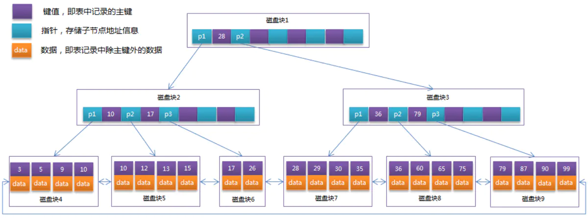
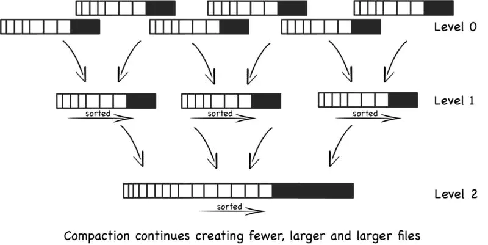

[TOC]

# LSM Tree（Log-structured merge-tree）

磁盘读写特性：随机操作慢，顺序读写快

磁盘读写的动作

一次访盘请求（读/写）完成过程由三个动作组成：

1. 寻道（时间）：磁头移动定位到指定磁道
2. 旋转延迟（时间）：等待指定扇区从磁头下旋转经过
3. 数据传输（时间）：数据在磁盘与内存之间的实际传输

因此在磁盘上读取扇区数据（一块数据）所需时间：

`Ti/o=tseek +tla + n *twm`

* tseek 为寻道时间
* tla为旋转时间
* twm 为传输时间

---

通常的文件读写都是提高读性能，但确降低了写性能

1. 二分查找: 将文件数据有序保存，使用二分查找来完成特定key的查找。
2. 哈希：用哈希将数据分割为不同的bucket
3. B+树：使用B+树 或者 ISAM 等方法，可以减少外部文件的读取
4. 外部文件：将数据保存为日志，并创建一个hash或者查找树映射相应的文件

因为上面这些方法，都强加了总体的结构信息在数据上，数据被按照特定的方式放置，所以可以很快的找到特定的数据，但是却对写操作不友善，让写操作性能下降。比如，当我们需要更新hash或者B+树的结构时，需要同时更新文件系统中特定的部分，这就是上面说的比较慢的随机读写操作

---

LSM 则使用一种不同于上述四种的方法，保持了日志文件写性能，以及微小的读操作性能损失

* B+Tree回顾

如果数据更新或者插入完全无序的时候，比如先插入0 ，然后80000，然后200，然后666666，由于不在一个磁盘块中，就需要先去查找到这个数据。数据非常离散，那么就意味着每次查找的时候，它的叶子节点很可能都不在内存中，所以会有很多随机IO访问。并且随机写产生的子树的分裂等等，产生很多的磁盘碎片。

* LSM 实现

关键词：内存/磁盘，顺序写，层(level)，归并排序

顺序写log到磁盘，同时写到内存，等内存中数据达到一定的数量的时候再按照数据的排序方式有序的写入硬盘

会对数据按key划分为若干层(`level`)；每个level会对应若干文件，包括存在于内存中和落盘了的；每个文件内key都是有序的，同级的各个文件之间，一般也有序的；每层文件到达一定条件后，进行合并操作，然后放置到更高层

