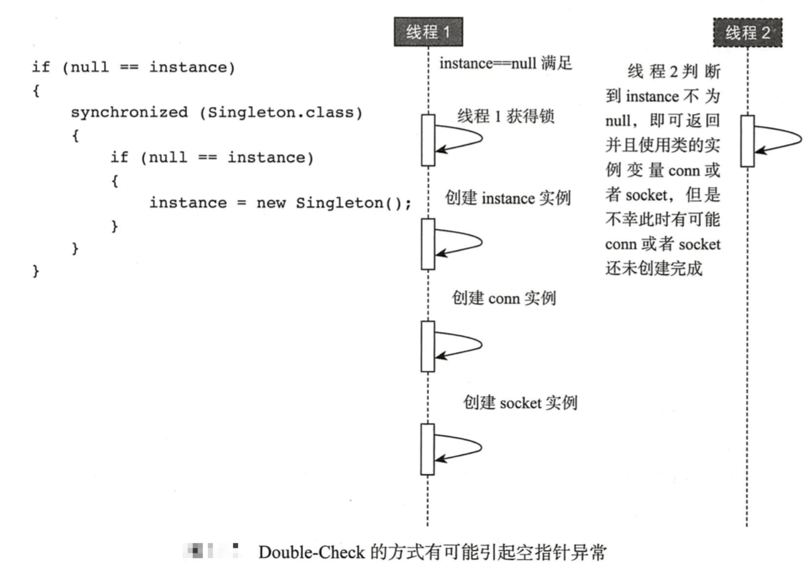

[TOC]

# 单例模式

* 单例类只能有一个实例
* 单例类必须自己创建自己的唯一实例
* 单例类必须给所有其他对象提供这一实例

* 懒汉：在初始化类的时候，不创建唯一的实例，而是等到真正需要用到的时候才创建。必须加上同步，否则有可能依然创建多个实例。

* 饿汉：在初始化的时候，就创建了唯一的实例，不管是否需要用到。不需要自己加同步，一定产生唯一的实例。

## 懒汉式 + 非同步

```java
final class Singleton{
    private byte[] data = new byte[1024];

    private static Singleton instance = null;

    public static Singleton getInstance(){
        if(null == instance){
            System.out.println("new Singleton()");
            instance = new Singleton();
        }
        return instance;
    }

}
```

`Singleton.class`初始化的时候，`instance`不会实例化，`getInstance()`方法内部会实例化，但是多线程下会出现`new Singleton()`多次的情况，因为某个时间可能多个线程看到的`instance`都是null, 这使得实例并不唯一

```java
// 20个线程简单测试
for(int i=0;i<20;i++){
    new Thread(()-> Singleton.getInstance()).start();
}
```

## 懒汉式 + `synchronized`同步

`getInstance`同一时刻只能被一个线程访问，效率很低

```java
final class Singleton{
    private byte[] data = new byte[1024];

    private static Singleton instance = null;

    public static synchronized Singleton getInstance(){
        if(null == instance){
            System.out.println("new Singleton");
            instance = new Singleton();
        }
        return instance;
    }

}
```

## double-check（仍然线程不安全）

首次初始化的时候加锁，之后多线程调用`getInstance`

```java
final class Singleton{
    private byte[] data = new byte[1024];

    private static Singleton instance = null;
    String conn;
    Socket socket;

    private Singleton(){
        System.out.println("Singleton constructor init");
        try {
            TimeUnit.SECONDS.sleep(2);
        }catch (Exception e){
            e.printStackTrace();
        }
        this.conn = new String();
        this.socket = new Socket();
    }

    public static Singleton getInstance(){
        if(null == instance){
            synchronized (Singleton.class) {
                if(null == instance) {
                    System.out.println("new Singleton");
                    instance = new Singleton(); // new 对象 可能会指令重排
                }
            }
        }
        return instance;
    }
}
```



创建一个变量需要：一个是申请一块内存，调用构造方法进行初始化操作，另一个是分配一个指针指向这块内存。这两个操作谁在前谁在后呢？JVM规范并没有规定。那么就存在这么一种情况，JVM是先开辟出一块内存，然后把指针指向这块内存，最后调用构造方法进行初始化。

## double-check & volatile（懒汉式）

`volatile`止指令重排，保证顺序性

```java
private volatile static Singleton instance = null;
```

## Holder方式（静态内部类）

```java
final class Singleton{
    private byte[] data = new byte[1024];

    private Singleton(){
    }

    private static class Holder{
        private static Singleton singleton = new Singleton();
    }

    public static Singleton getInstance(){
        return Holder.singleton;
    }

}
```

Singleton初始化的时候不会创建实例，用内部类静态变量创建实例，在Java程序类加载的编译时期收集`<clinit>()`方法中，该方法是同步方法

## 枚举

```java
```

枚举类型不允许被继承，同样是线程安全的且只能被实例化一次，但是枚举类型不能够实现懒加载
