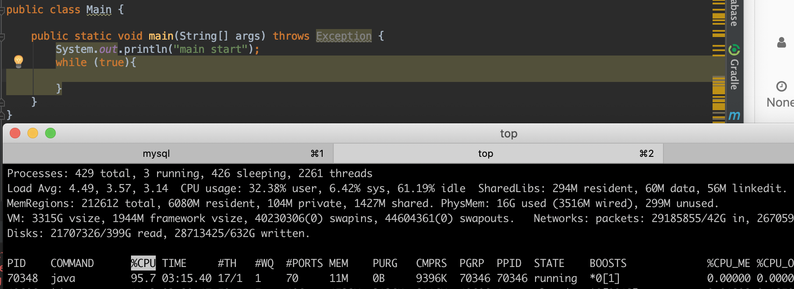
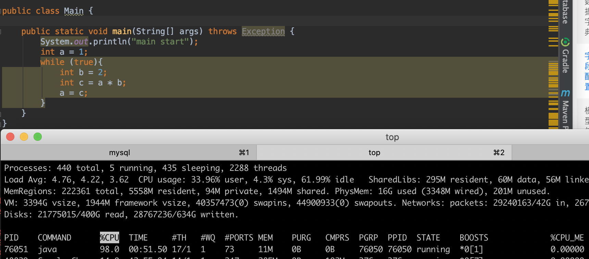
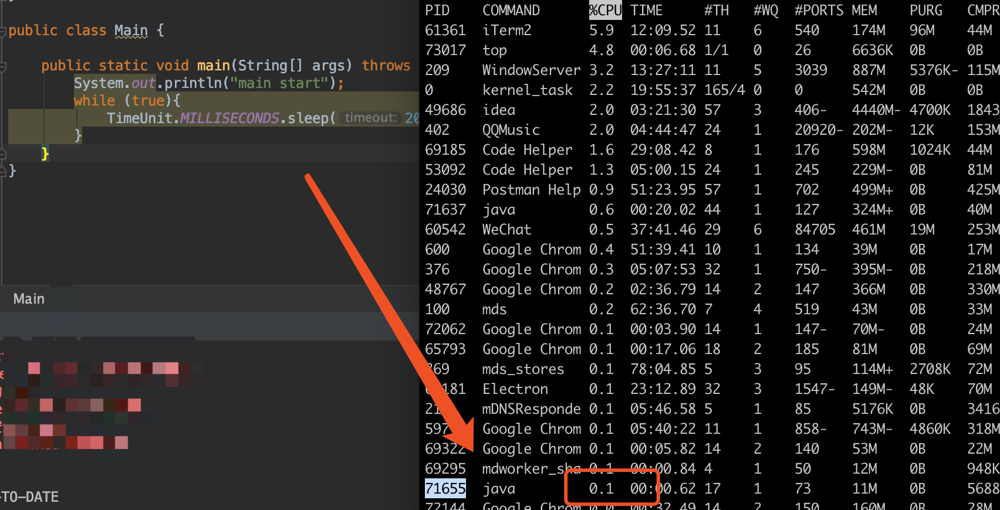
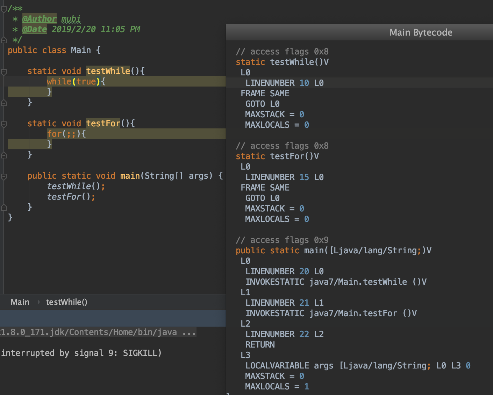
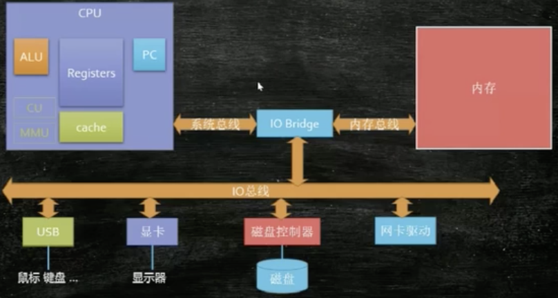
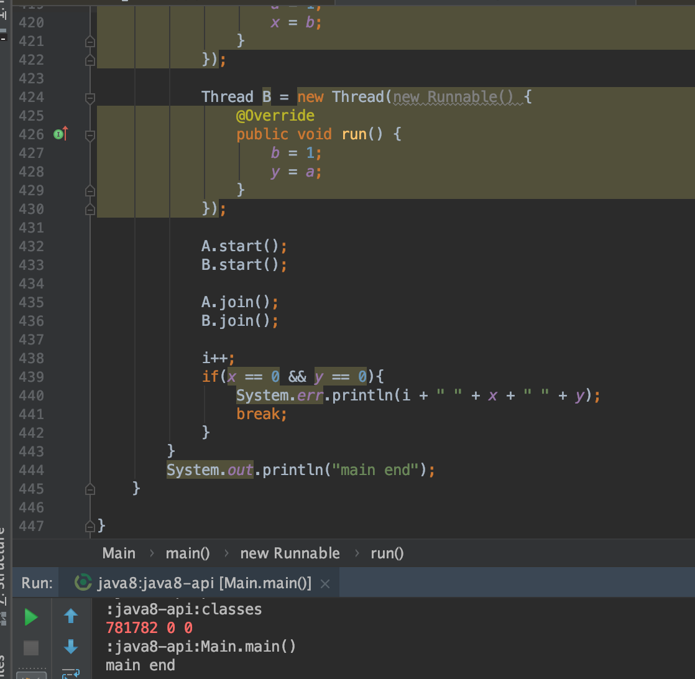
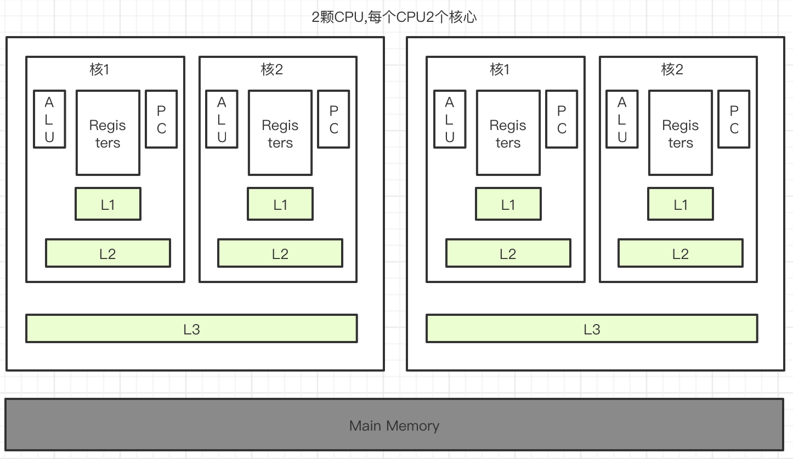
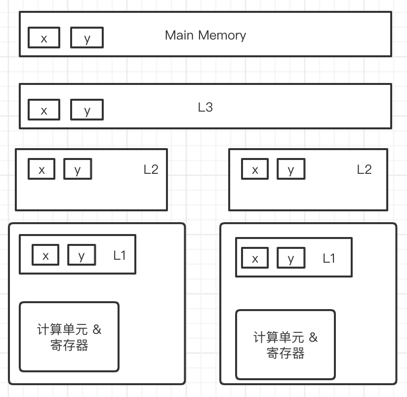

[TOC]

# CPU while(true)

* while(true){}无任何操作，近乎占满一个CPU核





* while(true){sleep},基本不暂用CPU



* while(true)和for(;;)无差异



## CPU南桥北桥

靠近cpu的是北桥 较远的是南桥。

* 北桥芯片主要负责实现与CPU、内存、AGP接口之间的数据传输，同时还通过特定的数据通道和南桥芯片相连接。北桥芯片的封装模式最初使用BGA封装模式，到现在Intel的北桥芯片已经转变为FC-PGA封装模式，不过为AMD处理器设计的主板北桥芯片到现在依然还使用传统的BGA封装模式。

* 南桥芯片主要负责和IDE设备、PCI设备、声音设备、网络设备以及其他的I/O设备的沟通，南桥芯片到目前为止还只能见到传统的BGA封装模式一种。

# 缓存一致性

## CPU架构



## CPU提速优化

CPU优化的两点

1. 指令乱序执行（CPU执行更多的指令）
2. CPU高速缓存（匹配速度慢的主存，也是能执行更多的指令）

cpu中为了能够让指令的执行尽可能地并行起来，从而发明了流水线技术。但是如果两条指令的前后存在依赖关系，比如数据依赖，控制依赖等，此时后一条语句就必需等到前一条指令完成后，才能开始。cpu为了提高流水线的运行效率，会做出比如：

1. 对无依赖的前后指令做适当的乱序和调度；
2. 对控制依赖的指令做分支预测；
3. 对读取内存等的耗时操作，做提前预读；
4. 。。。

这些都可能会导致指令乱序

---

* 附: 指令流水线是为提高处理器执行指令的效率，把一条指令的操作分成多个细小的步骤（取指、译码、执行、访问主存、写回），每个步骤由专门的电路完成的方式。举个例子：例如一条指令要执行要经过3个阶段：取指令、译码、执行，每个阶段都要花费一个机器周期，如果没有采用流水线技术，那么这条指令执行需要3个机器周期；如果采用了指令流水线技术，那么当这条指令完成`取指`后进入`译码`的同时，下一条指令就可以进行`取指`了，这样就提高了指令的执行效率。

### 指令乱序例子程序

google blog: <a href='https://preshing.com/20120515/memory-reordering-caught-in-the-act/'>Memory Reordering Caught in the Act</a>

```java
public class Main {

    static int x, y, a, b;

    public static void main(String[] args) throws Exception{
        int i = 0;
        while (true) {
            x = 0;
            y = 0;
            b = 0;
            a = 0;

            Thread A = new Thread(new Runnable() {
                @Override
                public void run() {
                    a = 1;
                    x = b;
                }
            });

            Thread B = new Thread(new Runnable() {
                @Override
                public void run() {
                    b = 1;
                    y = a;
                }
            });

            A.start();
            B.start();

            A.join();
            B.join();

            i++;
            if(x == 0 && y == 0){
                System.err.println(i + " " + x + " " + y);
                break;
            }
        }
        System.out.println("main end");
    }
}
```

指令有序的话，理论上不会出现x，y都等于0的情况；如果出现，则可以说明指令乱序



## 三级缓存



* L1高速缓存：也叫一级缓存。一般内置在内核旁边，是与CPU结合最为紧密的CPU缓存。一次访问只需要2~4个时钟周期
* L2高速缓存：也叫二级缓存。空间比L1缓存大，速度比L1缓存略慢。一次访问约需要10多个时钟周期
* L3高速缓存：也叫三级缓存。部分单CPU多核心的才会有的缓存，介于多核和内存之间。存储空间已达Mb级别，一次访问约需要数十个时钟周期。

当CPU要读取一个数据时，首先从L1缓存查找，命中则返回；若未命中，再从L2缓存中查找，如果还没有则从L3缓存查找（如果有L3缓存的话）。如果还是没有，则从内存中查找，并将读取到的数据逐级放入缓存。

eg:



## MESI协议

计算机内存模型


多个处理器都涉及同一块主内存区域的更改时，将导致各自的缓存数据不一致？如何解决？

* MESI 是指4种状态的首字母。每个缓存行(Cache Line)有4个状态，可用2个bit表示，它们分别是：

状态 | 描述 | 监听任务
-|-|-
M 修改 (Modified) | 该Cache line有效，数据被修改了，和内存中的数据不一致，数据只存在于本Cache中。| 缓存行必须时刻监听所有试图读该缓存行相对就主存的操作，这种操作必须在缓存将该缓存行写回主存并将状态变成S（共享）状态之前被延迟执行。
E 独享、互斥 (Exclusive) | 该Cache line有效，数据和内存中的数据一致，数据只存在于本Cache中。| 缓存行也必须监听其它缓存读主存中该缓存行的操作，一旦有这种操作，该缓存行需要变成S（共享）状态。
S 共享 (Shared) | 该Cache line有效，数据和内存中的数据一致，数据存在于很多Cache中。| 缓存行也必须监听其它缓存使该缓存行无效或者独享该缓存行的请求，并将该缓存行变成无效（Invalid）。
I 无效 (Invalid) | 该Cache line无效。| 无

当某个cpu修改缓存行数据时，其它的cpu通过监听机制获悉共享缓存行的数据被修改，会使其共享缓存行失效。本cpu会将修改后的缓存行写回到主内存中。此时其它的cpu如果需要此缓存行共享数据，则从主内存中重新加载，并放入缓存，以此完成了缓存一致性。

<a href="https://zh.wikipedia.org/wiki/MESI%E5%8D%8F%E8%AE%AE" target="_blanck">mesi wiki</a>

## 总线锁和缓存锁

`总线锁`是把CPU和内存的通信给锁住了；使得在锁定期间，其它处理器不能操作内存的其它数据，这样开销较大

`缓存锁`不需锁定总线，只需要"锁定"被缓存的共享对象（实际为：缓存行）即可；接受到lock指令，通过`缓存一致性协议`，维护本处理器内部缓存和其它处理器缓存的一致性。相比总线锁，会提高CPU利用率。

## 缓存行 cache line

* 程序局部性原理（这里解释为：访问内存或缓存的某个位置，顺带的把紧邻的位置一起读取出来）

    1. 缓存行越大，局部性空间效率越高，但读取时间慢
    2. 缓存行越小，局部性空间效率越低，但读取时间快

折中取：64字节

消除伪共享

### 两个变量在一个缓存行中

```java
import java.util.concurrent.CountDownLatch;


public class Main {

    private static class T {
        public volatile long x;
    }

    public static T[] arr = new T[2];

    static {
        arr[0] = new T();
        arr[1] = new T();
    }

    // 一亿次
    static int FOR_COUNT = 100_000_000;

    public static void main(String[] args) throws Exception{
        CountDownLatch latch = new CountDownLatch(2);

        Thread t1 = new Thread(()->{
            for (int i = 0; i < FOR_COUNT; i ++){
                arr[0].x ++;
            }
            latch.countDown();
        });

        Thread t2 = new Thread(()->{
            for (int i = 0; i < FOR_COUNT; i ++){
                arr[1].x ++;
            }
            latch.countDown();
        });

        final long start = System.nanoTime();
        t1.start();
        t2.start();
        latch.await();
        System.out.println((System.nanoTime() - start) /1_000_000 + " ms");
    }
}
```

程序输出：`2990 ms`,`2952 ms`,`2490 ms`，大概3秒左右

### 消除伪共享

```java
import java.util.concurrent.CountDownLatch;


public class Main {

    private static class T {
        public volatile long p1, p2, p3, p4, p5, p6, p7;
        public volatile long x;
        public volatile long p8, p9, p10, p11, p12, p13, p14;
    }

    public static T[] arr = new T[2];

    static {
        arr[0] = new T();
        arr[1] = new T();
    }

    // 一亿次
    static int FOR_COUNT = 100_000_000;

    public static void main(String[] args) throws Exception{
        CountDownLatch latch = new CountDownLatch(2);

        Thread t1 = new Thread(()->{
            for (int i = 0; i < FOR_COUNT; i ++){
                arr[0].x ++;
            }
            latch.countDown();
        });

        Thread t2 = new Thread(()->{
            for (int i = 0; i < FOR_COUNT; i ++){
                arr[1].x ++;
            }
            latch.countDown();
        });

        final long start = System.nanoTime();
        t1.start();
        t2.start();
        latch.await();
        System.out.println((System.nanoTime() - start) /1_000_000 + " ms");
    }
}
```

程序输出：`900 ms`,`894 ms`,`1189 ms`，1秒多

#### 原因

```java
private static class T {
    public volatile long p1, p2, p3, p4, p5, p6, p7;
    public volatile long x;
    public volatile long p8, p9, p10, p11, p12, p13, p14;
}
```

数组如下：`arr[0].x` 与 `arr[1].x` 不会在一个缓存行中；这样修改用的各自的缓存行，互不影响

```java
56字节
x(8字节)
56字节
56字节
x(8字节)
56字节
```

配合`import sun.misc.Contended;`的`@Contended`注解(注意加上`-XX:-RestrictContended`参数)
