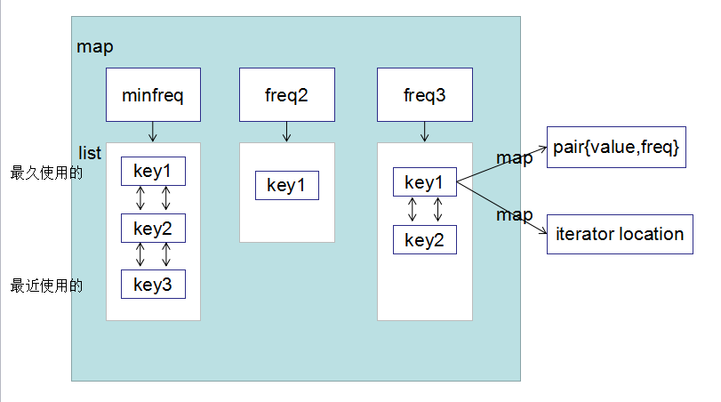

[TOC]

# LFU

Least Frequently Used ,最近最少使用算法

这个缓存算法使用一个计数器来记录条目被访问的频率。通过使用LFU缓存算法，最低访问数的条目首先被移除。这个方法并不经常使用，因为它无法对一个拥有最初高访问率之后长时间没有被访问的条目缓存负责。



leetcode java (460题)

* <font color='red'>注意capacity=0的特殊情况</font>

* <font color='red'>注意最小频率的设置问题</font>

* <font color='red'>注意三个map结构的更新，修改，删除处理</font>

```java
// 普通双向链表,有一个初始的dummyNode
class DoubleList {
    private DoubleNode head, tail; // 头尾虚节点
    private int size; // 链表当前size

    public DoubleList() {
        head = new DoubleNode(0, 0);
        tail = head;
        head.next = tail;
        tail.prev = head;
        size = 0;
    }


    // O(1)
    // 头插
    public void addFirst(DoubleNode x) {
        x.next = head.next;
        x.prev = head;
        head.next.prev = x;
        head.next = x;
        size++;
    }

    // O(1)
    // 删除链表中的 x 节点（x 一定存在）
    public void remove(DoubleNode x) {
        x.prev.next = x.next;
        x.next.prev = x.prev;
        size--;
    }

    // O(1)
    // 删除链表中最后一个节点，并返回该节点
    public DoubleNode removeLast() {
        if (tail.prev == head) {
            return null;
        }
        DoubleNode last = tail.prev;
        remove(last);
        return last;
    }

    public DoubleNode getFirst() {
        if (tail.prev == head) {
            return null;
        }
        return head.next;
    }

    // O(1)
    // 已存在元素移动到第一个位置
    public DoubleNode moveFirst(DoubleNode node) {
        remove(node);
        addFirst(node);
        return head.next;
    }


    // 返回链表长度
    public int size() {
        return size;
    }

    public boolean isEmpty() {
        return size == 0;
    }

    // 双向链表的节点
    static class DoubleNode {
        public int key, val;
        public DoubleNode next, prev;
        public DoubleNode(int k, int v) {
            this.key = k;
            this.val = v;
        }
    }

    public static DoubleNode newNode(int key, int val){
        return new DoubleNode(key, val);
    }
}

class LFUCache {
    // 频率对应的双向链表
    Map<Integer, DoubleList> freDoubleListMap;
    // key 对应的 频率
    Map<Integer, Integer> keyFreMap;
    // key 对应 在双向链表中的具体位置，头部位置是最近访问的，尾部位置是久远前访问的(要删除)
    Map<Integer, DoubleList.DoubleNode> keyNodeMap;
    // 容量
    int cap;
    // 最小频率不会突然增加，要么是1，要么是上一次的最小频率加上1
    int minFre;

    public LFUCache(int capacity) {
        freDoubleListMap = new HashMap<>();
        keyFreMap = new HashMap<>();
        keyNodeMap = new HashMap<>();
        cap = capacity;
        minFre = 0;
    }

    public int get(int key) {
        if (cap <= 0) {
            return -1;
        }
        if (!keyFreMap.containsKey(key)) {
            return -1;
        }
        int oldFre = keyFreMap.get(key);
        DoubleList.DoubleNode oldNode = keyNodeMap.get(key);
        int retVal = oldNode.val;
        modify(key, oldFre, oldFre + 1, oldNode, oldNode);
        return retVal;
    }

    // 更新3个map
    private void modify(int key, int oldFre, int newFre,
                        DoubleList.DoubleNode oldNode, DoubleList.DoubleNode newNode) {
        if (oldFre != 0 && oldNode != null) {
            DoubleList oldList = freDoubleListMap.get(oldFre);
            oldList.remove(oldNode);
            if (oldList.isEmpty()) {
                freDoubleListMap.remove(oldFre);
            } else {
                freDoubleListMap.put(oldFre, oldList);
            }
        }
        if(minFre == oldFre && !freDoubleListMap.containsKey(oldFre)){
            minFre ++;
        }
        keyFreMap.put(key, newFre);
        DoubleList doubleList;
        // 新频率的双向链表不存在,则新增一个
        if (!freDoubleListMap.containsKey(newFre)) {
            doubleList = new DoubleList();
        } else {
            doubleList = freDoubleListMap.get(newFre);
        }
        doubleList.addFirst(newNode);

        freDoubleListMap.put(newFre, doubleList);
        keyNodeMap.put(key, doubleList.getFirst());
    }

    public void put(int key, int value) {
        if(cap <= 0){
            return;
        }
        if(keyNodeMap.containsKey(key)) {
            DoubleList.DoubleNode oldNode = keyNodeMap.get(key);
            // DoubleList.DoubleNode newNode = DoubleList.newNode(key, value);
            DoubleList.DoubleNode newNode = oldNode;
            newNode.val = value;
            int oldFre = keyFreMap.get(key);
            modify(key, oldFre, oldFre + 1, oldNode, newNode);
            return;
        }
        // 先判断是否容量满了，要删除最小频率的最久访问的元素
        if (keyFreMap.size() == cap) {
            DoubleList doubleList = freDoubleListMap.get(minFre);
            DoubleList.DoubleNode node = doubleList.removeLast();
            keyFreMap.remove(node.key);
            keyNodeMap.remove(node.key);
            if (doubleList.isEmpty()) {
                freDoubleListMap.remove(minFre);
            } else {
                freDoubleListMap.put(minFre, doubleList);
            }
        }
        // 新增新元素，最小频率就是1了
        DoubleList.DoubleNode newNode = DoubleList.newNode(key, value);
        modify(key, 0, 1, null, newNode);
        minFre = 1;
    }
}
```
