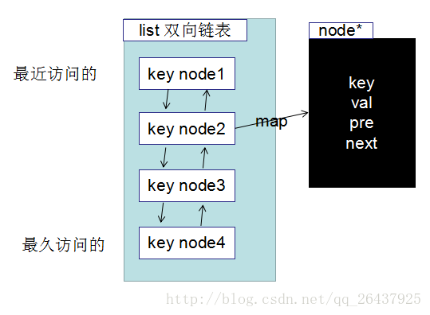

[TOC]

# LRU(Least Recently Used)

选择最近最久未使用的页面予以淘汰

leetcode 146题，eg

```java
LRUCache cache = new LRUCache( 2 /* 缓存容量 */ );

cache.put(1, 1);
cache.put(2, 2);
cache.get(1);       // 返回  1
cache.put(3, 3);    // 该操作会使得关键字 2 作废
cache.get(2);       // 返回 -1 (未找到)
cache.put(4, 4);    // 该操作会使得关键字 1 作废
cache.get(1);       // 返回 -1 (未找到)
cache.get(3);       // 返回  3
cache.get(4);       // 返回  4

来源：力扣（LeetCode）
链接：https://leetcode-cn.com/problems/lru-cache
著作权归领扣网络所有。商业转载请联系官方授权，非商业转载请注明出处。
```

## 双向链表(带头节点) + Map



```java
// 普通双向链表,有一个初始的dummyNode
class DoubleList {
    private DoubleNode head, tail; // 头尾虚节点
    private int size; // 链表当前size

    public DoubleList() {
        head = new DoubleNode(0, 0);
        tail = new DoubleNode(0, 0);
        head.next = tail;
        tail.prev = head;
        size = 0;
    }

    // O(1)
    // 头插
    public void addFirst(DoubleNode x) {
        x.next = head.next;
        x.prev = head;
        head.next.prev = x;
        head.next = x;
        size++;
    }

    // O(1)
    // 删除链表中的 x 节点（x 一定存在）
    public void remove(DoubleNode x) {
        x.prev.next = x.next;
        x.next.prev = x.prev;
        size--;
    }

    // O(1)
    // 删除链表中最后一个节点，并返回该节点
    public DoubleNode removeLast() {
        if (tail.prev == head) {
            return null;
        }
        DoubleNode last = tail.prev;
        remove(last);
        return last;
    }

    public DoubleNode getFirst() {
        if (tail.prev == head) {
            return null;
        }
        return head.next;
    }


    public DoubleNode putFirst(DoubleNode node) {
        remove(node);
        addFirst(node);
        return head.next;
    }


    // 返回链表长度
    public int size() {
        return size;
    }

    // 双向链表的节点
    class DoubleNode {
        public int key, val;
        public DoubleNode next, prev;
        public DoubleNode(int k, int v) {
            this.key = k;
            this.val = v;
        }
    }
}

class LRUCache {

    DoubleList doubleList;
    Map<Integer, DoubleList.DoubleNode> mp;

    int cap;

    public LRUCache(int capacity) {
        cap = capacity;
        mp = new HashMap<>();
        doubleList = new DoubleList();
    }

    public int get(int key) {
        if (mp.containsKey(key)) {
            // 已存在，位置要重置
            DoubleList.DoubleNode node = mp.get(key);
            DoubleList.DoubleNode node1 = doubleList.putFirst(node);
            mp.put(key, node1);
            return node1.val;
        } else {
            // 不存在返回-1
            return -1;
        }
    }

    public void put(int key, int value) {
        if ( mp.containsKey(key) ) {
            // 已存在，位置要重置，且要修改value
            DoubleList.DoubleNode node = mp.get(key);
            doubleList.remove(node);

            node.val = value;
            doubleList.addFirst(node);
            mp.put(key, doubleList.getFirst());
        } else {
            if( doubleList.size() == cap) {
                DoubleList.DoubleNode lastNode = doubleList.removeLast();
                mp.remove(lastNode.key);
            }
            // 添加新节点
            DoubleList.DoubleNode newNode = doubleList.new DoubleNode(key,value);
            doubleList.addFirst(newNode);
            mp.put(key, doubleList.getFirst());
        }
    }
}
```

## 使用LinkedHashMap实现一个LRU缓存(LeetCode)

```java
class BaseLRUCache<K,V> extends LinkedHashMap<K,V> {

    private int cacheSize;

    public BaseLRUCache(int cacheSize) {
        super(16,0.75f,true);
        this.cacheSize = cacheSize;
    }

    /**
     * 判断元素个数是否超过缓存容量
     */
    @Override
    protected boolean removeEldestEntry(Map.Entry<K, V> eldest) {
        return size() > cacheSize;
    }
}

class LRUCache {

    BaseLRUCache<Integer, Integer> baseLRUCache;

    public LRUCache(int capacity) {
        baseLRUCache = new BaseLRUCache(capacity);
    }

    public int get(int key) {
        if(baseLRUCache.get(key) == null){
            return -1;
        }
        return baseLRUCache.get(key);
    }

    public void put(int key, int value) {
        baseLRUCache.put(key, value);
    }
}
```

插入之后的removeEldestEntry方法(默认返回:false)，删除最久远的访问元素，LinkedHashMap默认直接返回false,即不会进行删除操作，可以重写该方法

```java
/**
* Returns <tt>true</tt> if this map should remove its eldest entry.
* This method is invoked by <tt>put</tt> and <tt>putAll</tt> after
* inserting a new entry into the map.  It provides the implementor
* with the opportunity to remove the eldest entry each time a new one
* is added.  This is useful if the map represents a cache: it allows
* the map to reduce memory consumption by deleting stale entries.
*
* <p>Sample use: this override will allow the map to grow up to 100
* entries and then delete the eldest entry each time a new entry is
* added, maintaining a steady state of 100 entries.
* <pre>
*     private static final int MAX_ENTRIES = 100;
*
*     protected boolean removeEldestEntry(Map.Entry eldest) {
*        return size() &gt; MAX_ENTRIES;
*     }
* </pre>
*
* <p>This method typically does not modify the map in any way,
* instead allowing the map to modify itself as directed by its
* return value.  It <i>is</i> permitted for this method to modify
* the map directly, but if it does so, it <i>must</i> return
* <tt>false</tt> (indicating that the map should not attempt any
* further modification).  The effects of returning <tt>true</tt>
* after modifying the map from within this method are unspecified.
*
* <p>This implementation merely returns <tt>false</tt> (so that this
* map acts like a normal map - the eldest element is never removed).
*
* @param    eldest The least recently inserted entry in the map, or if
*           this is an access-ordered map, the least recently accessed
*           entry.  This is the entry that will be removed it this
*           method returns <tt>true</tt>.  If the map was empty prior
*           to the <tt>put</tt> or <tt>putAll</tt> invocation resulting
*           in this invocation, this will be the entry that was just
*           inserted; in other words, if the map contains a single
*           entry, the eldest entry is also the newest.
* @return   <tt>true</tt> if the eldest entry should be removed
*           from the map; <tt>false</tt> if it should be retained.
*/
protected boolean removeEldestEntry(Map.Entry<K,V> eldest) {
    return false;
}
```
