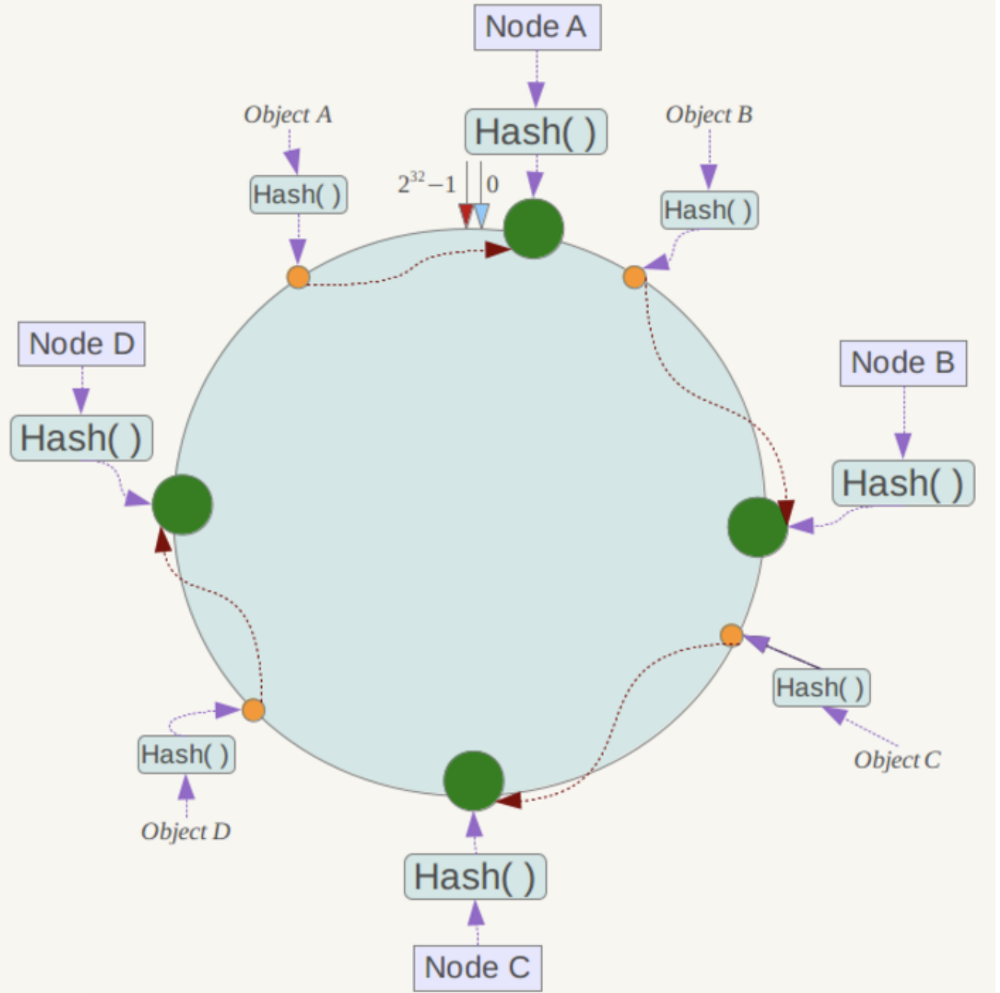
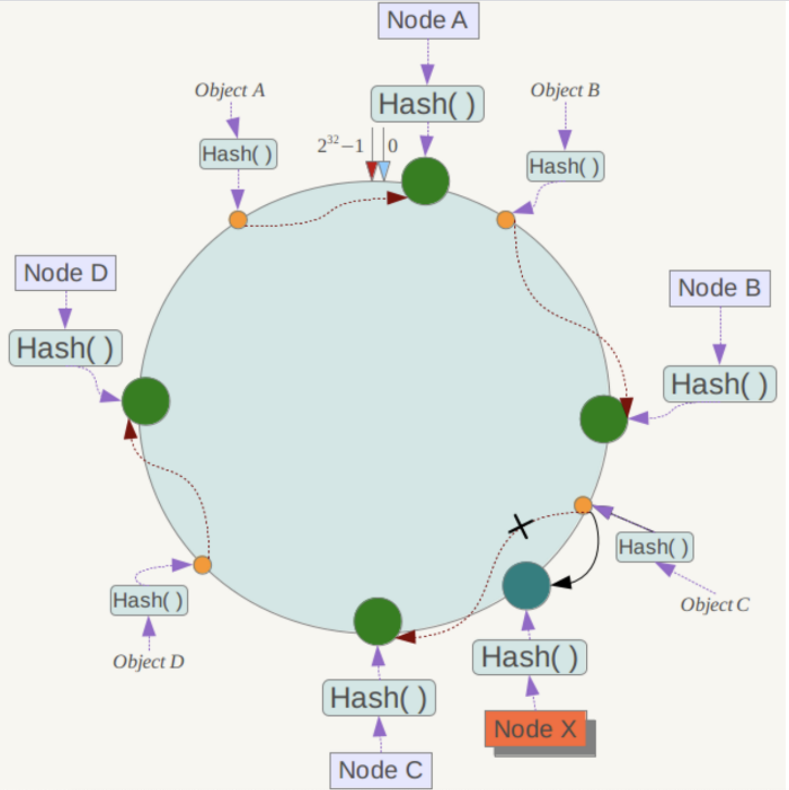

[TOC]

# 一致性Hash

## 问题引入

在解决分布式系统中负载均衡的问题时候可以使用Hash算法让固定的一部分请求落到同一台服务器上，这样每台服务器固定处理一部分请求（并维护这些请求的信息），起到负载均衡的作用。

但是普通的除留余数法（`hash(比如用户id)%服务器机器数`）算法伸缩性很差，当新增或者下线服务器机器时候，用户id与服务器的映射关系会大量失效。一致性hash则利用hash环对其进行了改进。

## 一致性Hash算法

1. 将整个哈希值空间映射成一个虚拟的圆环，整个哈希空间的取值范围为0~2^32-1（即是一个32位无符号整型）

2. 将各个服务器使用Hash进行一个哈希，具体可以选择服务器的ip或主机名作为关键字进行哈希，这样每台机器就能确定其在哈希环上的位置（原来是对服务器的数量进行取模，而一致性Hash算法是对2^32进行取模，然后顺时针找到对应对服务器）

数据如何定位到服务器，即如何hash确定位置的？

将数据key使用相同的函数Hash计算出哈希值，并确定此数据在环上的位置，从此位置沿环顺时针"行走"，第一台遇到的服务器就是其应该定位到的服务器。

现假设Node C不幸宕机，可以看到此时对象A、B、D不会受到影响，只有C对象被重定位到Node D。一般的，在一致性哈希算法中，如果一台服务器不可用，则受影响的数据仅仅是此服务器到其环空间中前一台服务器（即沿着逆时针方向行走遇到的第一台服务器）之间数据，其它不会受到影响。

现假设新增了服务器X，可以看到此时对象A、B、D不会受到影响，只有C对象被重定位到Node X，则受影响的数据仅仅是新服务器到其环空间中前一台服务器（即沿着逆时针方向行走遇到的第一台服务器）之间数据，其它数据也不会受到影响。

### 节点少，数据倾斜问题

引入虚拟节点
