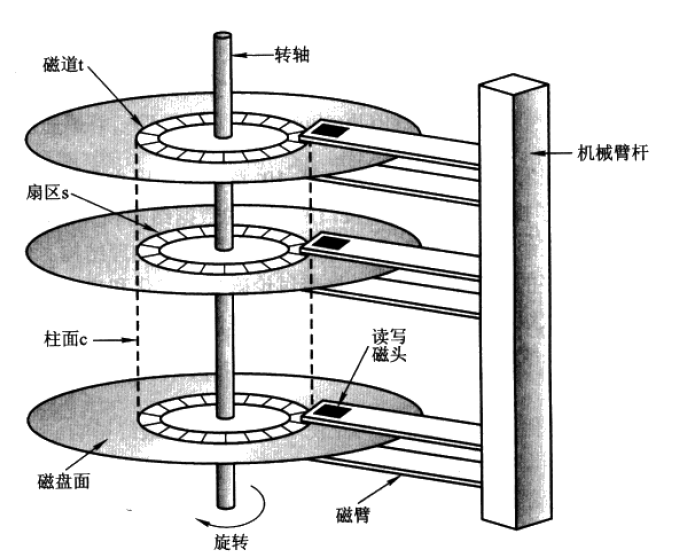

---
title: "局部性原理 & 磁盘IO"
layout: page
date: 2020-03-08 18:00
--- 

[TOC]

# 局部性原理

当一个数据被用到时，其附近的数据也通常会马上被使用。程序运行期间所需要的数据通常比较集中。由于磁盘顺序读取的效率很高(不需要寻道时间，只需很少的旋转时间) ，因此对于具有局部性的程序来说，磁盘预读可以提高1/0效率。预读的长度一般为页(page)的整倍数。页是计算机管理存储器的逻辑块，硬件及操作系统往往将主存和磁盘存储区分割为连续的大小相等的块，每个存储块称为一页(在许多操作系统中，页得大小通常为4k) ，主存和磁盘以页为单位交换数据。当程序要读取的数据不在主存中时，会触发一个缺页异常，此时系统会向磁盘发出读盘信号，磁盘会找到数据的起始位置并向后连续读取一页或几页载入内存中，然后异常返回，程序继续运行。

## 几种常见的局部性

* 时间局部性（Temporal Locality）：如果一个信息项正在被访问，那么在近期它很可能还会被再次访问。
程序循环、堆栈等是产生时间局部性的原因。

* 空间局部性（Spatial Locality）：在最近的将来将用到的信息很可能与正在使用的信息在空间地址上是临近的。

* 顺序局部性（Order Locality）：在典型程序中，除转移类指令外，大部分指令是顺序进行的。顺序执行和非顺序执行的比例大致是5:1。此外，对大型数组访问也是顺序的。

指令的顺序执行、数组的连续存放等是产生顺序局部性的原因。

## 硬盘读写基础

### 硬盘构成

* 盘面：盘面类似于光盘的数据存储面，由许多同心圆的磁道组成的盘面。一块硬盘有多个盘面
* 柱面：垂直方向由多个盘面组成，读取或者写入数据都是垂直方向的从第一个盘面同一磁道一直写入到最后一个盘面，然后数据还没写完的话在切换磁道
* 磁道：盘片被划分成一系列同心环，圆心是盘片中心，每个同心环叫做一个磁道;同一磁道再被划分成多个扇区
* 扇区：存储数据，每个扇区包括512个字节的数据和一些其他信息（每个扇区是磁盘的最小存储单元）

### 磁盘读写的动作

一次访盘请求（读/写）完成过程由三个动作组成：

1. 寻道（时间）：磁头移动定位到指定磁道
2. 旋转延迟（时间）：等待指定扇区从磁头下旋转经过
3. 数据传输（时间）：数据在磁盘与内存之间的实际传输

因此在磁盘上读取扇区数据（一块数据）所需时间：

`Ti/o=tseek +tla + n *twm`

* tseek 为寻道时间
* tla为旋转时间
* twm 为传输时间

#### IOPS(每秒的IO次数)

1000ms / (平均寻道时间+平均旋转延迟时间+平均数据读取的时间）ms

#### 硬盘吞吐量

每秒IO吞吐量 = IOPS * 平均每次IO的数据大小

### 磁盘预读

磁盘读取的一系列动作，导致其读写很慢；要提高效率，显然要尽量减少磁盘IO，为了达到这个目的，磁盘往往不是严格按需读取，而是每次都会磁盘预读，即使只需要一个字节，磁盘也会从这个位置开始，顺序向后读取一定长度的数据放入内存，这通常是一**页**的整倍数

#### 页

页是计算机管理存储器的逻辑块，硬件及操作系统往往将主存和磁盘存储区分割为连续的大小相等的块，每个存储块称为一页（在许多操作系统中，页得大小通常为4k），主存和磁盘以页为单位交换数据。当程序要读取的数据不在主存中时，会触发一个缺页异常，此时系统会向磁盘发出读盘信号，磁盘会找到数据的起始位置并向后连续读取一页或几页载入内存中，然后正常返回，程序继续运行

### SSD

固态驱动器（Solid State Disk或Solid State Drive，简称SSD），俗称`固态硬盘`，固态硬盘是用固态电子存储芯片阵列而制成的硬盘，因为台湾英语里把固体电容称之为Solid而得名。SSD由控制单元和存储单元（FLASH芯片、DRAM芯片）组成。固态硬盘在接口的规范和定义、功能及使用方法上与普通硬盘的完全相同，在产品外形和尺寸上也完全与普通硬盘一致。被广泛应用于军事、车载、工控、视频监控、网络监控、网络终端、电力、医疗、航空、导航设备等诸多领域。

优点(来自百度百科)：

* 读写速度快：采用闪存作为存储介质，读取速度相对机械硬盘更快。固态硬盘不用磁头，寻道时间几乎为0。持续写入的速度非常惊人，固态硬盘厂商大多会宣称自家的固态硬盘持续读写速度超过了500MB/s！固态硬盘的快绝不仅仅体现在持续读写上，随机读写速度快才是固态硬盘的终极奥义，这最直接体现在绝大部分的日常操作中。与之相关的还有极低的存取时间，最常见的7200转机械硬盘的寻道时间一般为12-14毫秒，而固态硬盘可以轻易达到0.1毫秒甚至更低。

* 防震抗摔性：传统硬盘都是磁碟型的，数据储存在磁碟扇区里。而固态硬盘是使用闪存颗粒（即mp3、U盘等存储介质）制作而成，所以SSD固态硬盘内部不存在任何机械部件，这样即使在高速移动甚至伴随翻转倾斜的情况下也不会影响到正常使用，而且在发生碰撞和震荡时能够将数据丢失的可能性降到最小。相较传统硬盘，固态硬盘占有绝对优势。

* 低功耗：固态硬盘的功耗上要低于传统硬盘。

* 无噪音：固态硬盘没有机械马达和风扇，工作时噪音值为0分贝。基于闪存的固态硬盘在工作状态下能耗和发热量较低（但高端或大容量产品能耗会较高）。内部不存在任何机械活动部件，不会发生机械故障，也不怕碰撞、冲击、振动。由于固态硬盘采用无机械部件的闪存芯片，所以具有了发热量小、散热快等特点。

* 工作温度范围大：典型的硬盘驱动器只能在5到55摄氏度范围内工作。而大多数固态硬盘可在-10~70摄氏度工作。固态硬盘比同容量机械硬盘体积小、重量轻。固态硬盘的接口规范和定义、功能及使用方法上与普通硬盘的相同，在产品外形和尺寸上也与普通硬盘一致。其芯片的工作温度范围很宽（-40~85摄氏度）。

* 轻便：固态硬盘在重量方面更轻，与常规1.8英寸硬盘相比，重量轻20-30克

## 随机/顺序访问

* 随机访问(Random Access)

指的是本次I/O所给出的扇区地址和上次I/O给出扇区地址相差比较大；这样的话，磁头在两次I/O操作之间需要作比较大的移动动作才能重新开始读/写数据

* 顺序访问(Sequential Access)

如果当次I/O给出的扇区地址与上次I/O结束的扇区地址一致或者是接近的话，那磁头就能很快的开始这次IO操作，这样的多个IO操作称为顺序访问
