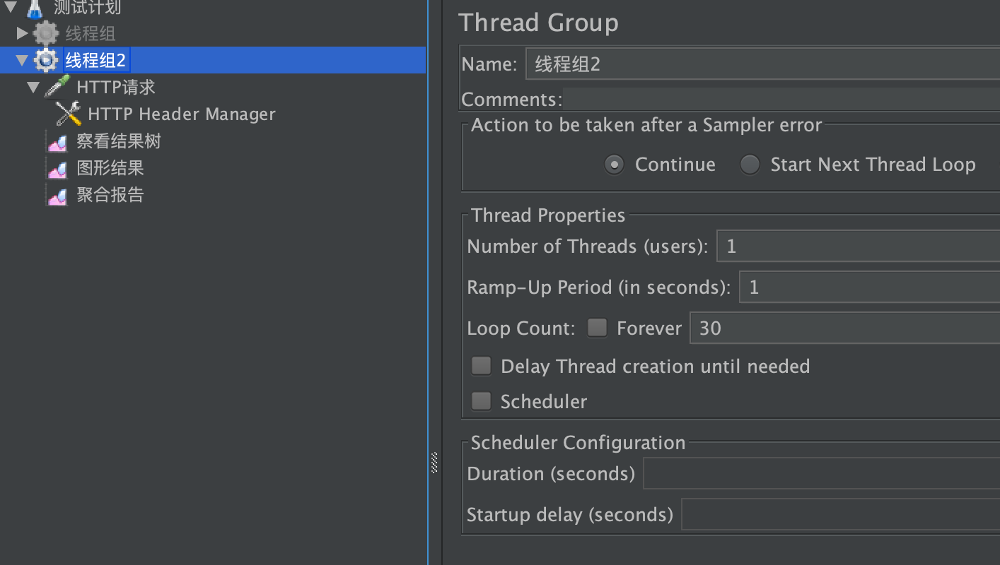
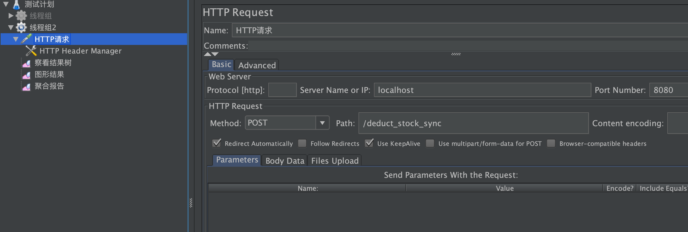
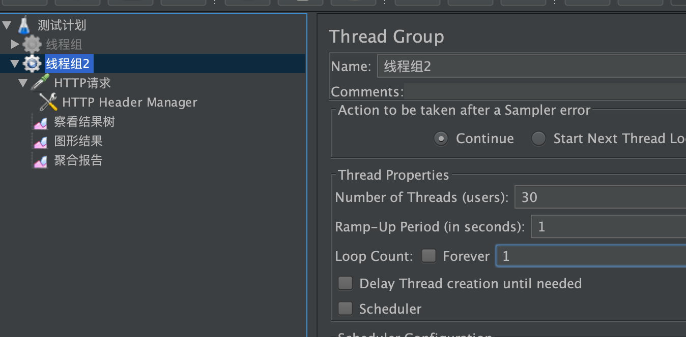

[TOC]

# 分布式锁

## 什么是分布式锁？

锁：共享资源；共享资源互斥的；多任务环境
分布式锁：如果多任务是多个JVM进程，需要一个外部锁，而不是JDK提供的锁

在分布式的部署环境下，通过锁机制来让多客户端互斥的对共享资源进行访问

* 排它性：在同一时间只会有一个客户端能获取到锁，其它客户端无法同时获取

* 避免死锁：这把锁在一段有限的时间之后，一定会被释放（正常释放或异常释放）

* 高可用：获取或释放锁的机制必须高可用且性能佳

## 分布式锁的实现方式

### 基于数据库(mysql)实现

新建一个锁表

```java
CREATE TABLE `methodLock` (
`id` int(11) NOT NULL AUTO_INCREMENT COMMENT '主键',  
`method_name` varchar(64) NOT NULL DEFAULT '' COMMENT '锁定的方法名',
`desc` varchar(1024) NOT NULL DEFAULT '备注信息',  
`update_time` timestamp NOT NULL DEFAULT CURRENT_TIMESTAMP ON UPDATE CURRENT_TIMESTAMP COMMENT '保存数据时间，自动生成',  
PRIMARY KEY (`id`),  
UNIQUE KEY `uidx_method_name` (`method_name `) USING BTREE ) ENGINE=InnoDB DEFAULT CHARSET=utf8 COMMENT='锁定中的方法';
```

1. insert, delete(method_name有唯一约束)

缺点：
    * 数据库单点会导致业务不可用
    * 锁没有失效时间：一旦解锁操作失败，就会导致锁记录一直在数据库中，其它线程无法再获得到锁。
    * 非重入锁：同一个线程在没有释放锁之前无法再次获得该锁。因为数据中数据已经存在记录了
    * 非公平锁

2. 通过数据库的`排他锁`来实现

在查询语句后面增加`for update`(表锁，行锁)，数据库会在查询过程中给数据库表增加`排它锁`。当某条记录被加上排他锁之后，其它线程无法再在该行记录上增加`排它锁`。可以认为获得排它锁的线程即可获得分布式锁，当获取到锁之后，可以执行方法的业务逻辑，执行完方法之后，再通过connection.commit()操作来释放锁

```java
public boolean lock(){
    connection.setAutoCommit(false)
    while (true) {
        try {
            result = select * from methodLock where method_name=xxx for update;
            if (result == null) {
                return true;
            } 
        } catch (Exception e) {
        }
        sleep(1000);
    }
    return false;
}

public void unlock(){
    connection.commit();
}
```

### 基于缓存(redis)

#### 多实例并发访问问题演示

##### 项目代码(使用redis)

见项目pr：<a href="https://github.com/doctording/springboot_gradle_demos/pull/2">https://github.com/doctording/springboot_gradle_demos/pull/2</a>

* Springboot项目启动两个实例(即有两个JVM进程)

```java
curl -X POST \
  http://localhost:8088/deduct_stock_sync \
  -H 'Content-Type: application/json'

curl -X POST \
  http://localhost:8089/deduct_stock_sync \
  -H 'Content-Type: application/json'
```


##### 配置nginx.conf

```java
http {
    include       mime.types;
    default_type  application/octet-stream;

    #log_format  main  '$remote_addr - $remote_user [$time_local] "$request" '
    #                  '$status $body_bytes_sent "$http_referer" '
    #                  '"$http_user_agent" "$http_x_forwarded_for"';

    #access_log  logs/access.log  main;

    sendfile        on;
    #tcp_nopush     on;

    #keepalive_timeout  0;
    keepalive_timeout  65;

    #gzip  on;
    upstream redislock{
		server localhost:8088 weight=1;
		server localhost:8089 weight=1;
	}

    server {
        listen       8080;
        server_name  localhost;

        #charset koi8-r;

        #access_log  logs/host.access.log  main;

        location / {
            root   html;
            index  index.html index.htm;
			proxy_pass  http://redislock;
        }
    }
}
```

* nginx启动和关闭命令

```java
mubi@mubideMacBook-Pro nginx $ sudo nginx
mubi@mubideMacBook-Pro nginx $ ps -ef | grep nginx
    0 47802     1   0  1:18下午 ??         0:00.00 nginx: master process nginx
   -2 47803 47802   0  1:18下午 ??         0:00.00 nginx: worker process
  501 47835 20264   0  1:18下午 ttys001    0:00.00 grep --color=always nginx
mubi@mubideMacBook-Pro nginx $
```

```java
sudo nginx -s stop
```

* 访问测试

```java
curl -X POST \
  http://localhost:8080/deduct_stock_sync \
  -H 'Content-Type: application/json'
```

##### jmeter压测复现问题

* redis 设置 stock 为 100


###### 并发是1，即不产生并发问题



redis get结果会是最终的`70`

###### 并发30测试,产生并发问题(虽然单实例是`synchronized`)






* 并发30访问测试结果：并不是最后的`70`


#### redis 分布式锁：setnx实现


* 30的并发失败率是60%，即只有12个成功的，最后redis的stock值是88符合预期

可以看到大部分没有抢到redis锁，而返回了系统繁忙错误


问题：

1. 超时时间是个问题：业务时常不确定
2. 其它线程可能删除别的线程的锁


* 改进1

```java
@PostMapping(value = "/deduct_stock_lock")
public String deductStockLock() throws Exception {
    // setnx，redis单线程
    String lockKey = "lockKey";
    String clientId = UUID.randomUUID().toString();
    // 如下两句要原子操作
//        Boolean setOk = stringRedisTemplate.opsForValue().setIfAbsent(lockKey, lockVal);
//        stringRedisTemplate.expire(lockKey, 10 , TimeUnit.SECONDS); // 设置过期时间
    Boolean setOk = stringRedisTemplate.opsForValue().setIfAbsent(lockKey, clientId, 10, TimeUnit.SECONDS);
    if (!setOk) {
        throw new Exception("业务繁忙，请稍后再试");
    }

    String retVal;
    try {
        // 只有一个线程能执行成功,可能有业务异常抛出来，可能宕机等等；但无论如何要释放锁
        retVal = stockReduce();
    } finally {
        // 可能失败
        if (clientId.equals(stringRedisTemplate.opsForValue().get(lockKey))) {
            stringRedisTemplate.delete(lockKey);
        }
    }
    return retVal;
}
```

* 超时不够，不断的定时设置，给锁续命

开启线程，每隔一段时间，判断锁还在不在，然后重新设置过期时间

#### Redisson

##### 代码&测试

```java
@Bean
public Redisson redisson(){
    Config config = new Config();
    config.useSingleServer().setAddress("redis://localhost:6379").setDatabase(0);
    return (Redisson)Redisson.create(config);
}
```

```java
@Autowired
private Redisson redisson;

@PostMapping(value = "/deduct_stock_redisson")
public String deductStockRedisson() throws Exception {
    String lockKey = "lockKey";
    RLock rLock = redisson.getLock(lockKey);
    String retVal;
    try {
        rLock.lock();
        // 只有一个线程能执行成功,可能有业务异常抛出来，可能宕机等等；但无论如何要释放锁
        retVal = stockReduce();
    } finally {
        rLock.unlock();
    }
    return retVal;
}
```


##### 底层原理


* setnx的设置key与过期时间用脚本实现原子操作
* key设置成功默认30s，则有后台线程每10秒(1/3的原始过期时间定时检查)检查判断，延长过期时间
* 未获取到锁的线程会自旋，知道获取到锁的其它线程的释放

###### redis主从架构问题？

补充知识：redis单机qps支持：10w级别

redis主从架构是主同步到从，如果`主`设置key成功，但是同步到`从`还没结束，就挂了；这样`从`成为主，但是是没有key存在的，那么另一个线程又能够加锁成功。（<font color='red'>redis主从架构锁失效问题？</font>）

redis无法保证强一致性？zookeeper解决，但是zk性能不如redis

###### Redlock


* 加锁失败的回滚
* redis加锁多，性能受影响

###### 高并发分布式锁如何实现

* 分段锁思想

### 基于ZooKeeper实现
