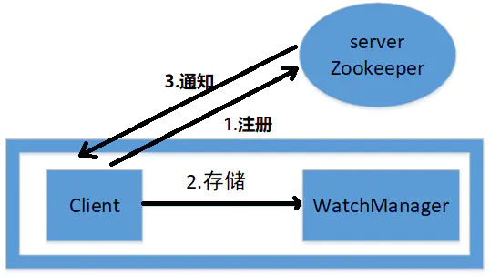
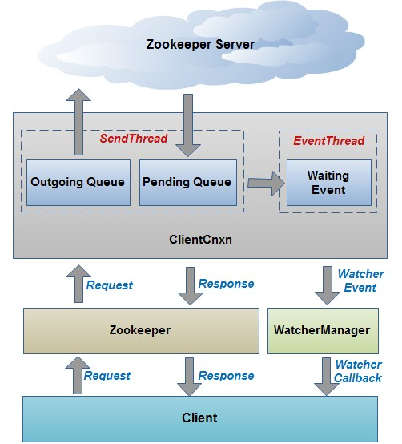
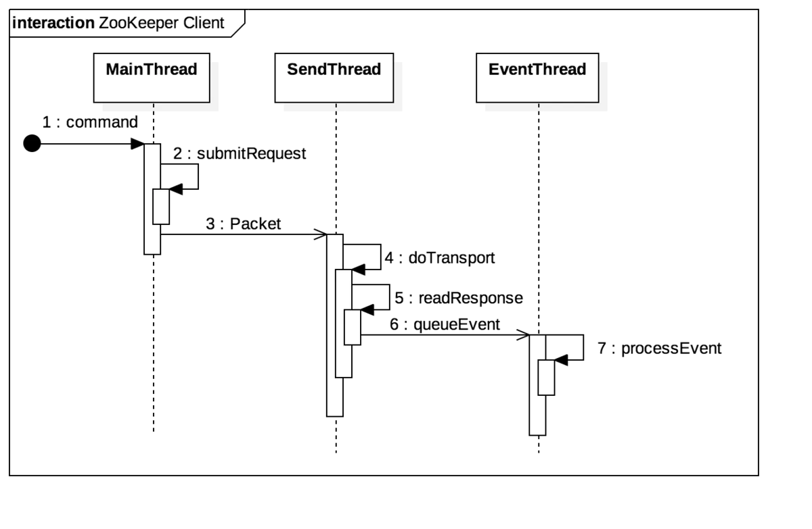

[TOC]

# Zookeeper

<a href='https://blog.csdn.net/qq_26437925/category_9176864.html'>zk blog笔记</a>

## 谈谈对zookeeper的认识？

文件系统 + 通知机制

* 可以看成是一个数据库（可以增删改查数据,能存储数据）
* 可以看成是一个文件系统（有类似文件系统的目录树结构）
* 是一个分布式的数据库，可以解决数据一致性问题(zk集群的主从同步，数据一致性的保证)
* 具有发布/订阅功能的分布式数据库(节点watch机制)

## Zookeeper 都有哪些功能？

* 集群管理：监控节点存活状态、运行请求等；

* 主节点选举：主节点挂掉了之后可以从备用的节点开始新一轮选主，主节点选举说的就是这个选举的过程，使用 Zookeeper 可以协助完成这个过程；

* 分布式锁：Zookeeper 提供两种锁：独占锁、共享锁。独占锁即一次只能有一个线程使用资源，共享锁是读锁共享，读写互斥，即可以有多线线程同时读同一个资源，如果要使用写锁也只能有一个线程使用。Zookeeper 可以对分布式锁进行控制

* 命名服务：在分布式系统中，通过使用命名服务，客户端应用能够根据指定名字来获取资源或服务的地址，提供者等信息

## 谈下你对 ZAB 协议的了解？

Zab协议(ZooKeeper Atomic Broadcast protocol)

ZAB 协议是为分布式协调服务 Zookeeper 专门设计的一种支持崩溃恢复的原子广播协议。ZAB 协议包括两种基本的模式：**崩溃恢复**和**消息广播**

当整个 Zookeeper 集群刚刚启动或者Leader服务器宕机、重启或者网络故障导致不存在过半的服务器与 Leader 服务器保持正常通信时，所有服务器进入**崩溃恢复模式**，首先选举产生新的 Leader 服务器，然后集群中 Follower 服务器开始与新的 Leader 服务器进行数据同步；当集群中超过半数机器与该 Leader 服务器完成数据同步之后，退出恢复模式进入**消息广播模式**，Leader 服务器开始接收客户端的事务请求生成事物提案来进行事务请求处理

## 强一致性、弱一致性、最终一致性？

一致性（Consistency）是指多副本（Replications）问题中的数据一致性。可以分为强一致性、顺序一致性与弱一致性。

* 强一致性（Strict Consistency）

要求：
    * 任何一次读都能读到某个数据的最近一次写的数据
    * 系统中的所有进程，看到的操作顺序，都和全局时钟下的顺序一致

* 最终一致性

不保证在任意时刻任意节点上的同一份数据都是相同的，但是随着时间的迁移，不同节点上的同一份数据总是在向趋同的方向变化。
简单说，就是在一段时间后，节点间的数据会最终达到一致状态。

* 弱一致性

数据更新后，如果能容忍后续的访问只能访问到部分或者全部访问不到，则是弱一致性

最终一致性就属于弱一致性

## zk节点的几种类型？

* PERSISTENT-持久节点

除非手动删除，否则节点一直存在于 Zookeeper 上

* EPHEMERAL-临时节点

临时节点的生命周期与客户端会话绑定，一旦客户端会话失效（客户端与zookeeper 连接断开不一定会话失效），那么这个客户端创建的所有临时节点都会被移除。

* PERSISTENT_SEQUENTIAL-持久顺序节点

基本特性同持久节点，只是增加了顺序属性，节点名后边会追加一个由父节点维护的自增整型数字。

* EPHEMERAL_SEQUENTIAL-临时顺序节点

基本特性同临时节点，增加了顺序属性，节点名后边会追加一个由父节点维护的自增整型数字。

## 节点操作与产生的事件

ZooKeeper的Java API中，可以通过`getData()`方法、`Exists()`方法、`getChildren()`方法来绑定监听事件，凡是所有的事务型的操作(增、删、改)，都会触发到监听事件

```java
None(-1),   客户端连接状态发生变化的时候，会收到None的事件
NodeCreated(1),  创建节点的事件
NodeDeleted(2),  删除节点的事件
NodeDataChanged(3),  节点数据发生变更
NodeChildrenChanged(4);  子节点被创建、被删除，会发生事件触发
```

- | 监听父节点 | 监听子节点
-|-|-
create(父节点) | NodeCreated |无
delete(父节点) | NodeDeleted |无
setData(父节点) |NodeDataChanged |无
create(子节点) |NodeChildrenChanged | NodeCreated
delete(子节点) |NodeChildrenChanged |NodeDeleted
setData(子节点) |无| NodeDataChanged

## 通知(Watch)机制原理？



* zk客户端向zk服务器注册watcher的同时，会将watcher对象存储在客户端的watchManager。

* zk服务器触发watcher事件后，会向客户端发送通知，客户端线程从watchManager中回调watcher执行相应的功能。

### 回到zk的架构



当创建一个Zookeeper实例的时候，会有两个线程被创建：`SendThread`和`EventThread`。所以当我们使用ZK Client端的时候应该尽量只创建一个Zookeeper实例并反复使用。大量的创建销毁Zookeeper实例不仅会反复的创建和销毁线程，而且会在Server端创建大量的Session。


其中`SendThread`是真正处理网络IO的线程，所有通过网络发送和接受的数据包都在这个线程中处理,线程的主体是一个while循环;SendThread 负责将ZooKeeper的请求信息封装成一个Packet，发送给 Server ,并维持同Server的心跳;`EventThread`负责解析通过通过SendThread得到的Response，之后发送给Watcher::processEvent进行详细的事件处理

* SendThread

```java
/**
    * This class services the outgoing request queue and generates the heart
    * beats. It also spawns the ReadThread.
    */
class SendThread extends ZooKeeperThread {

     @Override
    public void run() {
        clientCnxnSocket.introduce(this, sessionId, outgoingQueue);
        clientCnxnSocket.updateNow();
        clientCnxnSocket.updateLastSendAndHeard();
        int to;
        long lastPingRwServer = Time.currentElapsedTime();
        final int MAX_SEND_PING_INTERVAL = 10000; //10 seconds
        while (state.isAlive()) {
            try {
                if (!clientCnxnSocket.isConnected()) {
                    // don't re-establish connection if we are closing
                    if (closing) {
                        break;
                    }
                    startConnect();
                    clientCnxnSocket.updateLastSendAndHeard();
                }

                if (state.isConnected()) {
                    // determine whether we need to send an AuthFailed event.
                    if (zooKeeperSaslClient != null) {
                        boolean sendAuthEvent = false;
                        if (zooKeeperSaslClient.getSaslState() == ZooKeeperSaslClient.SaslState.INITIAL) {
                            try {
                                zooKeeperSaslClient.initialize(ClientCnxn.this);
                            } catch (SaslException e) {
                                LOG.error("SASL authentication with Zookeeper Quorum member failed: " + e);
                                state = States.AUTH_FAILED;
                                sendAuthEvent = true;
                            }
                        }
                        KeeperState authState = zooKeeperSaslClient.getKeeperState();
                        if (authState != null) {
                            if (authState == KeeperState.AuthFailed) {
                                // An authentication error occurred during authentication with the Zookeeper Server.
                                state = States.AUTH_FAILED;
                                sendAuthEvent = true;
                            } else {
                                if (authState == KeeperState.SaslAuthenticated) {
                                    sendAuthEvent = true;
                                }
                            }
                        }

                        if (sendAuthEvent == true) {
                            eventThread.queueEvent(new WatchedEvent(
                                    Watcher.Event.EventType.None,
                                    authState,null));
                        }
                    }
                    to = readTimeout - clientCnxnSocket.getIdleRecv();
                } else {
                    to = connectTimeout - clientCnxnSocket.getIdleRecv();
                }
                
                if (to <= 0) {
                    String warnInfo;
                    warnInfo = "Client session timed out, have not heard from server in "
                        + clientCnxnSocket.getIdleRecv()
                        + "ms"
                        + " for sessionid 0x"
                        + Long.toHexString(sessionId);
                    LOG.warn(warnInfo);
                    throw new SessionTimeoutException(warnInfo);
                }
                if (state.isConnected()) {
                    //1000(1 second) is to prevent race condition missing to send the second ping
                    //also make sure not to send too many pings when readTimeout is small 
                    int timeToNextPing = readTimeout / 2 - clientCnxnSocket.getIdleSend() - 
                            ((clientCnxnSocket.getIdleSend() > 1000) ? 1000 : 0);
                    //send a ping request either time is due or no packet sent out within MAX_SEND_PING_INTERVAL
                    if (timeToNextPing <= 0 || clientCnxnSocket.getIdleSend() > MAX_SEND_PING_INTERVAL) {
                        sendPing();
                        clientCnxnSocket.updateLastSend();
                    } else {
                        if (timeToNextPing < to) {
                            to = timeToNextPing;
                        }
                    }
                }

                // If we are in read-only mode, seek for read/write server
                if (state == States.CONNECTEDREADONLY) {
                    long now = Time.currentElapsedTime();
                    int idlePingRwServer = (int) (now - lastPingRwServer);
                    if (idlePingRwServer >= pingRwTimeout) {
                        lastPingRwServer = now;
                        idlePingRwServer = 0;
                        pingRwTimeout =
                            Math.min(2*pingRwTimeout, maxPingRwTimeout);
                        pingRwServer();
                    }
                    to = Math.min(to, pingRwTimeout - idlePingRwServer);
                }

                clientCnxnSocket.doTransport(to, pendingQueue, ClientCnxn.this);
            } catch (Throwable e) {
                if (closing) {
                    if (LOG.isDebugEnabled()) {
                        // closing so this is expected
                        LOG.debug("An exception was thrown while closing send thread for session 0x"
                                + Long.toHexString(getSessionId())
                                + " : " + e.getMessage());
                    }
                    break;
                } else {
                    // this is ugly, you have a better way speak up
                    if (e instanceof SessionExpiredException) {
                        LOG.info(e.getMessage() + ", closing socket connection");
                    } else if (e instanceof SessionTimeoutException) {
                        LOG.info(e.getMessage() + RETRY_CONN_MSG);
                    } else if (e instanceof EndOfStreamException) {
                        LOG.info(e.getMessage() + RETRY_CONN_MSG);
                    } else if (e instanceof RWServerFoundException) {
                        LOG.info(e.getMessage());
                    } else {
                        LOG.warn(
                                "Session 0x"
                                        + Long.toHexString(getSessionId())
                                        + " for server "
                                        + clientCnxnSocket.getRemoteSocketAddress()
                                        + ", unexpected error"
                                        + RETRY_CONN_MSG, e);
                    }
                    // At this point, there might still be new packets appended to outgoingQueue.
                    // they will be handled in next connection or cleared up if closed.
                    cleanup();
                    if (state.isAlive()) {
                        eventThread.queueEvent(new WatchedEvent(
                                Event.EventType.None,
                                Event.KeeperState.Disconnected,
                                null));
                    }
                    clientCnxnSocket.updateNow();
                    clientCnxnSocket.updateLastSendAndHeard();
                }
            }
        }
        synchronized (state) {
            // When it comes to this point, it guarantees that later queued
            // packet to outgoingQueue will be notified of death.
            cleanup();
        }
        clientCnxnSocket.close();
        if (state.isAlive()) {
            eventThread.queueEvent(new WatchedEvent(Event.EventType.None,
                    Event.KeeperState.Disconnected, null));
        }
        ZooTrace.logTraceMessage(LOG, ZooTrace.getTextTraceLevel(),
                "SendThread exited loop for session: 0x"
                        + Long.toHexString(getSessionId()));
    }
```



* EnvetThread

EventThread通过processEvent对队列中的事件进行消费，并分发给不同的Watcher

```java
class EventThread extends ZooKeeperThread {
    private final LinkedBlockingQueue<Object> waitingEvents =
        new LinkedBlockingQueue<Object>();

    /** This is really the queued session state until the event
        * thread actually processes the event and hands it to the watcher.
        * But for all intents and purposes this is the state.
        */
    private volatile KeeperState sessionState = KeeperState.Disconnected;

    private volatile boolean wasKilled = false;
    private volatile boolean isRunning = false;

    EventThread() {
        super(makeThreadName("-EventThread"));
        setDaemon(true);
    }

    @Override
    public void run() {
        try {
            isRunning = true;
            while (true) {
                Object event = waitingEvents.take();
                if (event == eventOfDeath) {
                    wasKilled = true;
                } else {
                    processEvent(event);
                }
                if (wasKilled)
                    synchronized (waitingEvents) {
                        if (waitingEvents.isEmpty()) {
                            isRunning = false;
                            break;
                        }
                    }
            }
        } catch (InterruptedException e) {
            LOG.error("Event thread exiting due to interruption", e);
        }

        LOG.info("EventThread shut down for session: 0x{}",
                    Long.toHexString(getSessionId()));
    }
```

### Watcher 具有以下几个特性

* 一次性

无论是服务端还是客户端，一旦一个 Watcher 被触发，ZooKeeper 都会将其从相应的存储中移除。因此，在 Watcher 的使用上，需要反复注册。这样的设计有效地减轻了服务端的压力。

* 客户端串行执行

客户端 Watcher 回调的过程是一个串行同步的过程，这为我们保证了顺序，同时，需要注意的一点是，一定不能因为一个 Watcher 的处理逻辑影响了整个客户端的 Watcher 回调，所以，我觉得客户端 Watcher 的实现类要另开一个线程进行处理业务逻辑，以便给其他的 Watcher 调用让出时间。

* 轻量

WatcherEvent 是 ZooKeeper 整个 Watcher 通知机制的最小通知单元，这个数据结构中只包含三部分内容：`通知状态`、`事件类型`和`节点路径`。也就是说，Watcher 通知非常简单，只会告诉客户端发生了事件，而不会说明事件的具体内容。例如针对 NodeDataChanged 事件，ZooKeeper 的Watcher 只会通知客户端指定数据节点的数据内容发生了变更，而对于原始数据以及变更后的新数据都无法从这个事件中直接获取到，而是需要客户端主动重新去获取数据——这也是 ZooKeeper 的 Watcher 机制的一个非常重要的特性。
