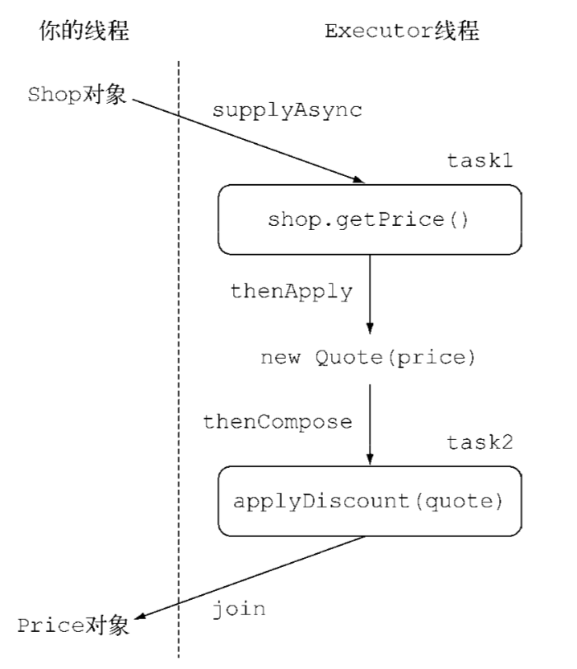
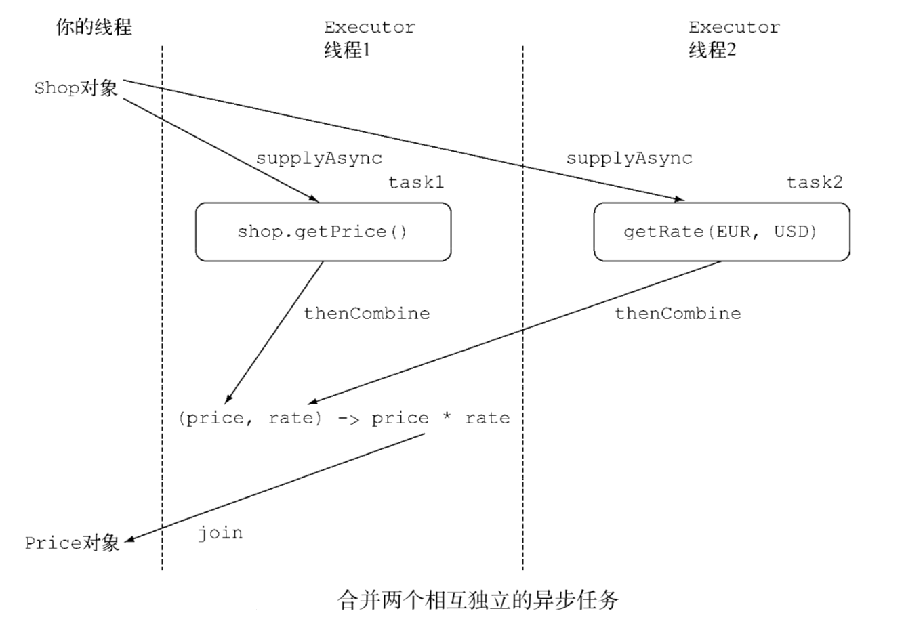

[TOC]

# Future 接口

Future接口在Java 5中被引入，设计初衷是对将来某个时刻会发生的结果进行建模。它建模了一种异步计算，返回一个执行运算结果的引用，当运算结束后，这个引用被返回给调用方。在Future中触发那些潜在耗时的操作把调用线程解放出来，让它能继续执行其他有价值的工作， 不再需要呆呆等待耗时的操作完成。打个比方，你可以把它想象成这样的场景:你拿了一袋子衣服到你中意的干洗店去洗。干洗店的员工会给你张发票，告诉你什么时候你的衣服会洗好(这就是一个Future事件)。衣服干洗的同时，你可以去做其他的事情。

## 同步API 与 异步API

`同步API`其实只是对传统方法调用的另一种称呼:你调用了某个方法，调用方在被调用方运行的过程中会等待，被调用方运行结束返回，调用方取得被调用方的返回值并继续运行。即使调用方和被调用方在不同的线程中运行，调用方还是需要等待被调用方结束运行，这就是`阻塞式调用`这个名词的由来。

与此相反，`异步API`会直接返回，或者至少在被调用方计算完成之前，将它剩余的计算任务给另一个线程去做，该线程和调用方是异步的——这就是`非阻塞调用`的由来。执行剩余计算任务的线程会将它的计算结果返回给调用方。返回的方式要么是通过过`回调函数`，要么是由调用方再次执行一个"等待，直到计算完成"的方法调用。这种方式的计算在I/O系统程序设计中非常常见:你发起了一次磁盘访问，这次访问和你的其它计算操作是异步的，你完成其它的任务时，磁盘块的数据可能还没载入到内存，你只需要等待数据的载入完成。

### 实际例子

```java
class Shop {

    /**
     * 模拟1秒中延迟的方法
     */
    public static void delay() {
        try {
            Thread.sleep(1000L);
        } catch (InterruptedException e) {
            throw new RuntimeException(e);
        }
    }

    private double calculatePrice(String product) {
        delay();
        Random random = new Random();
        return random.nextDouble() * product.charAt(0) + product.charAt(1);
    }

    /**
     * 同步API
     * @param product
     * @return
     */
    public double getPrice(String product) {
        return calculatePrice(product);
    }

    /**
     * 异步API
     * @param product
     * @return
     */
    public Future<Double> getPriceAsync(String product) {
        CompletableFuture<Double> futurePrice = new CompletableFuture<>();
        new Thread( () -> {
            double price = calculatePrice(product);
            futurePrice.complete(price);
        }).start();
        return futurePrice;
    }

    public void doSomethingElse(){

    }
}

public class MainTest {

    public static void main(String[] args) {
        Shop shop = new Shop();
        long start = System.nanoTime();
        double price = shop.getPrice("apple");
        System.out.printf("Price is %.2f%n", price);
        long duration = (System.nanoTime() - start) / 1_000_000;
        System.out.println(duration + " msecs");

        System.out.println("======================");
        start = System.nanoTime();
        //  查询商店,试图取􏷄得商品的价格
        Future<Double> futurePrice = shop.getPriceAsync("apple");
        long invocationTime = ((System.nanoTime() - start) / 1_000_000);
        System.out.println("Invocation returned after " + invocationTime + " msecs");

        // 执行更多任务，比如查询其他商店
        shop.doSomethingElse();
        // 在计算商品价格的同时
        try {
            // 通过该对象可以在将来的某个时刻取得的价格
            // 执行了这个操作后，要么获得Future中封装的值(如果异步任务已经完成)，
            // 要么发生阻塞，直到该异步任务完成，期望的值能够访问。
            price = futurePrice.get();
            System.out.printf("Price is %.2f%n", price);
        } catch (Exception e) {
            throw new RuntimeException(e);
        }
        long retrievalTime = ((System.nanoTime() - start) / 1_000_000);
        System.out.println("Price returned after " + retrievalTime + " msecs");
    }
}
```

* output

```java
Price is 126.26
1024 msecs
======================
Invocation returned after 64 msecs
Price is 190.31
Price returned after 1065 msecs
```

### 错误处理

如果价格计算过程中产生了错误会怎样呢？

用于提示错误的异常会被限制在试图计算商品价格的当前线程的范围内，最终会杀死该线程，而这会导致等待get方法返回结果的客户端永久地被阻塞。

### 使用工厂方法supplyAsync创建CompletableFuture

```java

class Shop {

    /**
     * 模拟1秒中延迟的方法
     */
    public static void delay() {
        try {
            Thread.sleep(1000L);
        } catch (InterruptedException e) {
            throw new RuntimeException(e);
        }
    }

    private double calculatePrice(String product) {
        delay();
        throw new RuntimeException(product + " not available");
//        Random random = new Random();
//        return random.nextDouble() * product.charAt(0) + product.charAt(1);
    }

    /**
     * 同步API
     * @param product
     * @return
     */
    public double getPrice(String product) {
        return calculatePrice(product);
    }

    /**
     * 异步API
     * @param product
     * @return
     */
    public Future<Double> getPriceAsync(String product) {
        CompletableFuture<Double> futurePrice = new CompletableFuture<>();
        new Thread( () -> {
            try {
                double price = calculatePrice(product);
                futurePrice.complete(price);
            }catch (Exception ex){
                futurePrice.completeExceptionally(ex);
            }
        }).start();
        return futurePrice;
//         return CompletableFuture.supplyAsync(() -> calculatePrice(product));
    }

    public void doSomethingElse(){
        System.out.println("查询其他商店...");
    }

}

public class MainTest {

    public static void main(String[] args) {
        Shop shop = new Shop();
        long start = System.nanoTime();
        double price = 0.0f;
//        double price = shop.getPrice("apple");
//        System.out.printf("Price is %.2f%n", price);
//        long duration = (System.nanoTime() - start) / 1_000_000;
//        System.out.println(duration + " msecs");

        System.out.println("======================");
        start = System.nanoTime();
        System.out.println("查询商店,试图取得商品的价格");
        Future<Double> futurePrice = shop.getPriceAsync("apple");
        long invocationTime = ((System.nanoTime() - start) / 1_000_000);
        System.out.println("Invocation returned after " + invocationTime + " msecs");

        // 执行更多任务，比如查询其他商店
        shop.doSomethingElse();
        // 在计算商品价格的同时
        try {
            // 通过该对象􏳬􏰆可以在将来的某个时刻取得􏵑􏻌的价格
            // 执行了这个操作后，􏳬􏰆要么获得Future中封装的值(如果异步任务已经完成)，
            // 要么发生阻塞，直到该异步任务完成，期望􏰐􏳝的值能够访问。
            price = futurePrice.get();
            System.out.printf("Price is %.2f%n", price);
        } catch (Exception e) {
            throw new RuntimeException(e);
        }
        long retrievalTime = ((System.nanoTime() - start) / 1_000_000);
        System.out.println("Price returned after " + retrievalTime + " msecs");
    }
}
```

以异步的方式查询多个商店，避免被单一的请求所阻塞，并由此提升你的"最佳价格查询器"的性能和吞吐量。

### 让代码免受阻塞之苦

#### 顺序查询各个商店的某个商品的价格

```java

class Shop {

    private String name;

    public Shop(String name) {
        this.name = name;
    }

    public String getName() {
        return name;
    }

    /**
     * 模拟1秒中延迟的方法
     */
    public static void delay() {
        try {
            Thread.sleep(1000L);
        } catch (InterruptedException e) {
            throw new RuntimeException(e);
        }
    }

    private double calculatePrice(String product) {
        delay();
        Random random = new Random();
        return random.nextDouble() * product.charAt(0) + product.charAt(1);
    }

    /**
     * 同步API
     * @param product
     * @return
     */
    public double getPrice(String product) {
        return calculatePrice(product);
    }

}

public class MainTest {

    List<Shop> shops = Arrays.asList(new Shop("BestPrice"),
            new Shop("LetsSaveBig"),
            new Shop("MyFavoriteShop"),
            new Shop("BuyItAll"));

    public List<String> findPrices(String product) {
        return shops.stream()
                .map(shop -> String.format("%s price is %.2f",
                        shop.getName(), shop.getPrice(product)))
                .collect(Collectors.toList());
    }

    public static void main(String[] args) {
        MainTest mainTest = new MainTest();
        long start = System.nanoTime();
        List<String> shopPriceList = mainTest.findPrices("apple");
        shopPriceList.forEach( shopPrice -> System.out.println(shopPrice) );
        long duration = ((System.nanoTime() - start) / 1_000_000);
        System.out.println("Done in " + duration + " msecs");
    }
}
```

如预期一样，`findPrices`方法的执行时间仅比4秒多了那么些毫秒，因为对4个商店对查询是顺序进行对，并且一个查询操作会阻塞另一个，每一饿操作都要话费大约1秒左右都时间

```java
BestPrice price is 168.62
LetsSaveBig price is 159.47
MyFavoriteShop price is 187.64
BuyItAll price is 196.31
Done in 4109 msecs
```

#### 并行流操作

```java

class Shop {

    private String name;

    public Shop(String name) {
        this.name = name;
    }

    public String getName() {
        return name;
    }

    /**
     * 模拟1秒中延迟的方法
     */
    public static void delay() {
        try {
            Thread.sleep(1000L);
        } catch (InterruptedException e) {
            throw new RuntimeException(e);
        }
    }

    private double calculatePrice(String product) {
        delay();
        Random random = new Random();
        return random.nextDouble() * product.charAt(0) + product.charAt(1);
    }

    /**
     * 同步API
     * @param product
     * @return
     */
    public double getPrice(String product) {
        return calculatePrice(product);
    }

    /**
     * 异步API
     * @param product
     * @return
     */
    public Future<Double> getPriceAsync(String product) {
        CompletableFuture<Double> futurePrice = new CompletableFuture<>();
        new Thread( () -> {
            try {
                double price = calculatePrice(product);
                futurePrice.complete(price);
            }catch (Exception ex){
                futurePrice.completeExceptionally(ex);
            }
        }).start();
        return futurePrice;
//         return CompletableFuture.supplyAsync(() -> calculatePrice(product));
    }

}

public class MainTest {

    List<Shop> shops = Arrays.asList(new Shop("BestPrice"),
            new Shop("LetsSaveBig"),
            new Shop("MyFavoriteShop"),
            new Shop("BuyItAll"));

    public List<String> findPrices(String product) {
        return shops.stream()
                .map(shop -> String.format("%s price is %.2f",
                        shop.getName(), shop.getPrice(product)))
                .collect(Collectors.toList());
    }

    public List<String> parallelFindPrices(String product) {
        return shops.parallelStream()
                .map(shop -> String.format("%s price is %.2f",
                        shop.getName(), shop.getPrice(product)))
                .collect(Collectors.toList());
    }

    public static void main(String[] args) {
        MainTest mainTest = new MainTest();
        long start = System.nanoTime();
        List<String> shopPriceList = mainTest.parallelFindPrices("apple");
        shopPriceList.forEach( shopPrice -> System.out.println(shopPrice) );
        long duration = ((System.nanoTime() - start) / 1_000_000);
        System.out.println("Done in " + duration + " msecs");
    }
}
```

运行结果如下：

```java
BestPrice price is 179.70
LetsSaveBig price is 177.18
MyFavoriteShop price is 196.27
BuyItAll price is 114.68
Done in 1120 msecs
```

现在对四个不同商店的查询实现了并行，所以完成所有操作的总耗时只有1秒多一点儿？能做得更好吗?

#### 使用`CompletableFuture`: 组合式异步编程

```java
public List<CompletableFuture<String>> parallelFindPricesAnyc(String product) {
    return shops.stream()
            .map(shop -> CompletableFuture.supplyAsync(
                    () -> String.format("%s price is %.2f",
                    shop.getName(), shop.getPrice(product))))
            .collect(Collectors.toList());
}

public List<String> bestFindPrices(String product) {
    // 异步方式计算么个商店商品价格
    List<CompletableFuture<String>> priceFutures = parallelFindPricesAnyc(product);
    // 等待所有异步操作结束
    return priceFutures.stream()
            .map(CompletableFuture::join)
            .collect(Collectors.toList());

}

public static void main(String[] args) {
    MainTest mainTest = new MainTest();
    long start = System.nanoTime();
    List<String> shopPriceList = mainTest.bestFindPrices("apple");
    shopPriceList.forEach( shopPrice -> System.out.println(shopPrice) );
    long duration = ((System.nanoTime() - start) / 1_000_000);
    System.out.println("Done in " + duration + " msecs");
}
```

结果如下, 不尽人意

```java
BestPrice price is 158.86
LetsSaveBig price is 127.60
MyFavoriteShop price is 119.70
BuyItAll price is 128.21
Done in 2110 msecs
```

并行流版本执行的很好，因为它几乎能为4个任务都分配一个线程，并行执行任务

#### 当把shops增加到5个,9个

* 并行流运行结果如下

```java
BestPrice price is 114.81
LetsSaveBig price is 159.87
MyFavoriteShop price is 193.59
BuyItAll price is 123.66
five price is 139.15
Done in 2118 msecs
```

* CompletableFuture版本

```java
BestPrice price is 173.66
LetsSaveBig price is 186.67
MyFavoriteShop price is 207.36
BuyItAll price is 137.48
five price is 120.48
Done in 2009 msecs
```

CompletableFuture版本的程序似乎比并行流版本的程序还快那么一点儿。但是最后这个版本也不太令人满意。比如，如果你试图让你的代码处理9个商店，并行流版本耗时3143毫秒， 而CompletableFuture版本􏹱时3009毫秒。它们看起来不相伯仲，究其原因都一样:

它们内部采用的是同样的通用线程池，默认都使用固定数目的线程，具体线程数取决于`Runtime. getRuntime().availableProcessors()`的返回值(即CPU核心数)。然而，`CompletableFuture`具有一定的优势，因为它允许你对执行器(Executor)进行配置，尤其是线程池的大小，让它以更适合应用需求的方式进行配置，满足程序的要求，而这是并行流API无法提供的。让我们看看你怎样利用这种配置上的灵活性带来实际应用程序性能上的提升。

#### 使用定制的执行器

创建一个配有线程池的执行器，线程池中线程的数目取决于你预计你的应用需要处理的负荷，但是你该如何选择合适的线程数目呢？

《Java 并发编程实战》： 如果线程池中的数量过多，最终它们会竞争稀缺的处理器和内存资源，浪费大量的时间在上下文切换上。反之，如果线程的数目过少，正如你的应用所面临的情况，处理器的一些核可能就无法充分利用。Brian Goetz建议，线程池大小与处理器的利用率之比可以使用下面的公式进行估算：

```bash
线程池数目 = CPU核心数 * 期望的CPU利用率(介于0和1之间) *（1 + 等待时间和计算时间的比率）
```

```java
List<Shop> shops = Arrays.asList(new Shop("BestPrice"),
        new Shop("LetsSaveBig"),
        new Shop("MyFavoriteShop"),
        new Shop("BuyItAll"),
        new Shop("five"),
        new Shop("six"),
        new Shop("seven"),
        new Shop("eight"),
        new Shop("nine")
);

/**
 *  创建了一个由`守护线程`构成的线程池
 */
private final Executor executor = Executors.newFixedThreadPool(Math.min(shops.size(), 100)
        , new ThreadFactory() {
            @Override
            public Thread newThread(Runnable r) {
                Thread t = new Thread(r);
                t.setDaemon(true);
                return t;
            }
        });


public List<CompletableFuture<String>> parallelFindPricesAsync(String product) {
    // supplyAsync工􏱣方法 指定线程池
    return shops.stream()
            .map(shop -> CompletableFuture.supplyAsync(
                    () -> String.format("%s price is %.2f",
                    shop.getName(), shop.getPrice(product)), executor))
            .collect(Collectors.toList());
}

public static void testCompletableFuture(){
    MainTest mainTest = new MainTest();
    long start = System.nanoTime();
    List<String> shopPriceList = mainTest.bestFindPrices("apple");
    shopPriceList.forEach( shopPrice -> System.out.println(shopPrice) );
    long duration = ((System.nanoTime() - start) / 1_000_000);
    System.out.println("Done in " + duration + " msecs");
}
```

改进之后，使`CompletableFuture`方案的程序处理5个商店仅需要1021毫秒，处理9个商店耗时1022毫秒。一般而言，这种状态态会一直持续，直到商店的数目达到我们之前计算的阈值400。这个例子说明了`要创建更适合你的应用特性的执行器`，利用CompletableFutures向其提交任务执行是个不错的主意。处理需大量使用异步操作的情况时，这几乎是最有效的策略。

#### 并行 -- 使用`流`还是`CompletableFutures` ?

目前为止，你已经集合对集合进行并行计算有两种方式:要么将其转化为并行流，利用map这样的操作展开工作，要么枚举出集合中的每一个元素，创建新的线程，在CompletableFuture内对其进行操作。后者提供了更多的灵活性，你可以调整线程池的大小，而这能帮助你确保整体的计算不会因为线程都在等待I/O而发生阻塞。

建议：

对于计算密集型操作，并且没有I/O，那么推荐使用Stream接口，因为实现简单，同时效率也是最高的(如果所有的线程都是计算密集型的)，那就没有必要创建比处理器和数更多的线程。

如果并行的工作单元还涉及等待I/O的操作(包括网络连接等待)，那么使用`CompletableFuture`的灵活性更好。不使用并行流另一个原因是：处理流的流水线中如果发生I/O等待，流的延迟特效会让我们很难判断到底什么时候触发了等待。

### 对多个异步任务进行流水线操作

#### Discount

```java
/**
 * 折扣服务api
 */
public class Discount {
    public enum Code {
        NONE(0), SILVER(0), GOLD(10), PLATINUM(15), DIAMOND(20);
        private final int percentage;

        Code(int percentage) {
            this.percentage = percentage;
        }
    }

    public static String applyDiscount(Quote quote) {
        return quote.getShopName() + " price is " + Discount.apply(quote.getPrice(), quote.getDiscountCode());
    }

    private static double apply(double price, Code code) {
        delay();
        return price * (100 - code.percentage) / 100;
    }

    /**
     * 模拟计算,查询数据库等耗时
     */
    public static void delay() {
        try {
            Thread.sleep(1000);
        } catch (InterruptedException e) {
            e.printStackTrace();
        }
    }
}
```

#### Quote

```java
/**
 * 商店返回消息实体,不可变对象模式 线程安全
 */
public final class Quote {
    private final String shopName;
    private final double price;
    private final Discount.Code discountCode;

    public Quote(String shopName, double price, Discount.Code discountCode) {
        this.shopName = shopName;
        this.price = price;
        this.discountCode = discountCode;
    }

    public static Quote parse(String s) {
        String[] split = s.split(":");
        String shopName = split[0];
        double price = Double.parseDouble(split[1]);
        Discount.Code discountCode = Discount.Code.valueOf(split[2]);
        return new Quote(shopName, price, discountCode);
    }

    public String getShopName() {
        return shopName;
    }

    public double getPrice() {
        return price;
    }

    public Discount.Code getDiscountCode() {
        return discountCode;
    }
}
```

#### Shop

```java
public class Shop {

    private String name;

    public Shop(String name) {
        this.name = name;
    }

    public String getName() {
        return name;
    }

    /**
     * 模拟1秒中延迟的方法
     */
    public static void delay() {
        try {
            Thread.sleep(1000L);
        } catch (InterruptedException e) {
            throw new RuntimeException(e);
        }
    }

    private double calculatePrice(String product) {
        delay();
        Random random = new Random();
        return random.nextDouble() * product.charAt(0) + product.charAt(1);
    }

    public String getPrice(String product) {
        Random random = new Random();
        double price = calculatePrice(product);
        Discount.Code code = Discount.Code.values()[
                random.nextInt(Discount.Code.values().length)];
        return String.format("%s:%.2f:%s", name, price, code);
    }

}
```

#### MainTest

```java
public class MainTest {

    List<Shop> shops = Arrays.asList(new Shop("BestPrice"),
            new Shop("LetsSaveBig"),
            new Shop("MyFavoriteShop"),
            new Shop("BuyItAll"),
            new Shop("five")
//            new Shop("six"),
//            new Shop("seven"),
//            new Shop("eight"),
//            new Shop("nine")
    );

    public List<String> findprices(String product) {
        // 1. 取出商品的原始价格 -- 耗时1秒多
        // 2. 在Quote对象中对shop返回对字符串进行转换
        // 3. 联系Discount服务，为每个Quote申请折扣 -- 耗时1秒多
        return shops.stream()
                .map(shop ->  shop.getPrice(product))
                .map(Quote::parse)
                .map(Discount::applyDiscount)
                .collect(Collectors.toList());
    }

    public static void testCompletableFuture(){
        MainTest mainTest = new MainTest();
        long start = System.nanoTime();
        List<String> shopPriceList = mainTest.findprices("apple");
        System.out.println(shopPriceList);
//        shopPriceList.forEach( shopPrice -> System.out.println(shopPrice) );
        long duration = ((System.nanoTime() - start) / 1_000_000);
        System.out.println("Done in " + duration + " msecs");
    }

    public static void main(String[] args) {
        // 5个商店，耗时大概10秒多
        testCompletableFuture();
    }
}
```

### 构造同步和异步操作

```java
/**
 *  创建了一个由`守护线程`构成的线程池
 */
private final Executor executor = Executors.newFixedThreadPool(Math.min(shops.size(), 100)
        , new ThreadFactory() {
            @Override
            public Thread newThread(Runnable r) {
                Thread t = new Thread(r);
                t.setDaemon(true);
                return t;
            }
        });


public List<String> findPricesCompletableFuture(String product) {
    // supplyAsync工方法 指定线程池
    List<CompletableFuture<String>> priceFutureList =
            shops
            .stream()
            // 异步方式取得每个shop中指定产品的原始价格
            .map(shop -> CompletableFuture.supplyAsync(
                    () -> shop.getPrice(product), executor))
            //  在Quote对象中对shop返回对字符串进行转换
            .map(future -> future.thenApply(Quote::parse))
            // 另一个异步任务构建期望的Future,申请折扣 thenCompose 将多个future组合 一个一个执行
            .map(future -> future.thenCompose(quote ->
                    CompletableFuture.supplyAsync(
                        () -> Discount.applyDiscount(quote), executor)))
            .collect(Collectors.toList());

    return priceFutureList.stream()
            // 等待流中所有的future执行完毕,并提取各自的返回值
            .map(CompletableFuture::join)
            .collect(Collectors.toList());
}


public static void testCompletableFuture(){
    MainTest mainTest = new MainTest();
    long start = System.nanoTime();
    List<String> shopPriceList = mainTest.findPricesCompletableFuture("apple");
    System.out.println(shopPriceList);
//        shopPriceList.forEach( shopPrice -> System.out.println(shopPrice) );
    long duration = ((System.nanoTime() - start) / 1_000_000);
    System.out.println("Done in " + duration + " msecs");
}

public static void main(String[] args) {
    // 异步方式只用了 2117 msecs
    testCompletableFuture();
}
```

* 执行流程图



#### 合并两个独立的CompletableFuture对象



#### 响应CompletableFuture的completion事件

```java
public Stream<CompletableFuture<String>> findPricesStream(String product) {
    return shops.stream()
                // 异步方式取得每个shop中指定产品的原始价格
                .map(shop -> CompletableFuture.supplyAsync(
                        () -> shop.getPrice(product), executor))
                //  在Quote对象中对shop返回对字符串进行转换
                .map(future -> future.thenApply(Quote::parse))
                // 另一个异步任务构建期望的Future,申请折扣 thenCompose 将多个future组合 一个一个执行
                .map(future -> future.thenCompose(quote ->
                        CompletableFuture.supplyAsync(
                                () -> Discount.applyDiscount(quote), executor)));

}


public static void testCompletableFuture(){
    MainTest mainTest = new MainTest();
    /**
     * thenAccept方法也提供 了一个异步版本，名为thenAcceptAsync。
     * 异步版本的方法会对处理结果的消费者进行调度，从线程池中选择一个新的线程继续执行，
     * 不再由同一个线程完成CompletableFuture的所有任务。
     * 因为你想要避免不必要的上下文切换，更重要的是你希望避免在等待线程上浪费时间，
     * 尽快响应CompletableFuture的completion事件，所以这里没有采用异步版本。
     */
    long start = System.nanoTime();
    CompletableFuture[] futures = mainTest.findPricesStream("myPhone27S")
            .map(f -> f.thenAccept(
                    s -> System.out.println(s + " (done in " +
                            ((System.nanoTime() - start) / 1_000_000) + " msecs)")))
            .toArray(size -> new CompletableFuture[size]);
    CompletableFuture.allOf(futures).join();
    System.out.println("All shops have now responded in "
            + ((System.nanoTime() - start) / 1_000_000) + " msecs");
}
```

### 总结

执行比较耗时的操作时，尤其是那些依赖一个或多个远程服务的操作，使用异步任务可以改善程序的性能，加快程序的响应速度。

* 你应该`尽可能地为客户提供异步API`。使用CompletableFuture类提供的特性，你能够轻松地实现这一目标。
* CompletableFuture类还提供了异常管理的机制，让你有机会抛出/管理异步任务执行
中发生的异常。
* 将同步API的调用封装到一个CompletableFuture中，你能够以异步的方式使用其结果。
* 如果异步任务之间相互独立，或者它们之间某一些的结果是另一些的输入，你可以`将这些异步任务构造或者合并成一个`。
* 你`可以为CompletableFuture注册一个回调函数`，在Future执行完毕或者它们计算的结果可用时，针对性地执行一些程序。
* 你可以决定在什么时候结束程序的运行，是等待由CompletableFuture对象构成的列表中所有的对象都执行完毕，还是只要其中任何一个首先完成就中止程序的运行。
