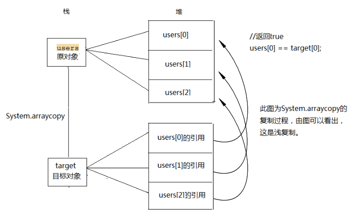

[TOC]

# System.arraycopy

使用说明：

```java
/*
* @param      src      the source array. 源数组
* @param      srcPos   starting position in the source array. 源数组要复制的起始位置
* @param      dest     the destination array. 目标数组
* @param      destPos  starting position in the destination data. 目标数组放置的起始位置；
* @param      length   the number of array elements to be copied. 要复制的长度
* @exception  IndexOutOfBoundsException  if copying would cause
*               access of data outside array bounds. dest数组大小比src数组大小小会报IndexOutOfBoundsException
* @exception  ArrayStoreException  if an element in the <code>src</code>
*               array could not be stored into the <code>dest</code> array
*               because of a type mismatch.
* @exception  NullPointerException if either <code>src</code> or
*               <code>dest</code> is <code>null</code>.
*/
public static native void arraycopy(Object src,  int  srcPos,
                                Object dest, int destPos,
                                int length);
```

## 浅拷贝：复制引用

```java
public static void testArraycopy(){
    class Obj{
        int a;
        String b;
        public Obj(){
            a=0;
            b="";
        }
        public Obj(int _a, String _b){
            a= _a;
            b=_b;
        }
    }
    int N = 3;
    Obj obj1 = new Obj(1, "a");
    Obj obj2 = new Obj(2, "b");
    Obj obj3 = new Obj(3, "c");

    Obj[] st = {obj1, obj2, obj3};
    Obj[] dt = new Obj[N];
    System.arraycopy(st, 0, dt, 0, N);

    // false
    System.out.println("两个数组地址是否相同：" + (st == dt));
    for(int i=0;i<N;i++){
        // true
        System.out.println("两个数组内容"+i+"是否相同：" + (st[i] == dt[i]));
    }

    st[0].a = 2;
    System.out.println("st[0].a = " + st[0].a);
    System.out.println("dt[0].a = " + dt[0].a);
}
/* 输出
两个数组地址是否相同：false
两个数组内容0是否相同：true
两个数组内容1是否相同：true
两个数组内容2是否相同：true
st[0].a = 2
dt[0].a = 2
*/
```

如下图：拷贝是复制一堆的引用变量到另一个数组，修改副本会影响原来到数组



### 附：深拷贝 & 浅拷贝

* 浅拷贝只是对指针的拷贝，拷贝后两个指针指向同一个内存空间；
* 深拷贝不但对指针进行拷贝，而且对指针指向的内容进行拷贝，经深拷贝后的指针是指向两个不同地址的指针。

## 对比for效率高

```java
public static void testArrayCopyOfEfficient(){
    final int N = 10000;
    String[] srcArray = new String[N];
    String[] forArray = new String[srcArray.length];
    String[] arrayCopyArray  = new String[srcArray.length];

    //初始化数组
    for(int index  = 0 ; index  < srcArray.length ; index ++){
        srcArray[index] = String.valueOf(index);
    }

    long forStartTime = System.nanoTime();
    for(int index  = 0 ; index  < srcArray.length ; index ++){
        forArray[index] = srcArray[index];
    }
    long forEndTime = System.nanoTime();
    System.out.println("for方式复制数组："  + (forEndTime - forStartTime) + "纳秒");

    long arrayCopyStartTime = System.nanoTime();
    System.arraycopy(srcArray,0,arrayCopyArray,0,srcArray.length);
    long arrayCopyEndTime = System.nanoTime();
    System.out.println("System.arraycopy复制数组："  + (arrayCopyEndTime - arrayCopyStartTime) + "纳秒");
}
```

System.arraycopy是直接对内存进行复制，而for循环需要寻址

## 非线程安全

```java
import java.util.Arrays;

/**
 * @Author mubi
 * @Date 2018/11/24 6:00 PM
 */
public class ArrayCopyThreadSafe {
    private static int[] arrayOriginal = new int[1024 * 1024 * 10];
    private static int[] arraySrc = new int[1024 * 1024 * 10];
    private static int[] arrayDist = new int[1024 * 1024 * 10];

    private void modify() {
        for (int i = 0; i < arraySrc.length; i++) {
            arraySrc[i] = i + 1;
        }
    }

    private synchronized void modify2() {
        for (int i = 0; i < arraySrc.length; i++) {
            arraySrc[i] = i + 1;
        }
    }

    private void copy() {
        System.arraycopy(arraySrc, 0, arrayDist, 0, arraySrc.length);
    }

    private synchronized void copy2() {
        System.arraycopy(arraySrc, 0, arrayDist, 0, arraySrc.length);
    }

    private void copy3() {
        synchronized (this) {
            System.arraycopy(arraySrc, 0, arrayDist, 0, arraySrc.length);
        }
    }

    private synchronized void init() {
        for (int i = 0; i < arraySrc.length; i++) {
            arrayOriginal[i] = i + 1;
            arraySrc[i] = i;
            arrayDist[i] = 0;
        }
    }

    private static void doThreadSafeCheck() throws Exception {
        ArrayCopyThreadSafe arrayCopyThreadSafe = new ArrayCopyThreadSafe();
        for (int i = 0; i < 100; i++) {
            System.out.println("run count: " + (i + 1));
            arrayCopyThreadSafe.init();

            Thread threadModify = new Thread(new Runnable() {
                @Override
                public void run() {
                    System.out.print("modify");
                    arrayCopyThreadSafe.modify2();
                }
            });

            Thread threadCopy = new Thread(new Runnable() {
                @Override
                public void run() {
                    System.out.print("copy");
                    arrayCopyThreadSafe.copy();
                }
            });

            threadModify.start();
            Thread.sleep(2);
            threadCopy.start();

            threadModify.join();
            threadCopy.join();

            if (!Arrays.equals(arrayOriginal, arrayDist)) {
                throw new RuntimeException("System.arraycopy is not thread safe");
            }
        }
    }

    public static void main(String[] args) throws Exception {
        doThreadSafeCheck();
    }
}
```

# Array.copyOf

* 直接 new 新的长度，然后调用了`System.arraycopy`

```java
 /**
     * Copies the specified array, truncating or padding with nulls (if necessary)
     * so the copy has the specified length.  For all indices that are
     * valid in both the original array and the copy, the two arrays will
     * contain identical values.  For any indices that are valid in the
     * copy but not the original, the copy will contain <tt>null</tt>.
     * Such indices will exist if and only if the specified length
     * is greater than that of the original array.
     * The resulting array is of exactly the same class as the original array.
     *
     * @param <T> the class of the objects in the array
     * @param original the array to be copied
     * @param newLength the length of the copy to be returned
     * @return a copy of the original array, truncated or padded with nulls
     *     to obtain the specified length
     * @throws NegativeArraySizeException if <tt>newLength</tt> is negative
     * @throws NullPointerException if <tt>original</tt> is null
     * @since 1.6
     */
    @SuppressWarnings("unchecked")
    public static <T> T[] copyOf(T[] original, int newLength) {
        return (T[]) copyOf(original, newLength, original.getClass());
    }
```

```java
public static <T,U> T[] copyOf(U[] original, int newLength, Class<? extends T[]> newType) {
    @SuppressWarnings("unchecked")
    T[] copy = ((Object)newType == (Object)Object[].class)
        ? (T[]) new Object[newLength]
        : (T[]) Array.newInstance(newType.getComponentType(), newLength);
    System.arraycopy(original, 0, copy, 0,
                        Math.min(original.length, newLength));
    return copy;
}
```
