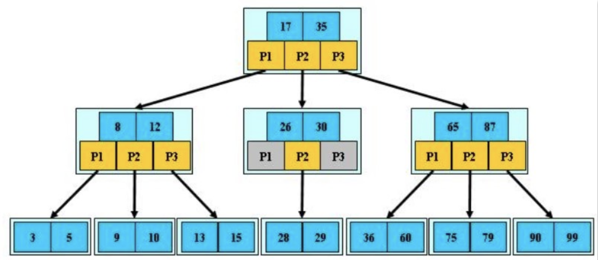
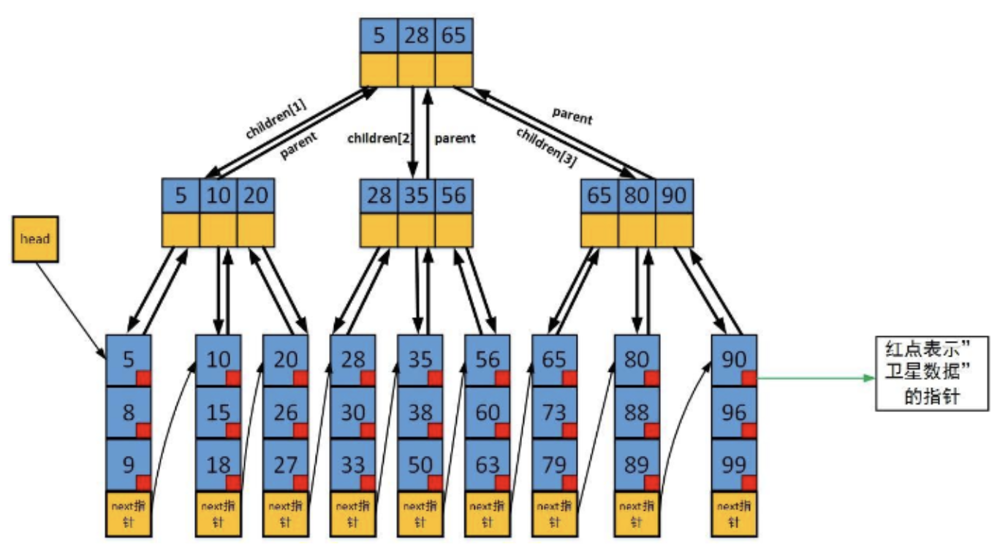

[TOC]

# B Tree(多路搜索树)

1. 关键字集合分布在整颗树中

2. 任何一个关键字出现且只出现在一个结点中

3. 搜索有可能在非叶子结点结束

4. 其搜索性能等价于在关键字全集内做一次二分查找

一棵m阶的B 树 (m叉树)的特性如下：
* 树中每个结点最多含有m个孩子（m>=2）；
* 除根结点和叶子结点外，其它每个结点至少有[ceil(m / 2)]个孩子（其中ceil(x)是一个取上限的函数）；
* 若根结点不是叶子结点，则至少有2个孩子（特殊情况：没有孩子的根结点，即根结点为叶子结点，整棵树只有一个根节点）；
* 所有叶子结点都出现在同一层，叶子结点不包含任何关键字信息(可以看做是外部接点或查询失败的接点，实际上这些结点不存在，指向这些结点的指针都为null)；
* 每个非终端结点中包含有n个关键字信息： (n，P0，K1，P1，K2，P2，......，Kn，Pn)。其中：
    * Ki (i=1...n)为关键字，且关键字按顺序升序排序K(i-1)< Ki。
    * Pi为指向子树根的接点，且指针P(i-1)指向子树种所有结点的关键字均小于Ki，但都大于K(i-1)。
    * 关键字的个数n必须满足： [ceil(m / 2)-1]<= n <= m-1。

## 磁盘相关

磁盘读取依靠的是机械运动，分为`寻道时间`、`旋转延迟`、`传输时间`三个部分，这三个部分耗时相加就是一次磁盘IO的时间，大概9ms左右。这个成本是访问内存的10w倍左右

预读: 每一次IO时，不仅仅把当前磁盘地址的数据加载到内存，同时也把相邻数据也加载到内存缓冲区中(程序局部性原理)

每次磁盘IO读取的数据我们称之为一页（page）。一页的大小与操作系统有关，一般为4k或者8k。这也就意味着读取一页内数据的时候，实际上发生了一次磁盘IO

数据库`索引`是存储在磁盘上，当表中的数据量比较大时，索引的大小也跟着增长，达到几个G甚至更多。当我们利用索引进行查询的时候，不可能把索引全部加载到内存中，只能逐一加载每个磁盘页，这里的磁盘页就对应索引树的节点

所以：**减少磁盘IO**的次数就必须要**压缩树的高度**

# B+ Tree

1. 红点表示是指向卫星数据的指针，指针指向的是存放实际数据的磁盘页，卫星数据就是数据库中一条数据记录

2. 叶子节点中还有一个指向下一个叶子节点的next指针，所以叶子节点形成了一个有序的链表，方便遍历B+树

## 对比B树

1. B+树所有数据存在叶子节点，其它节点不存储数据，只存储索引。那么同样大小的磁盘页可以容纳更多的节点元素存储索引，如此一来，相同数量的数据下，B+树就相对来说要更加**矮胖**些，磁盘IO的次数更少。

2. 由于只有叶子节点才保存真正的数据，B+树每次查询都要到叶子节点；而B树每次查询则不一样，最好的情况是根节点，最坏的情况是叶子节点，没有B+树稳定

3. 叶子节点形成有顺链表，**范围查找**性能更优

# 红黑树

**查找**，**插入**和**删除**等操作都是平均`O(logn)`时间内

从根到叶子的最长的可能路径不多于最短的可能路径的两倍长。结果是这个树大致上是平衡的。因为操作比如插入、删除和查找某个值的最坏情况时间都要求与树的高度成比例，这个在高度上的理论上限允许红黑树**在最坏情况下**都是高效的，而不同于普通的二叉查找树。

# Hash

## hash索引

哈希索引就是采用一定的哈希算法，把键值换算成新的哈希值，检索时不需要类似B+树那样从根节点到叶子节点逐级查找，只需一次哈希算法即可立刻定位到相应的位置，速度非常快

对比`B+树`:

* 如果是等值查询，那么哈希索引明显有绝对优势，因为只需要经过一次算法即可找到相应的键值；当然了，这个前提是，键值都是唯一的。如果键值不是唯一的，就需要先找到该键所在位置，然后再根据链表往后扫描，直到找到相应的数据

* 如果是**范围查询**检索，这时候哈希索引就毫无用武之地了，因为原先是有序的键值，经过哈希算法后，有可能变成不连续的了，就没办法再利用索引完成范围查询检索

* 哈希索引也没办法利用索引完成排序，以及`like ‘xxx%’`这样的部分模糊查询（这种部分模糊查询，其实本质上也是范围查询）

* 哈希索引也不支持多列联合索引的最左匹配规则

* B+树索引的关键字检索效率比较平均，不像B树那样波动幅度大，在有大量重复键值情况下，哈希索引的效率也是极低的，因为存在所谓的**哈希碰撞**问题（如：Java8 `HashMap` 拉链法后又补充了`红黑树`转换）
