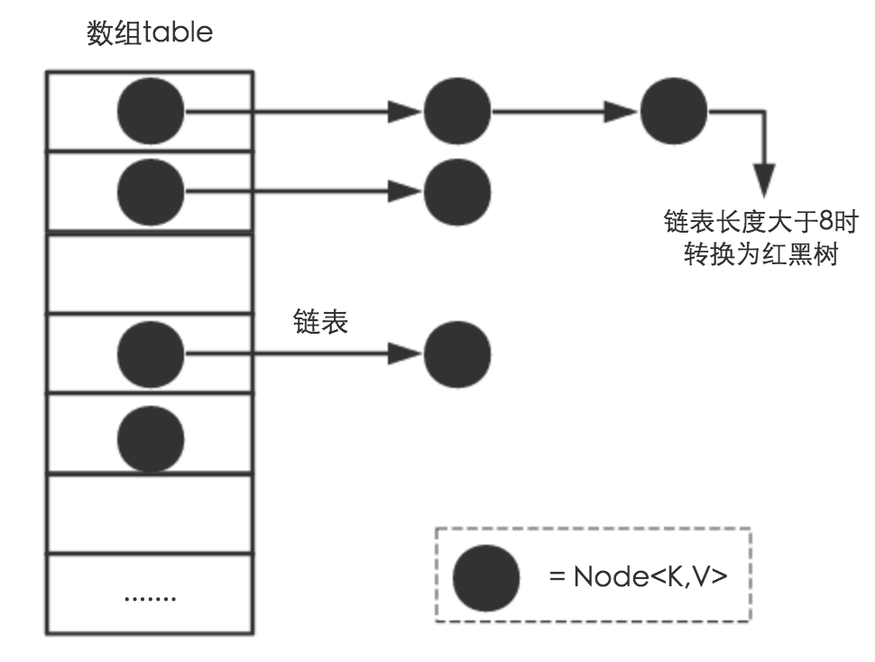
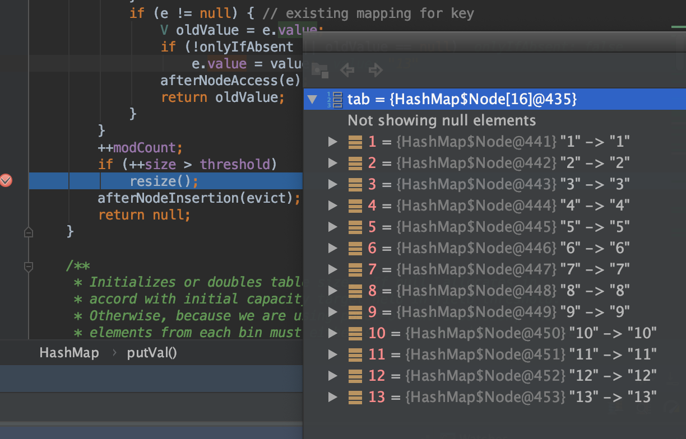
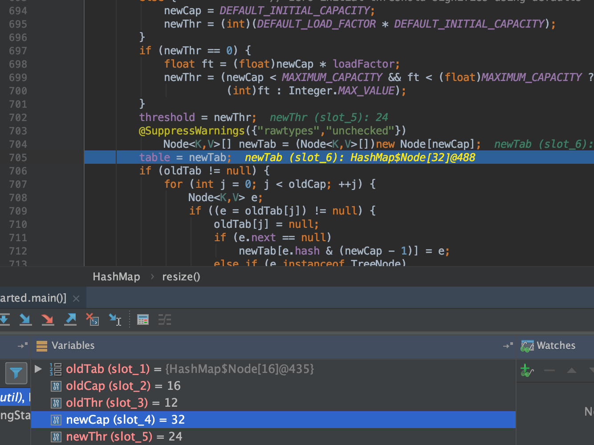

[TOC]

# Java8 HashMap

## 使用和底层结构

```java
HashMap<String,String> hashMap = new HashMap(10);
String oldValue = hashMap.put("1", "2");
System.out.println(oldValue); // null
oldValue = hashMap.put("1", "3");
System.out.println(oldValue); // 2
```

* hash表 + 链表(拉链法) + 红黑树

* hash冲突，拉链；链表过长，则转化为红黑树



## 链表结构和红黑树结构

* 普通的单链表结构

```java
/**
    * Basic hash bin node, used for most entries.  (See below for
    * TreeNode subclass, and in LinkedHashMap for its Entry subclass.)
    */
static class Node<K,V> implements Map.Entry<K,V> {
    final int hash;
    final K key;
    V value;
    Node<K,V> next;

    Node(int hash, K key, V value, Node<K,V> next) {
        this.hash = hash;
        this.key = key;
        this.value = value;
        this.next = next;
    }

    public final K getKey()        { return key; }
    public final V getValue()      { return value; }
    public final String toString() { return key + "=" + value; }

    public final int hashCode() {
        return Objects.hashCode(key) ^ Objects.hashCode(value);
    }

    public final V setValue(V newValue) {
        V oldValue = value;
        value = newValue;
        return oldValue;
    }

    public final boolean equals(Object o) {
        if (o == this)
            return true;
        if (o instanceof Map.Entry) {
            Map.Entry<?,?> e = (Map.Entry<?,?>)o;
            if (Objects.equals(key, e.getKey()) &&
                Objects.equals(value, e.getValue()))
                return true;
        }
        return false;
    }
}
```

* 红黑树结构

```java
/**
    * Entry for Tree bins. Extends LinkedHashMap.Entry (which in turn
    * extends Node) so can be used as extension of either regular or
    * linked node.
    */
static final class TreeNode<K,V> extends LinkedHashMap.Entry<K,V> {
    TreeNode<K,V> parent;  // red-black tree links
    TreeNode<K,V> left;
    TreeNode<K,V> right;
    TreeNode<K,V> prev;    // needed to unlink next upon deletion
    boolean red;
    TreeNode(int hash, K key, V val, Node<K,V> next) {
        super(hash, key, val, next);
    }

```

### 为什么使用红黑树？为什么有个8的阈值是链表和红黑树转换

平衡二叉树查找很快但是插入/删除时因为保持平衡需要旋转的平均次数较多不适应于插入/删除频繁的场景，红黑树则是插入和查找都能兼顾的平衡方案

另外红黑树占用空间显然是比链表大的，所以拉链法在节点只有几个的时候（概率分布统计得出，冲突为8的概率是千万分之一，否则hash函数有很大问题），没有必要用红黑树，链表查找即便O(n)，时间复杂度也还好

## 是否线程安全？

非线程安全；put操作是有扩容机制的，并发可能产生`ConcurrentModificationException`异常

```java
/**
    * The number of times this HashMap has been structurally modified
    * Structural modifications are those that change the number of mappings in
    * the HashMap or otherwise modify its internal structure (e.g.,
    * rehash).  This field is used to make iterators on Collection-views of
    * the HashMap fail-fast.  (See ConcurrentModificationException).
    */
transient int modCount;
```

## 为什么有链表和红黑树?

* 时间和空间的综合考虑

```java
* Because TreeNodes are about twice the size of regular nodes, we
* use them only when bins contain enough nodes to warrant use
* (see TREEIFY_THRESHOLD). And when they become too small (due to
* removal or resizing) they are converted back to plain bins.  In
* usages with well-distributed user hashCodes, tree bins are
* rarely used.  Ideally, under random hashCodes, the frequency of
* nodes in bins follows a Poisson distribution
* (http://en.wikipedia.org/wiki/Poisson_distribution) with a
* parameter of about 0.5 on average for the default resizing
* threshold of 0.75, although with a large variance because of
* resizing granularity. Ignoring variance, the expected
* occurrences of list size k are (exp(-0.5) * pow(0.5, k) /
* factorial(k)). The first values are:
```

## put方法（拉链尾插，转换红黑树）

```java
public V put(K key, V value) {
    return putVal(hash(key), key, value, false, true);
}

final V putVal(int hash, K key, V value, boolean onlyIfAbsent,
               boolean evict) {
    Node<K,V>[] tab; Node<K,V> p; int n, i;
    // 初始化桶数组 table，table 被延迟到插入新数据时再进行初始化
    if ((tab = table) == null || (n = tab.length) == 0)
        n = (tab = resize()).length;
    // 如果桶中不包含键值对节点引用，则将新键值对节点的引用存入桶中即可
    // 在数组中的下标通过：(n - 1) & hash] 计算得到
    if ((p = tab[i = (n - 1) & hash]) == null)
        tab[i] = newNode(hash, key, value, null);
    else {
        Node<K,V> e; K k;
        // 如果键的值以及节点 hash 等于链表中的第一个键值对节点时，则将 e 指向该键值对
        if (p.hash == hash &&
            ((k = p.key) == key || (key != null && key.equals(k))))
            e = p;

        // 如果桶中的引用类型为 TreeNode，则调用红黑树的插入方法
        else if (p instanceof TreeNode)  
            e = ((TreeNode<K,V>)p).putTreeVal(this, tab, hash, key, value);
        else {
            // 对链表进行遍历，并统计链表长度
            for (int binCount = 0; ; ++binCount) {
                // 链表中不包含要插入的键值对节点时，则将该节点接在链表的最后
                if ((e = p.next) == null) {
                    p.next = newNode(hash, key, value, null);
                    // 如果链表长度大于或等于树化阈值，则进行树化操作
                    if (binCount >= TREEIFY_THRESHOLD - 1) // -1 for 1st
                        treeifyBin(tab, hash);
                    break;
                }

                // 链表遍历找到了碰撞节点：hash值完全相等的节点，则用新节点替换老节点
                if (e.hash == hash &&
                    ((k = e.key) == key || (key != null && key.equals(k))))
                    break;
                p = e;
            }
        }

        // 判断要插入的键值对是否存在 HashMap 中
        if (e != null) { // existing mapping for key
            V oldValue = e.value;
            // onlyIfAbsent 表示是否仅在 oldValue 为 null 的情况下更新键值对的值
            if (!onlyIfAbsent || oldValue == null)
                e.value = value;
            afterNodeAccess(e);
            return oldValue;
        }
    }
    ++modCount;
    // 键值对数量超过阈值时，则进行扩容
    if (++size > threshold)
        resize();
    afterNodeInsertion(evict);
    return null;
}
```

* 拉链超过`TREEIFY_THRESHOLD=8`,则链表转化为红黑树

### 容量(resize方法)

```java
final Node<K,V>[] resize() {
    Node<K,V>[] oldTab = table;
    int oldCap = (oldTab == null) ? 0 : oldTab.length;
    int oldThr = threshold;
    int newCap, newThr = 0;
    if (oldCap > 0) {
        if (oldCap >= MAXIMUM_CAPACITY) {
            threshold = Integer.MAX_VALUE;
            return oldTab;
        }
        else if ((newCap = oldCap << 1) < MAXIMUM_CAPACITY &&
                    oldCap >= DEFAULT_INITIAL_CAPACITY)
            newThr = oldThr << 1; // double threshold
    }
    else if (oldThr > 0) // initial capacity was placed in threshold
        newCap = oldThr;
    else {               // zero initial threshold signifies using defaults
        newCap = DEFAULT_INITIAL_CAPACITY; // 16，初始数组的实际大小
        newThr = (int)(DEFAULT_LOAD_FACTOR * DEFAULT_INITIAL_CAPACITY); // 12 = 16 * 0.75
    }
    if (newThr == 0) {
        float ft = (float)newCap * loadFactor;
        newThr = (newCap < MAXIMUM_CAPACITY && ft < (float)MAXIMUM_CAPACITY ?
                    (int)ft : Integer.MAX_VALUE);
    }
    threshold = newThr;
    @SuppressWarnings({"rawtypes","unchecked"})
        Node<K,V>[] newTab = (Node<K,V>[])new Node[newCap];
    table = newTab;
    if (oldTab != null) {
        for (int j = 0; j < oldCap; ++j) {
            Node<K,V> e;
            if ((e = oldTab[j]) != null) {
                oldTab[j] = null;
                if (e.next == null)
                    newTab[e.hash & (newCap - 1)] = e;
                else if (e instanceof TreeNode)
                    ((TreeNode<K,V>)e).split(this, newTab, j, oldCap);
                else { // preserve order
                    Node<K,V> loHead = null, loTail = null;
                    Node<K,V> hiHead = null, hiTail = null;
                    Node<K,V> next;
                    do {
                        next = e.next;
                        if ((e.hash & oldCap) == 0) {
                            if (loTail == null)
                                loHead = e;
                            else
                                loTail.next = e;
                            loTail = e;
                        }
                        else {
                            if (hiTail == null)
                                hiHead = e;
                            else
                                hiTail.next = e;
                            hiTail = e;
                        }
                    } while ((e = next) != null);
                    if (loTail != null) {
                        loTail.next = null;
                        newTab[j] = loHead;
                    }
                    if (hiTail != null) {
                        hiTail.next = null;
                        newTab[j + oldCap] = hiHead;
                    }
                }
            }
        }
    }
    return newTab;
}
```

### 扩容

* 扩容前



* 扩容后：容量和阈值都扩大两倍，并且new了新的容量的Node数组



```java
/**
* Initializes or doubles table size.  If null, allocates in
* accord with initial capacity target held in field threshold.
* Otherwise, because we are using power-of-two expansion, the
* elements from each bin must either stay at same index, or move
* with a power of two offset in the new table.
*
* @return the table
*/
final Node<K,V>[] resize() {
    Node<K,V>[] oldTab = table;
    int oldCap = (oldTab == null) ? 0 : oldTab.length;
    int oldThr = threshold;
    int newCap, newThr = 0;
    // 如果 table 不为空，表明已经初始化过了
    if (oldCap > 0) {
        // 当 table 容量超过容量最大值，则不再扩容
        if (oldCap >= MAXIMUM_CAPACITY) {
            threshold = Integer.MAX_VALUE;
            return oldTab;
        }
        // 按旧容量和阈值的2倍计算新容量和阈值的大小
        else if ((newCap = oldCap << 1) < MAXIMUM_CAPACITY &&
                 oldCap >= DEFAULT_INITIAL_CAPACITY)
            newThr = oldThr << 1; // double threshold
    } else if (oldThr > 0) // initial capacity was placed in threshold
        /*
         * 初始化时，将 threshold 的值赋值给 newCap，
         * HashMap 使用 threshold 变量暂时保存 initialCapacity 参数的值
         */
        newCap = oldThr;
    else {               // zero initial threshold signifies using defaults
        /*
         * 调用无参构造方法时，桶数组容量为默认容量，
         * 阈值为默认容量与默认负载因子乘积
         */
        newCap = DEFAULT_INITIAL_CAPACITY;
        newThr = (int)(DEFAULT_LOAD_FACTOR * DEFAULT_INITIAL_CAPACITY);
    }

    // newThr 为 0 时，按阈值计算公式进行计算
    if (newThr == 0) {
        float ft = (float)newCap * loadFactor;
        newThr = (newCap < MAXIMUM_CAPACITY && ft < (float)MAXIMUM_CAPACITY ?
                  (int)ft : Integer.MAX_VALUE);
    }
    threshold = newThr;
    // 创建新的桶数组，桶数组的初始化也是在这里完成的
    Node<K,V>[] newTab = (Node<K,V>[])new Node[newCap];
    table = newTab;
    if (oldTab != null) {
        // 如果旧的桶数组不为空，则遍历桶数组，并将键值对映射到新的桶数组中
        for (int j = 0; j < oldCap; ++j) {
            Node<K,V> e;
            if ((e = oldTab[j]) != null) {
                oldTab[j] = null;
                if (e.next == null)
                    newTab[e.hash & (newCap - 1)] = e;
                else if (e instanceof TreeNode)
                    // 重新映射时，需要对红黑树进行拆分
                    ((TreeNode<K,V>)e).split(this, newTab, j, oldCap);
                else { // preserve order
                    Node<K,V> loHead = null, loTail = null;
                    Node<K,V> hiHead = null, hiTail = null;
                    Node<K,V> next;
                    // 遍历链表，并将链表节点按原顺序进行分组
                    do {
                        next = e.next;
                        if ((e.hash & oldCap) == 0) {
                            if (loTail == null)
                                loHead = e;
                            else
                                loTail.next = e;
                            loTail = e;
                        }
                        else {
                            if (hiTail == null)
                                hiHead = e;
                            else
                                hiTail.next = e;
                            hiTail = e;
                        }
                    } while ((e = next) != null);
                    // 将分组后的链表映射到新桶中
                    if (loTail != null) {
                        loTail.next = null;
                        newTab[j] = loHead;
                    }
                    if (hiTail != null) {
                        hiTail.next = null;
                        newTab[j + oldCap] = hiHead;
                    }
                }
            }
        }
    }
    return newTab;
}
```

* 计算新桶数组的容量 newCap 和新阈值 newThr
* 根据计算出的 newCap `new`出新的桶数组，桶数组 table 也是在这里进行初始化的(new新hash表，遍历重新设置)
* 将键值对节点重新映射到新的桶数组里。如果节点是 TreeNode 类型，则可能要**拆分红黑树**；如果是普通节点，则节点按原顺序进行分组，链表结构采用尾插

## 删除

```java
public V remove(Object key) {
    Node<K,V> e;
    return (e = removeNode(hash(key), key, null, false, true)) == null ?
        null : e.value;
}

final Node<K,V> removeNode(int hash, Object key, Object value,
                           boolean matchValue, boolean movable) {
    Node<K,V>[] tab; Node<K,V> p; int n, index;
    if ((tab = table) != null && (n = tab.length) > 0 &&
        // 1. 定位桶位置
        (p = tab[index = (n - 1) & hash]) != null) {
        Node<K,V> node = null, e; K k; V v;
        // 如果键的值与链表第一个节点相等，则将 node 指向该节点
        if (p.hash == hash &&
            ((k = p.key) == key || (key != null && key.equals(k))))
            node = p;
        else if ((e = p.next) != null) {  
            // 如果是 TreeNode 类型，调用红黑树的查找逻辑定位待删除节点
            if (p instanceof TreeNode)
                node = ((TreeNode<K,V>)p).getTreeNode(hash, key);
            else {
                // 2. 遍历链表，找到待删除节点
                do {
                    if (e.hash == hash &&
                        ((k = e.key) == key ||
                         (key != null && key.equals(k)))) {
                        node = e;
                        break;
                    }
                    p = e;
                } while ((e = e.next) != null);
            }
        }

        // 3. 删除节点，并修复链表或红黑树
        if (node != null && (!matchValue || (v = node.value) == value ||
                             (value != null && value.equals(v)))) {
            if (node instanceof TreeNode)
                ((TreeNode<K,V>)node).removeTreeNode(this, tab, movable);
            else if (node == p)
                tab[index] = node.next;
            else
                p.next = node.next;
            ++modCount;
            --size;
            afterNodeRemoval(node);
            return node;
        }
    }
    return null;
}
```

* 节点数量小于`TREEIFY_THRESHOLD=8`，红黑树转化为链表

## 被 transient 所修饰 table 变量

HashMap 的桶数组 table 被申明为`transient`。`transient`表示易变的意思，在 Java 中，被该关键字修饰的变量<font color='red'>不会被默认的序列化机制序列化</font>，而是通过实现`readObject/writeObject`两个方法自定义了序列化的内容

## 为什么Java中的HashMap默认加载因子是0.75？

```java
static final float DEFAULT_LOAD_FACTOR = 0.75f;  
```

加载因子是表示Hash表中元素的填满的程度
* 加载因子越大,填满的元素越多,空间利用率越高，但冲突的机会加大了。
* 反之,加载因子越小,填满的元素越少,冲突的机会减小,但空间浪费多了。

<a href="https://docs.oracle.com/javase/8/docs/api/java/util/HashMap.html">HashMap docs</a>

As a general rule, the default load factor (.75) offers a good tradeoff between time and space costs. Higher values decrease the space overhead but increase the lookup cost (reflected in most of the operations of the HashMap class, including get and put). The expected number of entries in the map and its load factor should be taken into account when setting its initial capacity, so as to minimize the number of rehash operations. If the initial capacity is greater than the maximum number of entries divided by the load factor, no rehash operations will ever occur.

通常，默认负载因子（0.75）在时间和空间成本之间提供了一个很好的折衷方案。较高的值会减少空间开销，但会增加查找成本（在HashMap类的大多数操作中都得到体现，包括get和put）。设置映射表的初始容量时，应考虑映射中的预期条目数及其负载因子，以最大程度地减少重新哈希操作的数量。如果初始容量大于最大条目数除以负载因子，则将不会进行任何哈希操作。

## 如何实现有序?

### LinkedHashMap(HashMap + 双向链表)

```java
public class LinkedHashMap<K,V>
    extends HashMap<K,V>
    implements Map<K,V>
{
```

对比普通的`HashMap.Node`，其增加了`before`和`after`,用来顺序连接

```java
/**
* HashMap.Node subclass for normal LinkedHashMap entries.
*/
static class Entry<K,V> extends HashMap.Node<K,V> {
    Entry<K,V> before, after;
    Entry(int hash, K key, V value, Node<K,V> next) {
        super(hash, key, value, next);
    }
}
```

### TreeMap（红黑树）

```java
public class TreeMap<K,V>
    extends AbstractMap<K,V>
    implements NavigableMap<K,V>, Cloneable, java.io.Serializable
{
```

TreeMap 为大多数操作提供平均`logN`的性能，如`add（）`，`remove（）`和`contains（）`
