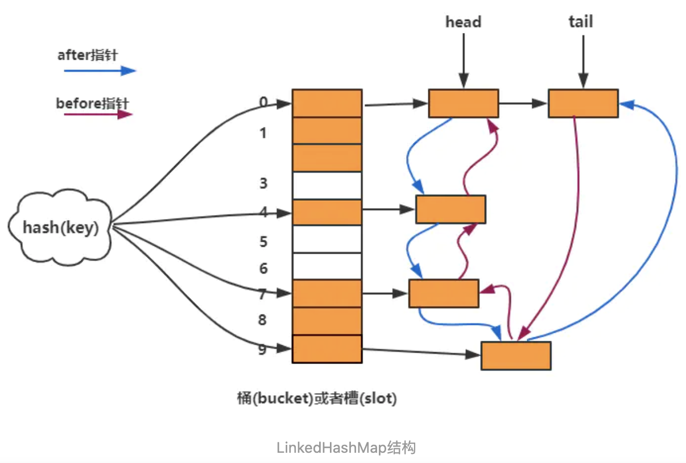

[TOC]

# LinkedHashMap

HashMap + 双向链表



## 双向链表的定义

节点继承了`HashMap.Node<K,V>`,再加上双向链表的`before`节点和`after`节点

```java
//扩展一个双向链表的entry
static class Entry<K,V> extends HashMap.Node<K,V> {
    Entry<K,V> before, after;
    Entry(int hash, K key, V value, Node<K,V> next) {
        super(hash, key, value, next);
    }
}

//链表头
transient LinkedHashMap.Entry<K,V> head;

//链表尾
transient LinkedHashMap.Entry<K,V> tail;
```

## 使用和说明

LinkedHashMap 的特性， 每个节点间由一个before引用 和 after 引用串联起来成为一个双向链表。链表节点按照访问时间进行排序，最近访问过的链表放在链表尾。

```java
// 10 是初始大小，0.75 是装载因子，true 是表示按照访问时间排序
HashMap<Integer, Integer> m = new LinkedHashMap<>(10, 0.75f, true);
m.put(3, 11);
m.put(1, 12);
m.put(5, 23);
m.put(2, 22);

m.put(3, 26);
m.get(5);

for (Map.Entry e : m.entrySet()) {
    System.out.println(e.getKey());
}
/*
输出的结果就是 1，2，3，5
*/
```

## get方法(类似LRU)

会将当前被访问到的节点e，移动至内部的双向链表的尾部。

```java
/**
    * Returns the value to which the specified key is mapped,
    * or {@code null} if this map contains no mapping for the key.
    *
    * <p>More formally, if this map contains a mapping from a key
    * {@code k} to a value {@code v} such that {@code (key==null ? k==null :
    * key.equals(k))}, then this method returns {@code v}; otherwise
    * it returns {@code null}.  (There can be at most one such mapping.)
    *
    * <p>A return value of {@code null} does not <i>necessarily</i>
    * indicate that the map contains no mapping for the key; it's also
    * possible that the map explicitly maps the key to {@code null}.
    * The {@link #containsKey containsKey} operation may be used to
    * distinguish these two cases.
    */
public V get(Object key) {
    Node<K,V> e;
    if ((e = getNode(hash(key), key)) == null)
        return null;
    if (accessOrder)
        afterNodeAccess(e);
    return e.value;
}
```

## 插入之后的removeEldestEntry方法(默认返回:false)

删除最久远的访问元素，LinkedHashMap默认直接返回false,即不会进行删除操作，可以重写该方法

```java
/**
* Returns <tt>true</tt> if this map should remove its eldest entry.
* This method is invoked by <tt>put</tt> and <tt>putAll</tt> after
* inserting a new entry into the map.  It provides the implementor
* with the opportunity to remove the eldest entry each time a new one
* is added.  This is useful if the map represents a cache: it allows
* the map to reduce memory consumption by deleting stale entries.
*
* <p>Sample use: this override will allow the map to grow up to 100
* entries and then delete the eldest entry each time a new entry is
* added, maintaining a steady state of 100 entries.
* <pre>
*     private static final int MAX_ENTRIES = 100;
*
*     protected boolean removeEldestEntry(Map.Entry eldest) {
*        return size() &gt; MAX_ENTRIES;
*     }
* </pre>
*
* <p>This method typically does not modify the map in any way,
* instead allowing the map to modify itself as directed by its
* return value.  It <i>is</i> permitted for this method to modify
* the map directly, but if it does so, it <i>must</i> return
* <tt>false</tt> (indicating that the map should not attempt any
* further modification).  The effects of returning <tt>true</tt>
* after modifying the map from within this method are unspecified.
*
* <p>This implementation merely returns <tt>false</tt> (so that this
* map acts like a normal map - the eldest element is never removed).
*
* @param    eldest The least recently inserted entry in the map, or if
*           this is an access-ordered map, the least recently accessed
*           entry.  This is the entry that will be removed it this
*           method returns <tt>true</tt>.  If the map was empty prior
*           to the <tt>put</tt> or <tt>putAll</tt> invocation resulting
*           in this invocation, this will be the entry that was just
*           inserted; in other words, if the map contains a single
*           entry, the eldest entry is also the newest.
* @return   <tt>true</tt> if the eldest entry should be removed
*           from the map; <tt>false</tt> if it should be retained.
*/
protected boolean removeEldestEntry(Map.Entry<K,V> eldest) {
    return false;
}
```

## 使用LinkedHashMap实现一个LRU缓存(LeetCode)

```java
class BaseLRUCache<K,V> extends LinkedHashMap<K,V> {

    private int cacheSize;

    public BaseLRUCache(int cacheSize) {
        super(16,0.75f,true);
        this.cacheSize = cacheSize;
    }

    /**
     * 判断元素个数是否超过缓存容量
     */
    @Override
    protected boolean removeEldestEntry(Map.Entry<K, V> eldest) {
        return size() > cacheSize;
    }
}

class LRUCache {

    BaseLRUCache<Integer, Integer> baseLRUCache;

    public LRUCache(int capacity) {
        baseLRUCache = new BaseLRUCache(capacity);
    }

    public int get(int key) {
        if(baseLRUCache.get(key) == null){
            return -1;
        }
        return baseLRUCache.get(key);
    }

    public void put(int key, int value) {
        baseLRUCache.put(key, value);
    }
}
```
