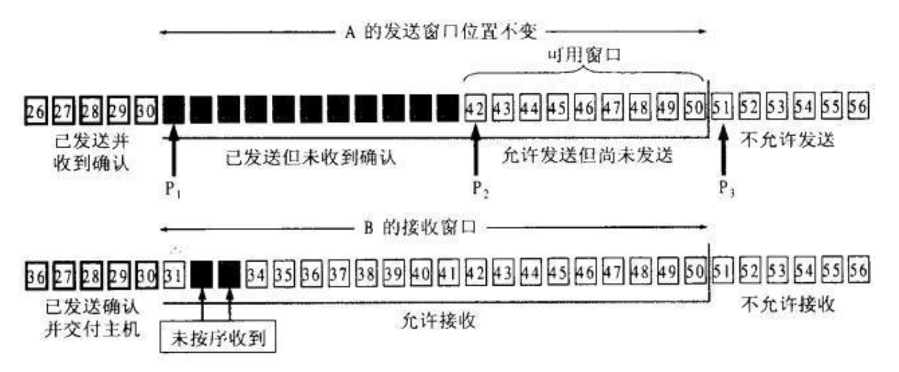

[TOC]

# 网络相关

## TCP

面向字节流/全双工

发送和接收的速率不一样 =》 发送缓存 & 接收缓存

TCP利用`发送缓存 & 接收缓存`来进行**流量控制**和**差错控制**

IP层必须以分组为单位发送数据，而不是字节流，所以TCP把若干字节流组成一个分组，称为**报文段**，TCP给报文段加上TCP头部，然后交给IP层。报文段在接收时有可能会失序，丢失，或者受到损伤和重传

参考：<a href="https://blog.csdn.net/qq_26437925/article/details/52100293" target="_blank">tcp三次握手，Wireshark实践</a>

### 流量控制

Sender won’t overflow receiver’s buffer by transmitting too much, too fast.

流量控制就是让发送方的发送速率不要太快，让接收方来得及接受。利用**滑动窗口**机制可以很方便的在TCP连接上实现对发送方的流量控制

### 滑动窗口

* tcp双方都各自维护一个发送窗口和一个接收窗口

（1）接收端将自己可以接收的缓冲区大小放入TCP首部中的“窗口大小”字段，通过ACK来通知发送端
（2）窗口大小字段越大，说明网络的吞吐率越高
（3）窗口大小指的是无需等待确认应答而可以继续发送数据的最大值，即就是说不需要接收端的应答，可以一次连续的发送数据
（4）操作系统内核为了维护滑动窗口，需要开辟发送缓冲区，来记录当前还有哪些数据没有应答，只有确认应答过的数据，才能从缓冲区删掉

* ps:发送缓冲区如果太大，就会有空间开销

（5）接收端一旦发现自己的缓冲区快满了，就会将窗口大小设置成一个更小的值通知给发送端，发送端收到这个值后，就会减慢自己的发送速度

（6）如果接收端发现自己的缓冲区满了，就会将窗口的大小设置为0，此时发送端将不再发送数据，但是需要定期发送一个窗口探测数据段，使接收端把窗口大小告诉发送端

ps：在TCP的首部中，有一个16为窗口字段，此字段就是用来存放窗口大小信息的

转载自：CSDN博主「dangzhangjing97」
原文链接：<a href="https://blog.csdn.net/dangzhangjing97/article/details/81008836">https://blog.csdn.net/dangzhangjing97/article/details/81008836</a>

### 滑动机制

1. 发送窗口只有收到发送窗口内字节的ACK确认，才会移动发送窗口的左边界。
2. 接收窗口只有在前面所有的段都确认的情况下才会移动左边界。当在前面还有字节未接收但收到后面字节的情况下，窗口不会移动，并不对后续字节确认。以此确保对端会对这些数据重传。
3. 遵循快速重传、累计确认、选择确认等规则。
4. 发送方发的window size = 8192;就是接收端最多发送8192字节，这个8192一般就是发送方接收缓存的大小。

### 拥塞控制

拥塞控制就是防止过多的数据注入到网络中，这样可以使网络中的路由器或链路不致过载。拥塞控制所要做的都有一个前提，就是网络能承受现有的网络负荷。拥塞问题是一个全局性的问题,涉及到所有的主机、所有的路由器、以及与降低网络传输性能有关的所有因素

因特网建议标准RFC2581定义了进行拥塞控制的四种算法

* 慢开始（Slow-start)
* 拥塞避免（Congestion Avoidance)
* 快重传（Fast Restrangsmit)
* 快恢复（Fast Recovery）

## 网络抖动？
