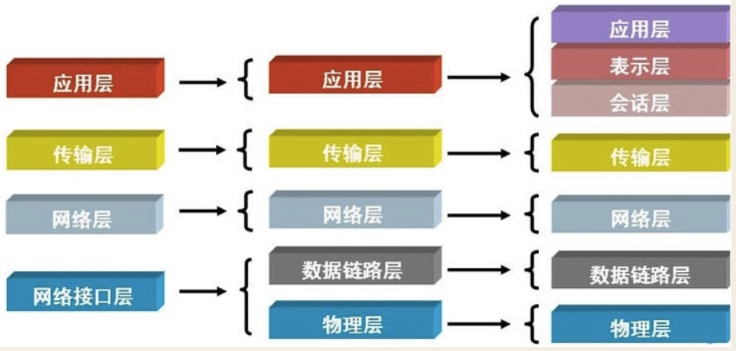
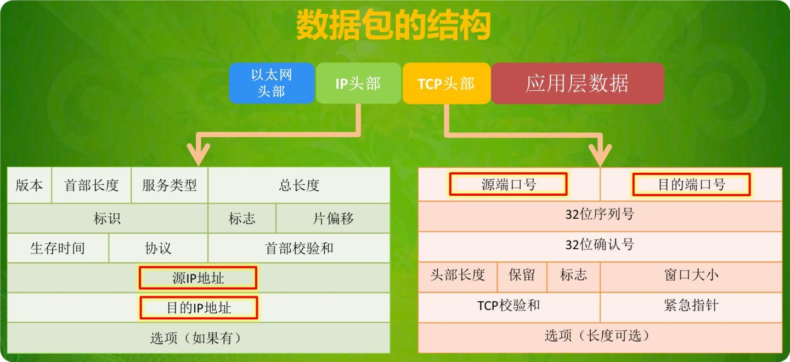

[TOC]

# 网络分层

4层，5层，7层




## OSI 7层网络模型

1. 物理层：主要定义物理设备标准，如网线的接口类型、光纤的接口类型、各种传输介质的传输速率等。它的主要作用是传输比特流（就是由1、0转化为电流强弱来进行传输，到达目的地后再转化为1、0，也就是我们常说的数模转换与模数转换）。这一层的数据叫做比特。
2. 数据链路层：定义了如何让格式化数据以帧为单位进行传输，以及如何让控制对物理介质的访问。该层对连接相邻的通路进行差错控制、数据成帧、同步等控制。检测差错一般采用循环冗余校验(CRC)，纠正差错采用计时器恢复和自动请求重发(ARQ)等技术。
3. 网络层：网络层规定了网络连接的建立、维持和拆除的协议。它的主要功能是利用数据链路层所提供的相邻节点间的无差错数据传输功能，通过路由选择和中继功能，实现两个系统之间的连接。在计算机网络系统中，网络层还具有多路复用的功能。
4. 传输层：定义了一些传输数据的协议和端口号（WWW端口80等），如：TCP（传输控制协议，传输效率低，可靠性强，用于传输可靠性要求高，数据量大的数据）；UDP（用户数据报协议，与TCP特性恰恰相反，用于传输可靠性要求不高，数据量小的数据，如QQ聊天数据就是通过这种方式传输的）。主要是将从下层接收的数据进行分段和传输，到达目的地址后再进行重组。常常把这一层数据叫做段。
5. 会话层：通过传输层(端口号：传输端口接收端口)建立数据传输的通路。主要在你的系统之间发起会话或者接受会话请求（设备之间需要互相认识可以是IP也可以是MAC或者是主机名）。
6. 表示层：可确保一个系统的应用层所发送的信息可以被另一个系统的应用层读取。例如，PC程序与另一台计算机进行通信，其中一台计算机使用扩展二一十进制交换码(EBCDIC)，而另一台则使用美国信息交换标准码（ASCII）来表示相同的字符。如有必要，表示层会通过使用一种通格式来实现多种数据格式之间的转换。
7. 应用层：应用层是OSI参考模型的最高层。其功能是实现应用进程(如用户程序、终端操作员等)之间的信息交换。同时，还具有一系列业务处理所需要的服务功能。

## TCP/IP 4层

1. 应用层：应用程序间沟通的层，如简单电子邮件传输（SMTP）、文件传输协议（FTP）、网络远程访问协议（Telnet）等。
2. 传输层：在此层中，它提供了节点间的数据传送服务，如传输控制协议（TCP）、用户数据报协议（UDP）等，TCP和UDP给数据包加入传输数据并把它传输到下一层中，这一层负责传送数据，并且确定数据已被送达并接收。
3. 网络层：负责提供基本的数据封包传送功能，让每一块数据包都能够到达目的主机（但不检查是否被正确接收），如网际协议（IP）。
4. 网络接口层：对实际的网络媒体的管理，定义如何使用实际网络（如Ethernet、Serial Line等）来传送数据。


附数据包在各层的封装：



## 四层和七层负载均衡?

所谓四层就是基于IP+端口的负载均衡；七层就是基于URL等应用层信息的负载均衡；同理，还有基于MAC地址的二层负载均衡和基于IP地址的三层负载均衡。

### 负载均衡算法

* 随机均衡（Random）：把来自网络的请求随机分配给内部中的多个服务器。

* 轮循均衡（Round Robin）：每一次来自网络的请求轮流分配给内部中的服务器，从1至N然后重新开始。此种均衡算法适合于服务器组中的所有服务器都有相同的软硬件配置并且平均服务请求相对均衡的情况。

* 权重轮循均衡（Weighted Round Robin）：根据服务器的不同处理能力，给每个服务器分配不同的权值，使其能够接受相应权值数的服务请求。例如：服务器A的权值被设计成1，B的权值是 3，C的权值是6，则服务器A、B、C将分别接受到10%、30％、60％的服务请求。此种均衡算法能确保高性能的服务器得到更多的使用率，避免低性能的服务器负载过重。

* 权重随机均衡（Weighted Random）：此种均衡算法类似于权重轮循算法，不过在处理请求分担时是个随机选择的过程。

* 响应速度均衡（Response Time）：负载均衡设备对内部各服务器发出一个探测请求（例如Ping），然后根据内部中各服务器对探测请求的最快响应时间来决定哪一台服务器来响应客户端的服务请求。此种均衡算法能较好的反映服务器的当前运行状态，但这最快响应时间仅仅指的是负载均衡设备与服务器间的最快响应时间，而不是客户端与服务器间的最快响应时间。

* 最少连接数均衡（Least Connection）：客户端的每一次请求服务在服务器停留的时间可能会有较大的差异，随着工作时间加长，如果采用简单的轮循或随机均衡算法，每一台服务器上的连接进程可能会产生极大的不同，并没有达到真正的负载均衡。最少连接数均衡算法对内部中需负载的每一台服务器都有一个数据记录，记录当前该服务器正在处理的连接数量，当有新的服务连接请求时，将把当前请求分配给连接数最少的服务器，使均衡更加符合实际情况，负载更加均衡。此种均衡算法适合长时处理的请求服务，如FTP。

* 处理能力均衡：此种均衡算法将把服务请求分配给内部中处理负荷（根据服务器CPU型号、CPU数量、内存大小及当前连接数等换算而成）最轻的服务器，由于考虑到了内部服务器的处理能力及当前网络运行状况，所以此种均衡算法相对来说更加精确，尤其适合运用到第七层（应用层）负载均衡的情况下。

* DNS响应均衡（Flash DNS）：在Internet上，无论是HTTP、FTP或是其它的服务请求，客户端一般都是通过域名解析来找到服务器确切的IP地址的。在此均衡算法下，分处在不同地理位置的负载均衡设备收到同一个客户端的域名解析请求，并在同一时间内把此域名解析成各自相对应服务器的IP地址（即与此负载均衡设备在同一位地理位置的服务器的IP地址）并返回给客户端，则客户端将以最先收到的域名解析IP地址来继续请求服务，而忽略其它的IP地址响应。在种均衡策略适合应用在全局负载均衡的情况下，对本地负载均衡是没有意义的。

# URL到页面的过程?

## 1 浏览器输入访问地址

当我们开始在浏览器中输入网址的时候，浏览器其实就已经在智能的匹配可能得 url 了，他会从历史记录，书签等地方，找到已经输入的字符串可能对应的 url，然后给出智能提示，让你可以补全url地址。对于 google的chrome 的浏览器，他甚至会直接从缓存中把网页展示出来，就是说，你还没有按下 enter，页面就出来了。

## 2 浏览器查找域名的 IP 地址

1. 请求一旦发起，浏览器首先要做的事情就是解析这个域名，一般来说，浏览器会首先查看本地硬盘的 hosts 文件，看看其中有没有和这个域名对应的规则，如果有的话就直接使用 hosts 文件里面的 ip 地址。

2. 如果在本地的 hosts 文件没有能够找到对应的 ip 地址，浏览器会发出一个 DNS请求到本地DNS服务器 。本地DNS服务器一般都是你的网络接入服务器商提供，比如中国电信，中国移动。

3. 查询你输入的网址的DNS请求到达本地DNS服务器之后，本地DNS服务器会首先查询它的缓存记录，如果缓存中有此条记录，就可以直接返回结果，此过程是递归的方式进行查询。如果没有，本地DNS服务器还要向DNS根服务器进行查询。

4. 根DNS服务器没有记录具体的域名和IP地址的对应关系，而是告诉本地DNS服务器，你可以到域服务器上去继续查询，并给出域服务器的地址。这种过程是迭代的过程。

5. 本地DNS服务器继续向域服务器发出请求，在这个例子中，请求的对象是.com域服务器。.com域服务器收到请求之后，也不会直接返回域名和IP地址的对应关系，而是告诉本地DNS服务器，你的域名的解析服务器的地址。

6. 最后，本地DNS服务器向域名的解析服务器发出请求，这时就能收到一个域名和IP地址对应关系，本地DNS服务器不仅要把IP地址返回给用户电脑，还要把这个对应关系保存在缓存中，以备下次别的用户查询时，可以直接返回结果，加快网络访问。

## 3 浏览器向 web 服务器发送一个 HTTP 请求

拿到域名对应的IP地址之后，浏览器会以一个随机端口（1024<端口<65535）向服务器的WEB程序（常用的有httpd,nginx等）80端口发起TCP的连接请求。这个连接请求到达服务器端后（这中间通过各种路由设备，局域网内除外），进入到网卡，然后是进入到内核的TCP/IP协议栈（用于识别该连接请求，解封包，一层一层的剥开），还有可能要经过Netfilter防火墙（属于内核的模块）的过滤，最终到达WEB程序，最终建立了TCP/IP的连接。

建立了TCP连接之后，发起一个http请求。一个典型的 http request header 一般需要包括请求的方法，例如 GET 或者 POST 等，不常用的还有 PUT 和 DELETE 、HEAD、OPTION以及 TRACE 方法，一般的浏览器只能发起 GET 或者 POST 请求。

## 4 服务器的永久重定向响应

服务器给浏览器响应一个301永久重定向响应，这样浏览器就会访问“http://www.google.com/” 而非“http://google.com/”。

为什么服务器一定要重定向而不是直接发送用户想看的网页内容呢？其中一个原因跟搜索引擎排名有关。如果一个页面有两个地址，就像http://www.yy.com/和http://yy.com/，搜索引擎会认为它们是两个网站，结果造成每个搜索链接都减少从而降低排名。而搜索引擎知道301永久重定向是什么意思，这样就会把访问带www的和不带www的地址归到同一个网站排名下。还有就是用不同的地址会造成缓存友好性变差，当一个页面有好几个名字时，它可能会在缓存里出现好几次。

## 5 浏览器跟踪重定向地址

现在浏览器知道了 "http://www.google.com/"才是要访问的正确地址，所以它会发送另一个http请求。

## 6 服务器处理请求

## 7 服务器返回一个 HTTP 响应

## 8 浏览器显示 HTML

## 9 浏览器发送请求获取嵌入在 HTML 中的资源（如图片、音频、视频、CSS、JS等等）

# HTTP 1.0 1.1 2.0

## HTTP协议

## HTTP 1.0

HTTP 1.0规定浏览器与服务器只保持**短暂连接**，浏览器的每次请求都需要与服务器建立一个TCP连接，服务器完成请求处理后立即断开TCP连接，服务器不跟踪每个客户也不记录过去的请求。HTTP是**无状态的**，服务端无需保存状态数据，这会造成了一些性能上的缺陷，例如，一个包含有许多图像的网页文件中并没有包含真正的图像数据内容，而只是指明了这些图像的URL地址，当WEB浏览器访问这个网页文件时，浏览器首先要发出针对该网页文件的请求，当浏览器解析WEB服务器返回的该网页文档中的HTML内容时，发现其中的图像标签后，浏览器将根据标签中的src属性所指定的URL地址再次向服务器发出下载图像数据的请求。显 然，访问一个包含有许多图像的网页文件的整个过程包含了多次请求和响应，每次请求和响应都需要建立一个单独的连接，每次连接只是传输一个文档和图像，上一次和下一次请求完全分离。即使图像文件都很小，但是客户端和服务器端每次建立和关闭连接却是一个相对比较费时的过程，并且会严重影响客户机和服务器的性能。当一个网页文件中包含JavaScript文件，CSS文件等内容时，也会出现类似上述的情况。

* 问题1: 连接无法复用
* 问题2: head of line blocking

## HTTP 1.1

HTTP 1.1的**持久连接**，也需要增加新的请求头来帮助实现，例如：Connection请求头的值为Keep-Alive时，客户端通知服务器返回本次请求结果后保持连接；Connection请求头的值为close时，客户端通知服务器返回本次请求结果后关闭连接。HTTP 1.1还提供了与身份认证、状态管理和Cache缓存等机制相关的请求头和响应头。

HTTP/1.1的默认模式使用带流水线（Pipelining）的持久连接处理，在一个TCP连接上可以传送多个HTTP请求和响应，减少了建立和关闭连接的消耗和延迟。例如：一个包含有许多图像的网页文件的多个请求和应答可以在一个连接中传输，但每个单独的网页文件的请求和应答仍然需要使用各自的连接。HTTP 1.1还允许客户端不用等待上一次请求结果返回，就可以发出下一次请求，但服务器端必须按照接收到客户端请求的先后顺序依次回送响应结果，以保证客户端能够区分出每次请求的响应内容。

HTTP 1.1增加host字段：在HTTP1.0中认为每台服务器都绑定一个唯一的IP地址，因此，请求消息中的URL并没有传递主机名（hostname）。但随着虚拟主机技术的发展，在一台物理服务器上可以存在多个虚拟主机（Multi-homed Web Servers），并且它们共享一个IP地址。HTTP1.1的请求消息和响应消息都应支持Host头域，且请求消息中如果没有Host头域会报告一个错误（400 Bad Request）。此外，服务器应该接受以绝对路径标记的资源请求。

### Cookie

<a href="https://developer.mozilla.org/en-US/docs/Web/HTTP/Cookies">mozilla doc of cookie</a>

An HTTP cookie (web cookie, browser cookie) is a small piece of data that a server sends to the user's web browser. The browser may store it and send it back with the next request to the same server. Typically, it's used to tell if two requests came from the same browser — keeping a user logged-in, for example. It remembers stateful information for the **stateless** HTTP protocol.

Cookie总是保存在客户端中，按在客户端中的存储位置，可分为内存Cookie和硬盘Cookie。内存Cookie由浏览器维护，保存在内存中，浏览器关闭后就消失了，其存在时间是短暂的。硬盘Cookie保存在硬盘里，有一个过期时间，除非用户手工清理或到了过期时间，硬盘Cookie不会被删除，其存在时间是长期的。所以，按存在时间，可分为非持久Cookie和持久Cookie。Cookie由服务端生成，响应给客户端，客户端存储后下次访问可以带上，发送给服务端。


#### Cookie的作用

* Session management(会话管理：登录信息，购物车等类似功能)

Logins, shopping carts, game scores, or anything else the server should remember

* Personalization（个性化设置，如用户偏好主题等）

User preferences, themes, and other settings

* Tracking（追踪用户行为）

Recording and analyzing user behavior

#### 如何创建Cookie

When receiving an HTTP request, a server can send a `Set-Cookie header` with the response. The cookie is usually stored by the browser, and then the cookie is sent with requests made to the same server inside a `Cookie HTTP header`. An expiration date or duration can be specified, after which the cookie is no longer sent. Additionally, restrictions to a specific domain and path can be set, limiting where the cookie is sent.

#### Cookie的缺陷

* Cookie会被附加在每个HTTP请求中，所以无形中增加了流量
* 由于在HTTP请求中的cookie是明文传递的，所以安全性成问题(除非用HTTPS)
* Cookie的大小限制在4KB左右。对于复杂的存储需求来说是不够用的

### Session

A session creates a file in a temporary directory on the server where registered session variables and their values are stored. This data will be available to all pages on the site during that visit. A session ends when the user closes the browser or after leaving the site, the server will terminate the session after a predetermined period of time, commonly 30 minutes duration.

session存在于服务端，会增加服务端存储压力；客户端浏览器访问服务器的时候，服务端把客户端信息以某种形式记录在服务器上

Session生成后，只要用户继续访问，服务器就会更新Session的最后访问时间，并维护该Session。用户每访问一次，无论是否读写Session，服务器都认为该用户的Session活跃（active）了一次。由于有越来越多的用户访问服务器，因此Session也会越来越多。为防止内存溢出，服务器会把长时间没有活跃的Session从内存中删除。这个时间就是Session的超时时间。如果超过了超时时间没有访问过服务器，Session就自动失效。

#### Session 需要借助 Cookie

虽然Session保存在服务器，对客户端是透明的，他的正常运行任然需要客户端浏览器的支持。这是因为Session需要使用Cookie作为识别标志。HTTP协议是无状态的，Session不能依据HTTP链接来判断是否为同一客户，因此服务器先客户端浏览器发送一个名为JSESSIONID的Cookie，其值为该Session的id（也就是HTTPSession.getId()的返回值，即sessionid）。Session依据此Cookie来识别是否为同一用户(`JSESSIONID=F23868383C49824819F7D41FB875B86A(sessionid)`)。

附：sessionid是一个会话的key，浏览器第一次访问服务器会在服务器端生成一个session，有一个sessionid和它对应。tomcat生成的sessionid叫做jsessionid。session在访问tomcat服务器HttpServletRequest的getSession(true)的时候创建，tomcat的ManagerBase类提供创建sessionid的方法：随机数+时间+jvmid。存储在服务器的内存中，tomcat的StandardManager类将session存储在内存中，也可以持久化到file，数据库，memcache，redis等。客户端只保存sessionid到cookie中，而不会保存session，session销毁只能通过invalidate或超时，关掉浏览器并不会关闭session

该Cookie为服务器自动生成的，它的maxAge属性一般为-1，表示仅当前浏览器内有效，并且个浏览器窗口间不共享，关闭浏览器就会失效。因此同一机器的两个浏览器窗口访问服务器时，会生成两个不同的Session、但是由浏览器窗口内的链接、脚本等打开的新窗口（也就是说不是双击=桌面浏览器图标打开 的窗口）除外。这类子窗口会共享父窗口的Cookie，因此会共享一个Session。

## HTTP 2.0

<a href='https://http2.github.io/http2-spec/'>http2-spec</a>

HTTP/2 enables a more efficient use of network resources and a reduced perception of latency by introducing header field compression and allowing multiple concurrent exchanges on the same connection. It also introduces unsolicited push of representations from servers to clients.

关键词：压缩，IO多路复用

## 1.0和1.1和2.0之间的区别

## HTTPS

### 什么是HTTPS协议

《图解HTTP》这本书中曾提过HTTPS是身披SSL外壳的HTTP。HTTPS是一种通过计算机网络进行安全通信的传输协议，经由HTTP进行通信，利用SSL/TLS建立全信道，加密数据包。HTTPS使用的主要目的是提供对网站服务器的身份认证，同时保护交换数据的隐私与完整性。

注：TLS是传输层加密协议，前身是SSL协议，由网景公司1995年发布，有时候两者不区分。

### HTTPS的验证流程

1. 客户端发起一个http请求，连接到服务器的443端口。

2. 服务端把自己的信息以数字证书的形式返回给客户端（证书内容有密钥公钥，网站地址，证书颁发机构，失效日期等）。证书中有一个公钥来加密信息，私钥由服务器持有。

3. 验证证书的合法性

客户端收到服务器的响应后会先验证证书的合法性（证书中包含的地址与正在访问的地址是否一致，证书是否过期）。

4. 生成随机密码（RSA签名）

如果验证通过，或用户接受了不受信任的证书，浏览器就会生成一个随机的对称密钥（session key）并用公钥加密，让服务端用私钥解密，解密后就用这个对称密钥进行传输了，并且能够说明服务端确实是私钥的持有者。

5. 生成对称加密算法

验证完服务端身份后，客户端生成一个对称加密的算法和对应密钥，以公钥加密之后发送给服务端。此时被黑客截获也没用，因为只有服务端的私钥才可以对其进行解密。之后客户端与服务端可以用这个对称加密算法来加密和解密通信内容了。


首先服务端拥有公钥和私钥，使用非对称加密算法

* 客户端先向服务端索要公钥
* 客户端进行公钥验证并生成随机的key（作为对称加密的密钥）
* 客户端将随机对称密钥发送给服务端（使用非对称的公钥加密）
* 服务端接收后使用非对称的私钥进行解密，得到对称加密的密钥，然后使用其进行加密数据
* 客户端接收服务端数据，则使用之前的随机的对称密钥进行数据解密

### https的特点

* 内容加密：采用混合加密技术，中间者无法直接查看明文内容
* 验证身份：通过证书认证客户端访问的是自己的服务器
* 保护数据完整性：防止传输的内容被中间人冒充或者篡改

### 对称加密

采用单钥密码系统的加密方法，同一个密钥可以同时用作信息的加密和解密，这种加密方法称为对称加密，也称为单密钥加密。

```java
f1(key, data) = x
f2(key, x) = data
```

密钥key只有一个，加密/解密都用这么一个

### 非对称加密

非对称加密算法是一种密钥的保密方法。

非对称加密算法需要两个密钥：公开密钥（publickey:简称公钥）和私有密钥（privatekey:简称私钥）。公钥与私钥是一对，如果用公钥对数据进行加密，只有用对应的私钥才能解密。因为加密和解密使用的是两个不同的密钥，所以这种算法叫作非对称加密算法。

```java
f(pk, data) = Y
f(sk, Y) = data

f(sk, data) = Y'
f(pk, Y') = data
```

数据返回的时候，使用了私钥，配合公钥还是能够解析出来

### HTTP 与 HTTPS 区别

* HTTP 明文传输，数据都是未加密的，安全性较差，HTTPS（SSL+HTTP） 数据传输过程是加密的，安全性较好。
* 使用 HTTPS 协议需要到 CA（Certificate Authority，数字证书认证机构）申请证书，一般免费证书较少，因而需要一定费用。证书颁发机构如：Symantec、Comodo、GoDaddy 和 GlobalSign 等。
* HTTP 页面响应速度比 HTTPS 快，主要是因为 HTTP 使用 TCP 三次握手建立连接，客户端和服务器需要交换 3 个包，而 HTTPS除了 TCP 的三个包，还要加上 ssl 握手需要的 9 个包，所以一共是 12 个包。
* http 和 https 使用的是完全不同的连接方式，用的端口也不一样，前者是 80，后者是 443。
* HTTPS 其实就是建构在 SSL/TLS 之上的 HTTP 协议，所以，要比较 HTTPS 比 HTTP 要更耗费服务器资源。

# 什么是TCP粘包/拆包,解决办法？

## 只有TCP才有粘包问题

UDP是基于报文发送的，从UDP的帧结构可以看出，在UDP首部采用了16bit来指示UDP数据报文的长度，因此在应用层能很好的将不同的数据报文区分开，从而避免粘包和拆包的问题。

TCP是基于字节流的，虽然应用层和TCP传输层之间的数据交互是大小不等的数据块，但是TCP把这些数据块仅仅看成一连串无结构的字节流，没有边界；另外从TCP的帧结构也可以看出，在TCP的首部没有表示数据长度的字段，基于上面两点，在使用TCP传输数据时，才有粘包或者拆包现象发生的可能。

## 什么是粘包、拆包？

假设客户端向服务端连续发送了两个数据包，用packet1和packet2来表示，那么服务端收到的数据可以分为三种，现列举如下：

* 第一种情况，接收端正常收到两个数据包，即没有发生拆包和粘包的现象


* 第二种情况，接收端只收到一个数据包，由于TCP是不会出现丢包的，所以这一个数据包中包含了发送端发送的两个数据包的信息，这种现象即为粘包


* 第三种情况，这种情况有两种表现形式，如下图。接收端收到了两个数据包，但是这两个数据包要么是不完整的，要么就是多出来一块，这种情况即发生了拆包和粘包


## 为什么会发生TCP粘包、拆包？

1. 应用程序写入的数据大于套接字缓冲区大小，这将会发生拆包。
2. 应用程序写入数据小于套接字缓冲区大小，网卡将应用多次写入的数据发送到网络上，这将会发生粘包。
3. 进行MSS（最大报文长度）大小的TCP分段，当`TCP报文长度`-`TCP头部长度`>`MSS`的时候将发生拆包。
4. 接收方法不及时读取套接字缓冲区数据，这将发生粘包。

## 粘包、拆包解决办法

TCP本身是面向流的，作为网络服务器，如何从这源源不断涌来的数据流中拆分出或者合并出有意义的信息呢？通常会有以下一些常用的方法：

1. 发送端给每个数据包添加包首部，首部中应该至少包含数据包的长度，这样接收端在接收到数据后，通过读取包首部的长度字段，便知道每一个数据包的实际长度了。
2. 发送端将每个数据包封装为固定长度（不够的可以通过补0填充），这样接收端每次从接收缓冲区中读取固定长度的数据就自然而然的把每个数据包拆分开来。
3. 可以在数据包之间设置边界，如添加特殊符号；这样，接收端通过这个边界就可以将不同的数据包拆分开。

# TCP半连接，半关闭，半打开？

# TCP长连接/短连接

## 长连接

在一个TCP连接上可以连续发送多个数据包，在TCP连接保持期间，如果没有数据包发送，需要双方发检测包以维持此连接，一般需要自己做在线维持（不发生RST包和四次挥手）

```java
连接 → 数据传输 → 保持连接(心跳) → 数据传输→保持连接(心跳) → …… → 关闭连接（一个TCP连接通道多个读写通信）；
```

<font color='red'>长连接在没有数据通信时需要定时发送数据包(心跳)，以维持连接状态；</font>

### Keep-Alive & 心跳包

* TCP keepalive处于传输层，由操作系统负责，能够判断进程存在，网络通畅，但无法判断进程阻塞或死锁等问题
    * keepalive只能检测连接是否存活，不能检测连接是否可用。比如服务器因为负载过高导致无法响应请求但是连接仍然存在，此时keepalive无法判断连接是否可用。
    * 如果TCP连接中的另一方因为停电突然断网，我们并不知道连接断开，此时发送数据失败会进行重传，由于重传包的优先级要高于keepalive的数据包，因此keepalive的数据包无法发送出去。只有在长时间的重传失败之后我们才能判断此连接断开了。
* 客户端与服务器之间有四层代理或负载均衡，即在传输层之上的代理，只有传输层以上的数据才被转发

基于以上原因，有时候还是需要应用程序自己去设计心跳规则的。可以服务端负责周期发送心跳包，检测客户端，也可以客户端负责发送心跳包，或者服服务端和客户端同时发送心跳包。

## 短连接

短连接是指通信双方有数据交互时，就建立一个TCP连接，数据发送完成后，则断开此TCP连接（管理起来比较简单，存在的连接都是有用的连接，不需要额外的控制手段）；

```java
连接 → 数据传输 → 关闭连接；
```

## 什么是SYN Flood攻击？如何避免？

SYN Flood (SYN洪水) 是种典型的DoS (Denial of Service，拒绝服务) 攻击。效果就是服务器TCP连接资源耗尽，停止响应正常的TCP连接请求。

A首先发送SYN（Synchronization）消息给B，要求B做好接收数据的准备；B收到后反馈SYN-ACK（Synchronization-Acknowledgement） 消息给A，这个消息的目的有两个：

1. 向A确认已做好接收数据的准备，
2. 同时要求A也做好接收数据的准备，此时B已向A确认好接收状态，并等待A的确认，连接处于半开状态（Half-Open），顾名思义只开了一半；

A收到后再次发送ACK(Acknowledgement)消息给B，向B确认也做好了接收数据的准备，至此三次握手完成，“连接”就建立了，实际上只是双方都按对方的要求进入了可以接收消息的状态。以上彼此要求对方确认的“状态”主要是双方将要使用的消息序号(SequenceNum)，TCP为保证消息按发送顺序抵达接收方的上层应用，需要用消息序号来标记消息的发送先后顺序的。TCP是“双工”(Duplex)连接，同时支持双向通信，也就是双方同时可向对方发送消息，其中SYN和SYN-ACK消息开启了A→B的单向通信通道（B获知了A的消息序号）；SYN-ACK和ACK消息开启了B→A单向通信通道（A获知了B的消息序号）。

---

客户端发起连接的报文即为syn报文。当攻击者发送大量的伪造IP端口的syn报文时，服务端接收到syn报文后，新建一共表项插入到半连接队列，并发送syn_ack。但由于这些syn报文都是伪造的，发出去的syn_ack报文将没有回应。TCP是可靠协议，这时就会重传报文，默认重试次数为5次，重试的间隔时间从1s开始每次都番倍，分别为1s + 2s + 4s + 8s +16s = 31s,第5次发出后还要等32s才知道第5次也超时了，所以一共是31 + 32 = 63s。

也就是说一共假的syn报文，会占用TCP准备队列63s之久，而半连接队列默认为1024，系统默认不同，可 cat /proc/sys/net/ipv4/tcp_max_syn_backlog c查看。也就是说在没有任何防护的情况下，每秒发送200个伪造syn包，就足够撑爆半连接队列，从而使真正的连接无法建立，无法响应正常请求。

如何避免：

* cookie源认证

原理是syn报文首先由DDOS防护系统来响应syn_ack。带上特定的sequence number （记为cookie）。真实的客户端会返回一个ack 并且Acknowledgment number 为cookie+1。 而伪造的客户端，将不会作出响应。这样我们就可以知道那些IP对应的客户端是真实的，将真实客户端IP加入白名单。下次访问直接通过，而其他伪造的syn报文就被拦截。

* reset认证

Reset认证利用的是TCP协议的可靠性，也是首先由DDOS防护系统来响应syn。防护设备收到syn后响应syn_ack,将Acknowledgement number (确认号)设为特定值（记为cookie）。当真实客户端收到这个报文时，发现确认号不正确，将发送reset报文，并且sequence number 为cookie + 1。而伪造的源，将不会有任何回应。这样我们就可以将真实的客户端IP加入白名单。

## TIME_WAIT状态的作用？

主动关闭的Socket端会进入TIME_WAIT状态，并且持续2MSL时间长度，MSL就是maximum segment lifetime(最大分节生命期），这是一个IP数据包能在互联网上生存的最长时间，超过这个时间将在网络中消失。MSL在RFC 1122上建议是2分钟，而源自berkeley的TCP实现传统上使用30秒，因而，TIME_WAIT状态一般维持在1-4分钟。

TIME_WAIT状态存在的理由：

1. 可靠地实现TCP全双工连接的终止

在进行关闭连接四路握手协议时，最后的ACK是由主动关闭端发出的，如果这个最终的ACK丢失，服务器将重发最终的FIN，因此客户端必须维护状态信息允许它重发最终的ACK。如果不维持这个状态信息，那么客户端将响应RST分节，服务器将此分节解释成一个错误（在java中会抛出`connection reset`的SocketException)。因而，要实现TCP全双工连接的正常终止，必须处理终止序列四个分节中任何一个分节的丢失情况，主动关闭的客户端必须维持状态信息进入TIME_WAIT状态。

2. 允许老的重复分节在网络中消逝

首先，存在这样的情况，某个路由器崩溃或者两个路由器之间的某个链接断开时，路由协议需要花费数秒到数分钟的时间才能稳定找出另一条通路。在这段时间内，可能发生路由循环（路由器A把分组发送给B，B又发送回给A），这种情况我们称之为迷途。假设迷途的分组是一个TCP分节，在迷途期间，发送端TCP超时并重传该分组，重传分组通过某路径到达目的地，而后不久（最多MSL秒）路由循环修复，早先迷失在这个循环中的分组最终也被送到目的地。这种分组被称之为重复分组或者漫游的重复分组，TCP必须要正确处理这些重复的分组。

我们假设ip1:port1和ip2:port2之间有一个TCP连接。我们关闭了这个链接，过一段时间后在相同IP和端口之间建立了另一个连接。TCP必须防止来自之前那个连接的老的重复分组在新连接上出现。为了做到这一点，TCP将不复用处于TIME_WAIT状态的连接。2MSL的时间足以让某个方向上的分组存活MSL秒后被丢弃，另一个方向上的应答也最多存活MSL秒后被丢弃。

## HTTP 常见状态码

分类 | 分类描述
:---:|:---:
1** | 信息，服务器收到请求，需要请求者继续执行操作
2** | 成功，操作被成功接收并处理
3** | 重定向，需要进一步的操作以完成请求
4** | 客户端错误，请求包含语法错误或无法完成请求
5** | 服务器错误，服务器在处理请求的过程中发生了错误

* 301 Moved Permanently

永久移动。请求的资源已被永久的移动到新URI，返回信息会包括新的URI，浏览器会自动定向到新URI。今后任何新的请求都应使用新的URI代替

* 302 临时移动

与301类似。但资源只是临时被移动。客户端应继续使用原有URI

* 400 Bad Request

客户端请求的语法错误，服务器无法理解

* 401 Unauthorized

请求要求用户的身份认证

* 403 Forbidden

服务器理解请求客户端的请求，但是拒绝执行此请求

* 500 Internal Server Error

服务器内部错误，无法完成请求

* 502 Bad Gateway

充当网关或代理的服务器，从远端服务器接收到了一个无效的请求

* 503 Service Unavailable

* 504

这是代表着网关超时是现象出现了。504错误问题是一个不好办的问题，当然你必须尝试着和网站官方获得联系，认真的去检查不同的电脑简的ip传输的状况。而且这个504错误要专业的负责人才能去解决
