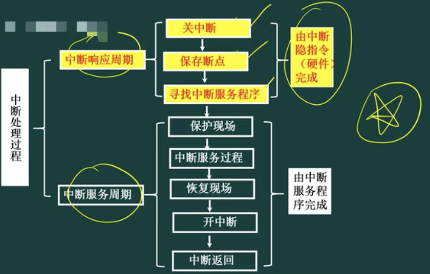
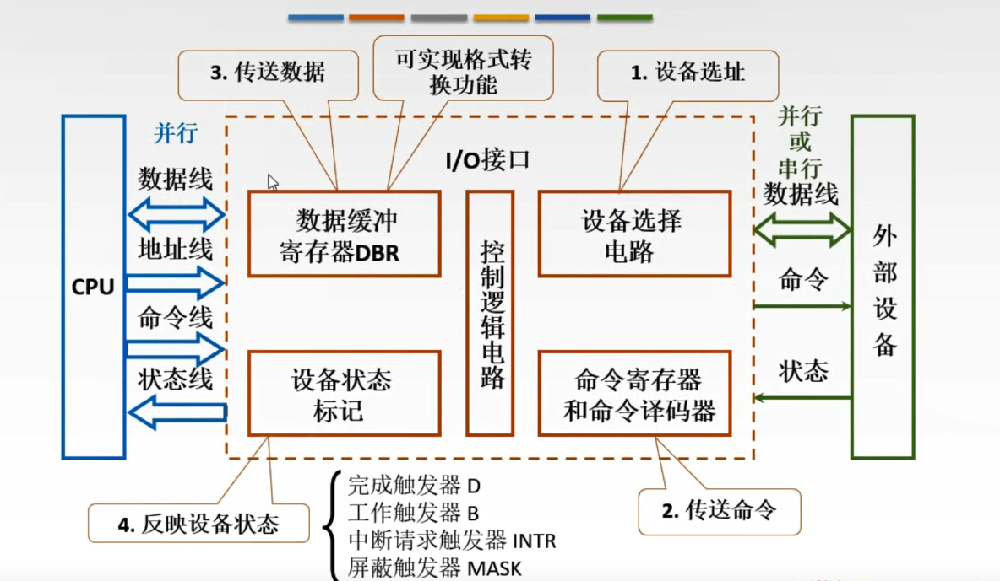

[TOC]

## 中断

一台典型的个人PC中，中断结构如下图：

设备完成工作，产生一个中断，他是通过在分配给它的一条总线信号线上置起信号而产生中断的。该信号主板上的中断控制器芯片检测到，由中断控制器芯片决定做什么。

在总线上置起中断信号，中断信号导致CPU停止当前正在做的工作并且开始做其它的事情。地址线上的数字被用做指向一个成为**中断向量(interrupt vector)**的表格的所用，以便读取一个新的程序计数器。这个程序计数器指向相应的中断服务过程的开始。

### 中断分类

* 中断源

中断是指由于某种事件的发生（硬件或者软件的），计算机暂停执行当前的程序，转而执行另一程序，以处理发生的事件，处理完毕后又返回原程序继续作业的过程。中断是处理器一种工作状态的描述。我们把引起中断的原因，或者能够发出中断请求信号的来源统称为中断源。

* 中断分类:外部中断/内部中断

    1. 外部设备请求中断。一般的外部设备（如键盘、打印机和A / D转换器等）在完成自身的操作后，向CPU发出中断请求，要求CPU为他服务。
    2. 故障强迫中断。计算机在一些关键部位都设有故障自动检测装置。如运算溢出、存储器读出出错、外部设备故障、电源掉电以及其他报警信号等，这些装置的报警信号都能使CPU中断，进行相应的中断处理。由计算机硬件异常或故障引起的中断，也称为内部异常中断。
    3. 实时时钟请求中断。在控制中遇到定时检测和控制，为此常采用一个外部时钟电路（可编程）控制其时间间隔。需要定时时，CPU发出命令使时钟电路开始工作，一旦到达规定时间，时钟电路发出中断请求，由CPU转去完成检测和控制工作。
    4. 数据通道中断。数据通道中断也称直接存储器存取（DMA）操作中断，如磁盘、磁带机或CRT等直接与存储器交换数据所要求的中断。
    5. 程序自愿中断。CPU执行了特殊指令（自陷指令）或由硬件电路引起的中断是程序自愿中断，是指当用户调试程序时，程序自愿中断检查中间结果或寻找错误所在而采用的检查手段，如断点中断和单步中断等。

* 中断分类:可屏蔽中断和非屏蔽中断

    1. 不可屏蔽中断源一旦提出请求，cpu必须无条件响应，而对于可屏蔽中断源的请求，cpu可以响应，也可以不响应。
    2. cup一般设置两根中断请求输入线：可屏蔽中断请求INTR(Interrupt Require)和不可屏蔽中断请求NMI(Nonmaskable Interrupt)。对于可屏蔽中断，除了受本身的屏蔽位的控制外，还都要受一个总的控制，即CPU标志寄存器中的中断允许标志位IF(Interrupt Flag)的控制，IF位为1，可以得到CPU的响应，否则，得不到响应。IF位可以有用户控制，指令STI或Turbo c的Enable()函数，将IF位置1(开中断)，指令CLI或Turbo_c 的Disable()函数，将IF位清0(关中断)。
    3. 可屏蔽中断：CPU关中断，则CU不响应中断；中断屏蔽字，CPU响应优先级高的中断

### 中断号(中断种类是有限的)

* 寻找中断服务程序的入口地址？

    1. 中断向量表（硬件向量法）(存储在内存中的某个位置)
    2. 中断识别程序 (软件查询法)

* 中断处理过程

问题1: 中断向量表用于保存：**服务程序的入口地址**

问题2: 中断响应是在：**一条执行执行之末**；（缺页中断：是在一条指令执行中间，执行执行不下去了；在执行中，不得不去响应中断）

问题3: 主存故障引起的中断是：**机器校验中断**（bootstrap会对主存，磁盘进行自检）

### 中断隐指令

中断隐指令引导CPU在响应中断信号时随机做出的一系列动作，这些动作是在检测到中断信号后便随即发生的，因而不能由软件来完成，而是由硬件来处理。中断隐指令并不是指令系统中的一条真正的指令，它没有操作码，所以中断隐指令是一种不允许、也不可能为用户使用的特殊指令。其所完成的操作主要有：

1. 保存现场

为了保证在中断服务程序执行完毕能正确返回原来的程序，必须将原来程序的断点（即程序计数器(PC)的内容）保存起来。断点可以压入堆栈，也可以存入主存的特定单元中。

2. 暂不允许中断(关中断)

暂不允许中断即关中断。在中断服务程序中，为了保护中断现场（即CPU主要寄存器的内容）期间不被新的中断所打断，必须要关中断，从而保证被中断的程序在中断服务程序执行完毕之后能接着正确地执行下去。并不是所有的计算机都在中断隐指令中由硬件自动地关中断，也有些计算机的这一操作是由软件（中断服务程序）来实现的。但是大部分计算机还是靠硬件来进行相关动作，因为硬件具有更好的可靠性和实时性。

3. 引出中断服务程序

引出中断服务程序的实质就是取出中断服务程序的入口地址送程序计数器（PC）。对于向量中断和非向量中断，引出中断服务程序的方法是不相同的。

4. 中断分发

硬件中断处理。在Windows所支持的硬件平台上，外部I/O中断进入到中断控制器的一根线上。该控制器接着在某一根线上中断处理器。处理器一旦被中断，就会询问控制器以获得此中断请求（IRQ）。中断控制器将该IRQ转译成一个中断号，利用该编号作为索引，在一个称为中断分发表（IDT）的结构中找到一个IDT项，并且将控制权传递给恰当的中断分发例程。每个处理器都有单独的IDT，所以，如果合适，不同的处理器可以运行不同的ISR。

## I/O控制方式

* cpu与外设

### 程序控制IO（轮询）

CPU要不断地`查询`外围设备的工作状态，一旦外围设备“准备好”或“不忙”，即可进行数据的传送；主机与外设只能串行工作，主机一个时间段只能与一个外设进行通讯，CPU效率低。

CPU：`轮询`，`忙等待`

### 中断驱动IO

* 首先每次的IO中断，都带来CPU的上下文切换

* 优点：CPU没有轮询检测I/O，只是根据I/O操作去向相应的设备控制器发出一条I/O命令，理论上可以去做其它的事情；

* 但是有大量数据传输时，CPU基本全程都在等待中断结束：在等待I/O数据的传输处理（CPU要等待中断返回，并没有去做别的事情）

### DMA（Direct Memory Access）

用来提供在外设和存储器之间或者存储器和存储器之间的高速数据传输。不需要依赖于CPU的大量中断负载。DMA控制器接管了数据读写请求，减少CPU的负担。

* DMA向CPU申请权限，让DMA进行I/O操作；CPU不需要在负责大量的I/O操作而无法处理其它事情了，此处有DMA总线

* 传统I/O流即类似DMA方式

如果大量I/O请求，DMA申请多，DMA总线冲突，一样有问题？

## I/O zero copy

### 传统I/O,用户进程读写的几次拷贝

* 写：用户态->内核态->DMA

CPU copy, DMA copy

* 读：DMA->内核态->用户态

DMA copy, CPU copy

### mmap

mmap将一个文件或者其它对象映射进内存。文件被映射到多个页上，如果文件的大小不是所有页的大小之和，最后一个页不被使用的空间将会清零

#### 内存映射文件(memory-mapped file，用户内存到文件系统页的映射)

由一个文件到一块内存的映射；文件的数据就是这块区域内存中对应的数据，读写文件中的数据，即直接对这块内存区域的地址操作，减少了内存复制的环节。

使用内存映射文件处理存储于磁盘上的文件时，将不必再对文件执行I/O操作，这意味着在对文件进行处理时将不必再为文件申请并分配缓存，所有的文件缓存操作均由系统直接管理，由于取消了将文件数据加载到内存、数据从内存到文件的回写以及释放内存块等步骤，使得内存映射文件在处理大数据量的文件时能起到相当重要的作用。

好处：

* 用户进程把文件数据当作内存，所以无需发起`read()`或 `write()`系统调用。

* 当用户进程碰触到映射内存空间，页错误会自动产生，从而将文件数据从磁盘读进内存。如果用户修改了映射内存空间，相关页会自动标记为脏，随后刷新到磁盘，文件得到更新。

* 操作系统的虚拟内存子系统会对页进行智能高速缓存，自动根据系统负载进行内存管理。

* 数据总是按页对齐的，无需执行缓冲区拷贝。

* 大型文件使用映射，无需耗费大量内存，即可进行数据拷贝。

* 映射文件区域的能力取决于于内存寻址的大小。在32位机器中，你不能访问超过`4GB`或`2 ^ 32`（以上的文件）。
