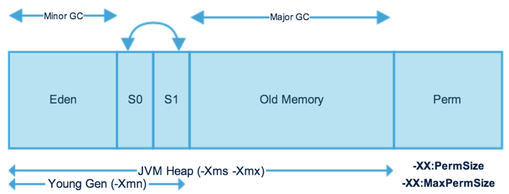
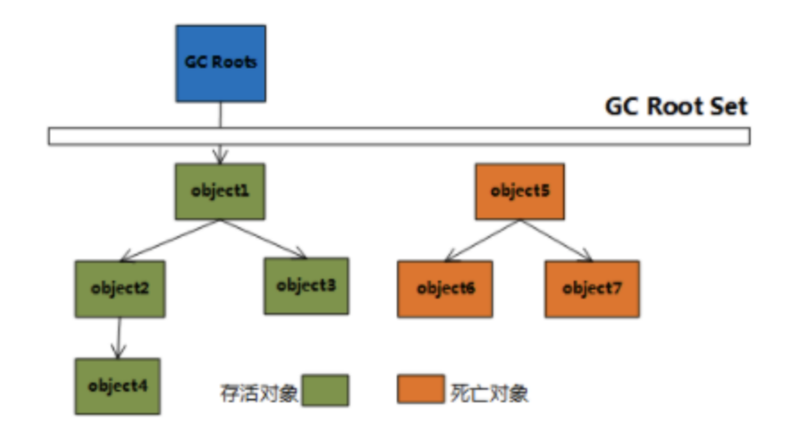
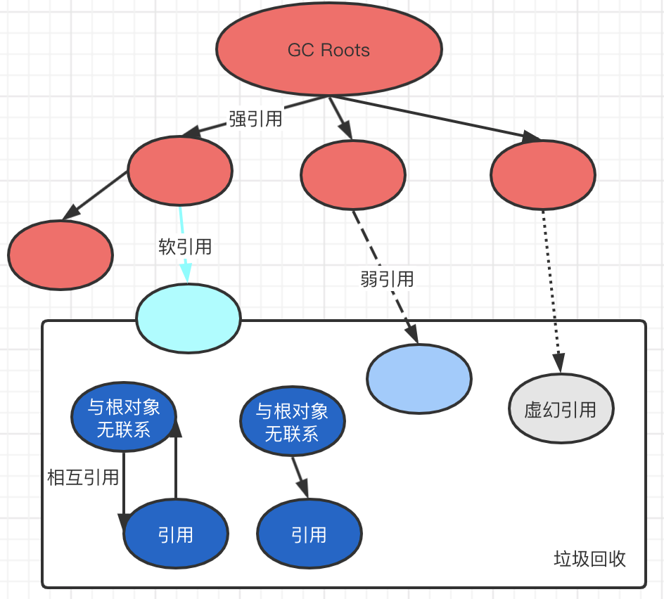
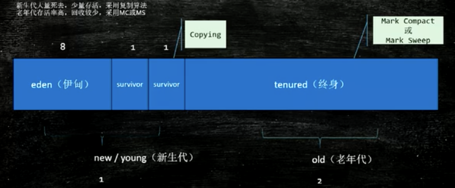
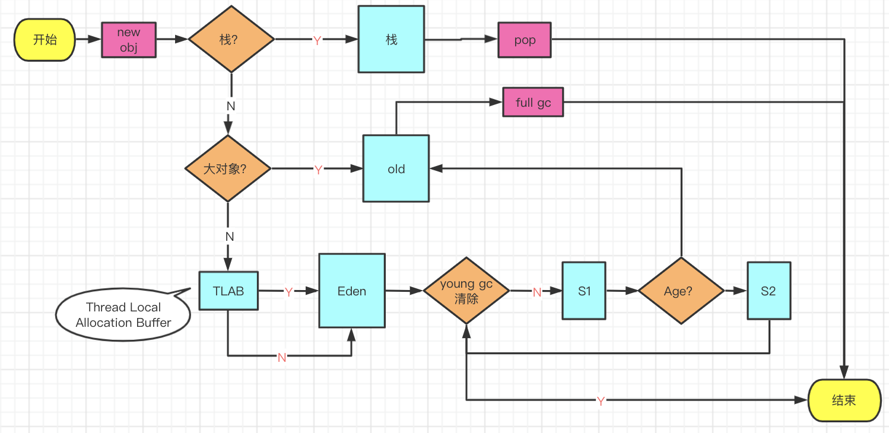
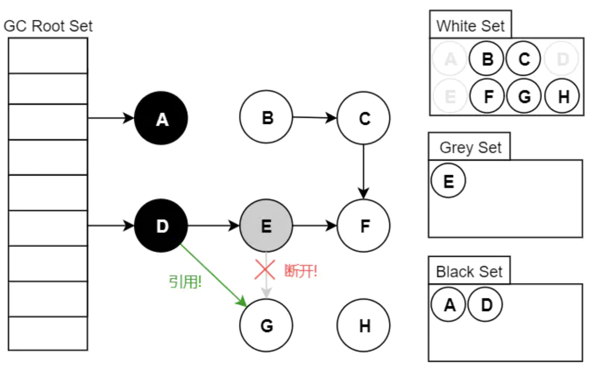
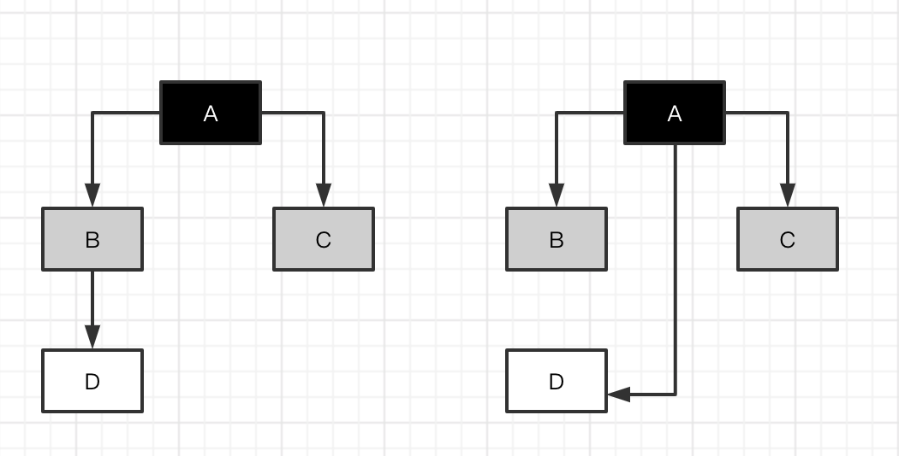
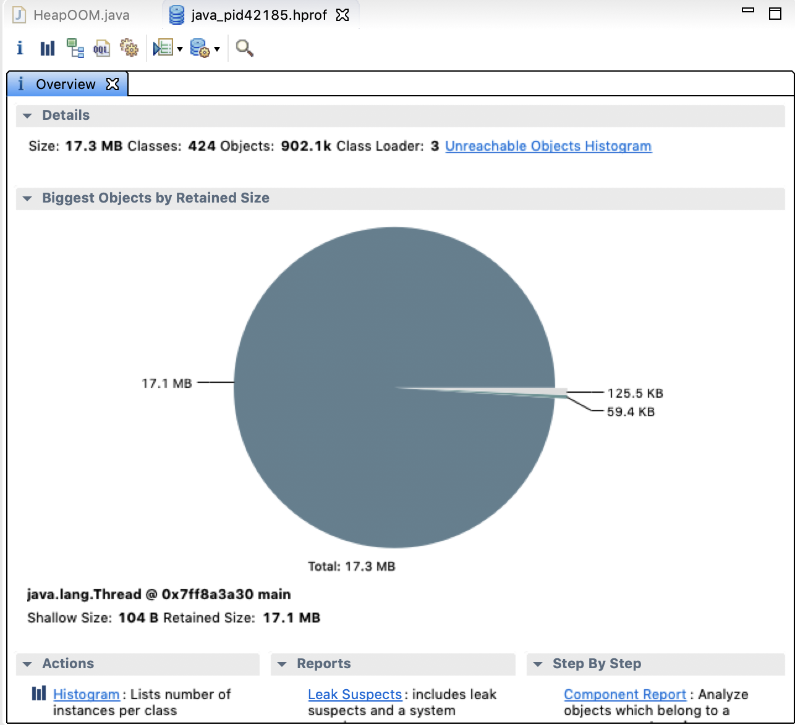
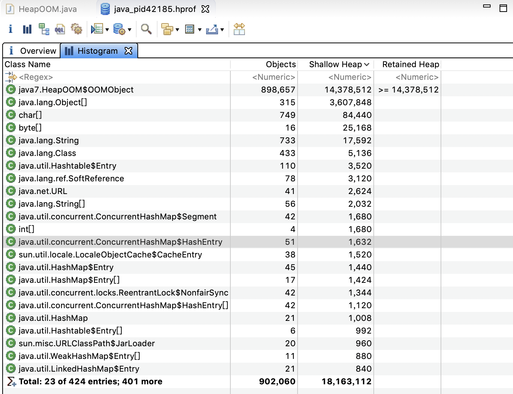

[TOC]

# 堆内存

## Java7堆内存划分

参考图书《深入理解java虚拟机》堆的描述

1. Java堆（Java Heap）是java虚拟机所管理的内存中最大的一块
2. Java堆被所有线程共享的一块内存区域
3. 虚拟机启动时创建java堆
4. Java堆的唯一目的就是存放对象实例。
5. Java堆是垃圾收集器管理的主要区域。
6. 从内存回收的角度来看， 由于现在收集器基本都采用分代收集算法， 所以Java堆可以细分为：新生代（`Young`）和老年代（`Old`）。 新生代又被划分为三个区域`Eden`、`From Survivor`， `To Survivor`等。无论怎么划分，最终存储的都是实例对象， 进一步划分的目的是为了更好的回收内存， 或者更快的分配内存。
7. Java堆的大小是可扩展的， 通过`-Xms`和`-Xmx`控制。
8. 如果堆内存不够分配实例对象， 并且对也无法在扩展时， 将会抛出outOfMemoryError异常。

## 堆区域与分代

* 堆大小 = 新生代 + 老年代（默认：新生代:老年代=`1:2`，即`1/3`的新生代，`2/3`的老年代）。堆大小设置参数：`–Xms`（堆的初始容量）、`-Xmx`（堆的最大容量）
* 其中，新生代 (`Young`) 被细分为`Eden`和两个`Survivor`区域，这两个`Survivor`区域分别被命名为`from`和`to`，以示区分。默认的，`Edem : from : to = 8 : 1 : 1`。(可以通过参数`–XX:SurvivorRatio`来设定 。即： Eden = 8/10 的新生代空间大小，from = to = 1/10 的新生代空间大小。
* JVM 每次只会使用`Eden`和其中的一块`Survivor`区域来为对象服务，所以无论什么时候，总是有一块`Survivor`区域是空闲着的。
* 新生代实际可用的内存空间为 9/10 ( 即90% )的新生代空间。

`jstat`查看gc相关的堆信息

## Java7 堆的各区域

```java
^Cmubi@mubideMacBook-Pro Home $ pwd
/Library/Java/JavaVirtualMachines/jdk1.7.0_80.jdk/Contents/Home
mubi@mubideMacBook-Pro Home $ bin/jstat -gcutil 62850 1000 10
Warning: Unresolved Symbol: sun.gc.generation.2.space.0.capacity substituted NaN
Warning: Unresolved Symbol: sun.gc.generation.2.space.0.used substituted NaN
Warning: Unresolved Symbol: sun.gc.generation.2.space.0.capacity substituted NaN
  S0     S1     E      O      P     YGC     YGCT    FGC    FGCT     GCT
  0.00  85.81  76.97  56.33      �    161    1.624    14    0.603    2.227
  0.00  85.81  77.08  56.33      �    161    1.624    14    0.603    2.227
  0.00  85.81  77.22  56.33      �    161    1.624    14    0.603    2.227
  0.00   85.81  77.33  56.33      �    161    1.624    14    0.603    2.227
```

* E    — Heap上的 Eden space 区已使用空间的百分比(`Eden`)
* S0   — Heap上的 Survivor space 0 区已使用空间的百分比(`From`)
* S1   — Heap上的 Survivor space 1 区已使用空间的百分比(`To`)
* O    — Heap上的 Old space 区已使用空间的百分比(`Old`)
* P    — Perm space 区已使用空间的百分比（`Java7中的Perm Generation`）
* YGC  — 从应用程序启动到采样时发生 Young GC 的次数
* YGCT – 从应用程序启动到采样时 Young GC 所用的时间(单位秒)
* FGC  — 从应用程序启动到采样时发生 Full GC 的次数
* FGCT – 从应用程序启动到采样时 Full GC 所用的时间(单位秒)
* GCT  — 从应用程序启动到采样时用于垃圾回收的总时间(单位秒)



### Java7永久代(Perm space)

* 是HotSpot的一种具体实现，实际指的就是**方法区**

* 类包含其对应的元数据，字符串常量池等被存储在永久代（默认大小是4m）中，容易导致性能问题和OOM

* 这个区域的内存回收目标主要是针对常量池的回收和对类型的卸载

## Java8 内存区域


```java
// java7
mubi@mubideMacBook-Pro Home $ pwd
/Library/Java/JavaVirtualMachines/jdk1.7.0_80.jdk/Contents/Home
mubi@mubideMacBook-Pro Home $ bin/jstat -gcutil 62850 1000 10
Warning: Unresolved Symbol: sun.gc.generation.2.space.0.capacity substituted NaN
Warning: Unresolved Symbol: sun.gc.generation.2.space.0.used substituted NaN
Warning: Unresolved Symbol: sun.gc.generation.2.space.0.capacity substituted NaN
  S0     S1     E      O      P     YGC     YGCT    FGC    FGCT     GCT
  0.00  85.81  76.97  56.33      �    161    1.624    14    0.603    2.227
  0.00  85.81  77.08  56.33      �    161    1.624    14    0.603    2.227
  0.00  85.81  77.22  56.33      �    161    1.624    14    0.603    2.227
  0.00  85.81  77.33  56.33      �    161    1.624    14    0.603    2.227

// java 8
^Cmubi@mubideMacBook-Pro Home $ jstat -gcutil 62850 1000 10
  S0     S1     E      O      M     CCS    YGC     YGCT    FGC    FGCT     GCT
  0.00  85.81  78.86  56.33  93.46  89.80    161    1.624    14    0.603    2.227
  0.00  85.81  78.93  56.33  93.46  89.80    161    1.624    14    0.603    2.227
  0.00  85.81  79.04  56.33  93.46  89.80    161    1.624    14    0.603    2.227
  0.00  85.81  79.17  56.33  93.46  89.80    161    1.624    14    0.603    2.227
  0.00  85.81  79.29  56.33  93.46  89.80    161    1.624    14    0.603    2.227
^Cmubi@mubideMacBook-Pro Home $
```

* S0   — Heap上的 Survivor space 0 区已使用空间的百分比(`From`)
* S1   — Heap上的 Survivor space 1 区已使用空间的百分比(`To`)
* E    — Heap上的 Eden space 区已使用空间的百分比(`Eden`)
* O    — Heap上的 Old space 区已使用空间的百分比(`Old`)
* M    - 元空间（Metaspace）： Klass Metaspace, NoKlass Metaspace
* CCS  - 表示的是NoKlass Metaspace的使用率
* YGC  — 从应用程序启动到采样时发生 Young GC 的次数
* YGCT – 从应用程序启动到采样时 Young GC 所用的时间(单位秒)
* FGC  — 从应用程序启动到采样时发生 Full GC 的次数
* FGCT – 从应用程序启动到采样时 Full GC 所用的时间(单位秒)
* GCT  — 从应用程序启动到采样时用于垃圾回收的总时间(单位秒)

### Java8元空间(元数据区)

参考学习1: <a target='_blank' href='http://openjdk.java.net/jeps/122'>openjdk相关文档</a>

Class metadata, interned Strings and class static variables will be moved from the permanent generation to either the Java heap or native memory.
(原来的永久代(class元信息、字面常量、静态变量等)转移到heap或者native memory中)

**Metaspace**由两大部分组成：Klass Metaspace和NoKlass Metaspace。

1. klass Metaspace就是用来存klass的，即class文件在jvm里的运行时数据结构，是一块连续的内存区域，紧接着Heap
2. NoKlass Metaspace专门来存klass相关的其它的内容，比如method，ConstantPool等，可以由多块不连续的内存组成

# 垃圾收集器

## 三个问题

1. 哪些内存需要回收

2. 什么时候进行回收

3. 如何回收

## 通过`可达性分析`来判定对象是否存活(什么是垃圾?)

算法的基本思路就是通过一系列的称为`GC Roots`的对象作为起始点，从这些节点向下搜索，搜索所走过的路径称为`引用链(Reference Chain)`,当一个对象到`GC Roots`没有任何引用链相连(用图论的话来说，就是`GC Roots`到这个对象不可达)时，则证明此对象是不可用的。



### Java中可作为`GC Roots`的对象包括

* 虚拟机栈（栈帧中的本地变量表）中引用的对象
* 本地方法栈中JNI(即一般说的Native方法)引用的对象
* 运行方法区中常量池引用的对象
* 方法区中中的类静态属性引用的对象
* load的Clazz

<font color='red'>which instances are roots?</font>(JVM规范中)

JVM stack, native method stack, run-time constant pool, static references in method area, Clazz

<a href="https://www.dynatrace.com/resources/ebooks/javabook/how-garbage-collection-works/" target="_blank">参考学习文章链接</a>

## 4种引用`Reference`

参考：<a href="https://www.geeksforgeeks.org/types-references-java/">https://www.geeksforgeeks.org/types-references-java/</a>



### 强引用

使用最普遍的引用。如果一个对象具有强引用，那垃圾回收器绝不会回收它。如

```java
//Strong Reference - by default
Gfg g = new Gfg();

//Now, object to which 'g' was pointing earlier is  
//eligible for garbage collection.
g = null;  
```

* 强引用与GC

```java
static class M{
    @Override
    protected void finalize() {
        System.out.println("finalize");
    }
}

/**
* 强引用，强制gc
* 输出如下
* Main$M@736e9adb
* null
* finalize
*/
static void testM(){
    M m = new M();
    System.out.println(m);
    m = null;
    System.gc();
    System.out.println(m);
}
```

### 软引用(`SoftReference`)

In Soft reference, even if the object is free for garbage collection then also its not garbage collected, until JVM is in need of memory badly.The objects gets cleared from the memory when JVM runs out of memory.To create such references java.lang.ref.SoftReference class is used.(<font color='red'>JVM 内存紧张的时候会回收软引用对象</font>)

用来描述一些还有用但并非必需的对象，对于软引用关联者的对象，在系统将要发生内存溢出异常之前，将会把这些对象列进回收范围之中进行第二次回收。如果这次回收还没有足够的内存，才会抛出内存溢出异常。

```java
//Code to illustrate Soft reference
import java.lang.ref.SoftReference;

class Gfg
{
    //code..
    public void x()
    {
        System.out.println("GeeksforGeeks");
    }
}
  
public class Example
{
    public static void main(String[] args)
    {
        // Strong Reference
        Gfg g = new Gfg();
        g.x();

        // Creating Soft Reference to Gfg-type object to which 'g'
        // is also pointing.
        SoftReference<Gfg> softref = new SoftReference<Gfg>(g);

        // Now, Gfg-type object to which 'g' was pointing
        // earlier is available for garbage collection.
        g = null;  

        // You can retrieve back the object which
        // has been weakly referenced.
        // It successfully calls the method.
        g = softref.get();  

        g.x();
    }
}
```

* 软引用与GC

```java
 /**
    * 内存不够用了，软引用才被回收
    * 输出如下
    * [B@736e9adb
    * [B@736e9adb
    * [B@6d21714c
    * null
    */
static void testSoftReference() throws Exception{
    SoftReference<byte[]> mSoft = new SoftReference<>(new byte[10 * 1024 * 1024]);
    System.out.println(mSoft.get());

    System.gc();
    TimeUnit.SECONDS.sleep(1);

    // gc没有回收软引用
    System.out.println(mSoft.get());

    byte[] b = new byte[11 * 1024 * 1024];
    System.out.println(b);

    // 由于强引用申请空间不够，必须要清除软引用了
    System.out.println(mSoft.get());
}
```

### 弱引用(`WeakReference`)

```java
// Strong Reference
Gfg g = new Gfg();
g.x();

// Creating Weak Reference to Gfg-type object to which 'g'  
// is also pointing.
WeakReference<Gfg> weakref = new WeakReference<Gfg>(g);

//Now, Gfg-type object to which 'g' was pointing earlier
//is available for garbage collection.
//But, it will be garbage collected only when JVM needs memory.
g = null;  

// You can retrieve back the object which
// has been weakly referenced.
// It successfully calls the method.
g = weakref.get();  

g.x();
```

* This type of reference is used in WeakHashMap to reference the entry objects .
* If JVM detects an object with only weak references (i.e. no strong or soft references linked to any object object), this object will be marked for garbage collection.
* To create such references java.lang.ref.WeakReference class is used.
* These references are used in real time applications while establishing a DBConnection which might be cleaned up by Garbage Collector when the application using the database gets closed.

* 弱引用与GC

```java
/**
    * 只要有垃圾回收线程执行，弱引用直接会被回收
    * 输出如下：
    * Main$M@736e9adb
    * null
    * finalize
    */
static void testWeakReference(){
    WeakReference<M> m = new WeakReference<>(new M());
    System.out.println(m.get());
    System.gc();
    System.out.println(m.get());
}
```

### 虚引用(`PhantomReference`)

The objects which are being referenced by phantom references are eligible for garbage collection. But, before removing them from the memory, JVM puts them in a queue called ‘reference queue’ . They are put in a reference queue after calling finalize() method on them.To create such references java.lang.ref.PhantomReference class is used.

也称为幽灵引用或者幻影引用，它是最弱的一种引用关系。一个对象是否有虚引用的存在，完全不会对其生存时间构成影响，也无法通过虚引用来取得一个对象实例。为一个对象设置虚引用关联的唯一目的就是<font color='red'>能够在这个对象被收集器回收时收到一个系统通知。</font>

* 它的get()方法写死了，返回null（也就是跟前面不一样，不能通过get()方法获取被包装的对象）
* Java中虚幻引用作用：管理直接内存(不属于堆)

* 虚引用与GC

* 虚引用get不到,因为get方法是直接返回的null
* 虚引用放到队列(`java.lang.ref.ReferenceQueue`)中，不断的从队列中取出来看是否被回收了

```java
static final List<Object> LIST = new LinkedList<>();
static final ReferenceQueue<M> QUEUE = new ReferenceQueue<>();

public static void main(String[] args) throws Exception{

    PhantomReference<M> phantomReference = new PhantomReference<>(new M(), QUEUE);

    new Thread(()->{
        while (true){
            LIST.add(new byte[3 * 1024 * 1024]);
            try{
                TimeUnit.SECONDS.sleep(1);
            }catch (Exception e){

            }
            System.out.println(phantomReference.get());
        }
    }).start();

    new Thread(()->{
        while (true){
            Reference<? extends M> poll = QUEUE.poll();
            if(poll != null) {
                System.out.println("PhantomReference 被 jvm 回收了:" + poll.get());
            }
        }
    }).start();

    TimeUnit.SECONDS.sleep(2);
}
```

管理堆外内存：

1. jvm对象用虚引用，指向堆外内存
2. jvm 堆 里面把引用回收掉，然后堆外也回收掉

## 对象是生存还是死亡的？

### `两次标记`&`F-Queue`&`Finalizer线程`

```java
=》没有GC Roots的引用链 =》 判断对象是否有必要执行`finalize()`方法
```

**第一次**：通过GC roots遍历，找到不在引用链内的对象。并检查是否需要执行finalize()方法。（如果没重写finalize()则只需要标记一次，然后就可以进行gc掉）

在第一次标记中有`finalize()`需要被执行的对象，会被丢到一个优先级较低的队列(`F-Queue`:`java.lang.ref.Finalizer.ReferenceQueue`)中执行，但不保证能被执行(因为是由**低优先级**的`Finalizer线程`去处理的，试想低优先级线程不被执行到，那么重写了`finalize()`的对象就永久在堆中不能被gc掉，即`java.lang.ref.Finalizer`对象会占用很大的堆空间，甚至溢出)

**第二次**：对队列(`F-Queue`)中的对象再遍历一次，看是否有自救，没有则进行GC

1. 对象没有覆盖`finalize()`方法，或者`finalize()`方法已经被虚拟机调用过,虚拟机将这两种情况都视为"没有必要执行"
2. 如果这个对象被判定为有必要执行`finalize()`方法,则这个对象会放置在一个叫做`F-Queue`的队列之中，并在稍后由一个虚拟机自动建立的，**低优先级**的`Finalizer线程`去执行它。

如果对象要在`finalize()`中成功拯救自己，则只需要重新与引用链上的任何一个对象建立关联即可，GC对`F-Queue`中对对象进行第二次标记时，会将它移出"即将回收"的集合；否则就会被回收

### `finalize()`自救代码演示

```java
/**
 * 此代码说明如下两点：
 * 1. 对象可以在GC时自我拯救
 * 2. 这种自救的机会只有一次，因为一个对象的`finalize()`方法最多只会被系统自动调用一次
 */
public class FinalizeEscapeGC {

    public static FinalizeEscapeGC SAVE_HOOK = null;
    public String name;

    public FinalizeEscapeGC(String name) {
        this.name = name;
    }

    public void isAlive() {
        System.out.println("yes, i am still alive");
    }

    @Override
    protected void finalize() throws Throwable {
        super.finalize();
        System.out.println("finalize method executed!");
        System.out.println(this.name);
        FinalizeEscapeGC.SAVE_HOOK = this;
    }

    public static void main(String[] args) throws Throwable {
        SAVE_HOOK = new FinalizeEscapeGC("abc");
        // 对象第一次成功拯救自己
        SAVE_HOOK = null;
        System.gc();
        // 执行finalize方法的线程优先级很低，暂停0.5秒等待它执行
        Thread.sleep(500);
        if(SAVE_HOOK != null) {
            SAVE_HOOK.isAlive();
        } else {
            System.out.println("no, i am dead");
        }
        // 下面这段代码与上面完全相同，但是这次自救却失败了
        SAVE_HOOK = null;
        System.gc();
        Thread.sleep(500);
        if(SAVE_HOOK != null) {
            SAVE_HOOK.isAlive();
        } else {
            System.out.println("no, i am dead");
        }
    }

}
```

* output

```java
finalize method executed!
abc
yes, i am still alive
no, i am dead
```

### 最后，不推荐使用`finalize()`

## Java7方法区(永久代)的回收

堆中，新生代进行一次垃圾收集一般可以回收`70%-95%`的空间，而永久代的垃圾收集效率远低于此。

永久代主要回收两部分内容：废弃常量和无用的类， 判断"无用的类"：

1. 该类所有的实例都已经被回收，也就是Java堆中不存在该类的任何实例
2. 加载该类的ClassLoader已经被回收
3. 该类对应的java.lang.Class对象没有在任何地方被引用，无法在任何地方通过反射访问该类的方法

是否对类进行回收，HotSpot虚拟机提供了`-Xnoclassgc`参数进行控制，还可以使用`-verbose:class`以及`-XX:+TraceClassLoading`,`-XX:+TraceClassUnLoading`查看类加载和卸载信息，其中`-verbose:class`和`-XX:+TraceClassLoading`可以在Product版的虚拟机中使用，`-XX:+TraceClassUnLoading`参数需要FastDebug版的虚拟机支持

在大量使用反射，动态代理，CGLib等ByteCode框架，动态生成JSP以及OSGi这类频繁自定义ClassLoader的场景都需要虚拟机具备类卸载的功能，以保证永久代不会溢出

## HotSpot 算法实现可达性分析

可达性分析的"一致性"分析，GC进行时必须停顿所有Java执行线程(Sun将这件事情称为`Stop The World`)

虚拟机有办法直接得知哪些地方存放着对象的引用，HotSpot中使用一组称为`OopMap`的数据结构来达到这个目的：在类加载完成的时候，HotPot就把对象内什么偏移量是什么类型的数据计算出来，在JIT编译过程中，也会在特定的位置记录下栈和寄存器中哪些位置是引用。这样，GC在扫描时就可以直接得知这些信息了。

借助`OopMap`，HotSpot可以快速且准确地完成GC Roots枚举，问题：

* 可能导致引用关系变化，或者说OopMap内容变化的指令特别多，如果为每一条指令都生成对应的OopMap，那将会需要大量的额外空间，这样GC的空间成本将会变得很高

实际上，HotSpot没有为每条指令都生成`oopMap`, 安全点(`Sagepoint`) GC， 选举以"是否具有让程序长时间执行的特征"为标准进行选定，如方法调用，循环跳转，异常跳转等，这些功能的指令会产生安全点

### Stop The World

<a href="https://www.cubrid.org/blog/understanding-java-garbage-collection" target="_blank">参考文章</a>

```java
There is a term that you should know before learning about GC. The term is "stop-the-world." Stop-the-world will occur no matter which GC algorithm you choose. Stop-the-world means that the JVM is stopping the application from running to execute a GC. When stop-the-world occurs, every thread except for the threads needed for the GC will stop their tasks. The interrupted tasks will resume only after the GC task has completed. GC tuning often means reducing this stop-the-world time.
```

只有GC线程工作，其它线程都停止；当GC线程工作完成，其它线程恢复

# 常见的垃圾回收算法

参考学习：<a href='https://blog.csdn.net/qq_26437925/article/details/53728388' target="_blank">几种垃圾回收算法</a>

垃圾回收算法 | 优缺点
:---: | :---:
引用计数法(Referenc Counting) | 无法处理循环引用
标记-清除算法(Mark-Sweep)算法 | 扫描并标记垃圾，然后将垃圾清理掉；能解决循环引用，会产生内存碎片
标记-缩并（Mark-Compact)算法 | 类似mark-sweep,不过最后是：1.压缩使用的内存，规整下到一起，2.清除剩下全部空间；可解决内存碎片；存活对象越多，耗时就越大
拷贝(Copying)算法 | 堆空间分两半，有用的拷贝到另一半，把当前这一半直接全部清除，解决内部碎片，但浪费空间

# 垃圾收集器发展和介绍

垃圾收集器，并发&并行

* 并行(Parallel)：指多条垃圾收集线程并行工作，但此时用户线程仍是被阻塞的等待状态

* 并发(Concurrent): 只用户线程与垃圾收集线程同时执行（但不一定是并行的，可能会交替执行），用户程序在继续运行，而垃圾收集程序运行于另一个CPU上

## GC收集器及其发展

### (一) Serial （STW,单线程收集器）

<font color='red'>a stop-the-world,coping collector which uses a single GC thread</font>

使用Coping算法的单线程的收集器，但是它的"单线程"的意义并不仅仅说明它只会使用**一个CPU**或者**一条收集线程**去完成垃圾收集工作，更重要的是它进行垃圾收集时，**必须暂停其他所有的工作线程，直到收集结束**即`Stop The World`

#### ParNew (Serial的多线程版本)

ParNew收集器除了多线程收集之外，其他与Serial收集器相比并没有太多创新之处，但它却是许多运行在Server模式下的虚拟机中首选的新生代收集器，其中有一个与性能无关但很重要的原因是，除了Serial收集器外，目前只有它能与`CMS`收集器配合工作。

### (二) Parallel Scavenge（STW,多线程收集器）

<font color='red'>a stop-the-world,coping collector which uses multi GC threads</font>

使用Coping算法的**并行多线程收集器**。Parallel Scavenge是`Java1.8`默认的收集器，特点是并行的多线程回收，以吞吐量（CPU用于运行用户代码的时间与CPU总消耗时间的比值，吞吐量=运行用户代码时间/(运行用户代码时间+垃圾收集时间)）优先

停顿时间越短就越适合需要与用户交互的程序，良好的响应速度能提升用户体验，而高吞吐量则可以高效率地利用CPU时间，尽快完成程序的运算任务，主要适合在后台运算而不需要太多交互的任务

#### Parallel old

<font color='red'>a compacting collector that uses multi GC threads</font>

### (三) CMS收集器

* concurret mark sweep
* a mostly concurrent, low-pause collector

4 phases:

1. initial mark(stw)
2. concurrent mark
3. remark(stw)
4. concurrent sweep

CMS收集器在Minor GC时会暂停所有的应用线程，并以多线程的方式进行垃圾回收。在Full GC时不再暂停应用线程，而是使用若干个后台线程定期的对老年代空间进行扫描，及时回收其中不再使用的对象

### (四) G1

G1收集器（或者垃圾优先收集器）的设计初衷是为了尽量缩短处理超大堆（大于4GB）时产生的停顿。相对于CMS的优势而言是内存碎片的产生率大大降低；目标是用在**多核**，**大内存**的机器上，它在大多数情况下可以实现指定的GC暂停时间，同时还能保持较高的吞吐量

```java
Java HotSpot(TM) 64-Bit Server VM (25.171-b11) for bsd-amd64 JRE (1.8.0_171-b11), built on Mar 28 2018 12:50:57 by "java_re" with gcc 4.2.1 (Based on Apple Inc. build 5658) (LLVM build 2336.11.00)
Memory: 4k page, physical 16777216k(1978920k free)

/proc/meminfo:

CommandLine flags: -XX:InitialHeapSize=20971520 -XX:MaxHeapSize=20971520 -XX:MaxNewSize=10485760 -XX:NewSize=10485760 -XX:+PrintGC -XX:+PrintGCDetails -XX:+PrintGCTimeStamps -XX:SurvivorRatio=8 -XX:+UseCompressedClassPointers -XX:+UseCompressedOops -XX:+UseG1GC
0.196: [GC pause (G1 Humongous Allocation) (young) (initial-mark), 0.0022978 secs]
   [Parallel Time: 2.0 ms, GC Workers: 4]
      [GC Worker Start (ms): Min: 196.2, Avg: 196.2, Max: 196.3, Diff: 0.0]
      [Ext Root Scanning (ms): Min: 0.6, Avg: 0.6, Max: 0.6, Diff: 0.0, Sum: 2.4]
      [Update RS (ms): Min: 0.0, Avg: 0.0, Max: 0.0, Diff: 0.0, Sum: 0.0]
         [Processed Buffers: Min: 0, Avg: 0.0, Max: 0, Diff: 0, Sum: 0]
      [Scan RS (ms): Min: 0.0, Avg: 0.0, Max: 0.0, Diff: 0.0, Sum: 0.0]
      [Code Root Scanning (ms): Min: 0.0, Avg: 0.0, Max: 0.0, Diff: 0.0, Sum: 0.0]
      [Object Copy (ms): Min: 0.8, Avg: 1.1, Max: 1.3, Diff: 0.5, Sum: 4.3]
      [Termination (ms): Min: 0.0, Avg: 0.3, Max: 0.5, Diff: 0.5, Sum: 1.1]
         [Termination Attempts: Min: 1, Avg: 1.2, Max: 2, Diff: 1, Sum: 5]
      [GC Worker Other (ms): Min: 0.0, Avg: 0.0, Max: 0.0, Diff: 0.0, Sum: 0.0]
      [GC Worker Total (ms): Min: 1.9, Avg: 2.0, Max: 2.0, Diff: 0.0, Sum: 7.8]
      [GC Worker End (ms): Min: 198.2, Avg: 198.2, Max: 198.2, Diff: 0.0]
   [Code Root Fixup: 0.0 ms]
   [Code Root Purge: 0.0 ms]
   [Clear CT: 0.0 ms]
   [Other: 0.2 ms]
      [Choose CSet: 0.0 ms]
      [Ref Proc: 0.1 ms]
      [Ref Enq: 0.0 ms]
      [Redirty Cards: 0.0 ms]
      [Humongous Register: 0.0 ms]
      [Humongous Reclaim: 0.0 ms]
      [Free CSet: 0.0 ms]
   [Eden: 3072.0K(10.0M)->0.0B(9216.0K) Survivors: 0.0B->1024.0K Heap: 8629.0K(20.0M)->6823.5K(20.0M)]
 [Times: user=0.00 sys=0.00, real=0.01 secs] 
0.199: [GC concurrent-root-region-scan-start]
0.199: [GC concurrent-root-region-scan-end, 0.0005314 secs]
0.199: [GC concurrent-mark-start]
0.199: [GC concurrent-mark-end, 0.0000251 secs]
0.202: [GC remark 0.202: [Finalize Marking, 0.0000621 secs] 0.202: [GC ref-proc, 0.0000215 secs] 0.202: [Unloading, 0.0003779 secs], 0.0005651 secs]
 [Times: user=0.00 sys=0.00, real=0.00 secs] 
0.203: [GC cleanup 13M->13M(20M), 0.0001664 secs]
 [Times: user=0.00 sys=0.00, real=0.00 secs] 
 Heap
 garbage-first heap   total 20480K, used 12967K [0x00000007bec00000, 0x00000007bed000a0, 0x00000007c0000000)
  region size 1024K, 2 young (2048K), 1 survivors (1024K)
 Metaspace       used 3342K, capacity 4500K, committed 4864K, reserved 1056768K
  class space    used 371K, capacity 388K, committed 512K, reserved 1048576K
```

## Java垃圾回收的依据/假设

* Most objects soon become unreachable.
* References from old objects to young objects only exist in small numbers.

## 分代GC,查看默认的GC配置

```java
mubi@mubideMacBook-Pro ~ $ java -XX:+PrintCommandLineFlags -version
-XX:InitialHeapSize=268435456 -XX:MaxHeapSize=4294967296 -XX:+PrintCommandLineFlags -XX:+UseCompressedClassPointers -XX:+UseCompressedOops -XX:+UseParallelGC
java version "1.8.0_171"
Java(TM) SE Runtime Environment (build 1.8.0_171-b11)
Java HotSpot(TM) 64-Bit Server VM (build 25.171-b11, mixed mode)
mubi@mubideMacBook-Pro ~ $
```



-|年轻代(别名)|老年代|JVM 参数
:---:|:---:|:---:|:---:
组合一|Serial (DefNew) | Serial Old(PSOldGen) | -XX:+UseSerialGC
组合二|Parallel Scavenge | (PSYoungGen) | Serial Old(PSOldGen) | -XX:+UseParallelGC
组合三(*)|Parallel Scavenge (PSYoungGen) | Parallel Old (ParOldGen) | -XX:+UseParallelOldGC
组合四|ParNew (ParNew) | Serial Old(PSOldGen) | -XX:-UseParNewGC
组合五(*)|ParNew (ParNew) | CMS+Serial Old(PSOldGen) | -XX:+UseConcMarkSweepGC
组合六(*)|G1 | G1 | -XX:+UseG1GC

### `new object`的gc生命周期



线程TLAB局部缓存区域（Thread Local Allocation Buffer）：Sun Hotspot JVM为了提升对象内存分配的效率，对于所创建的线程都会分配一块独立的空间TLAB（Thread Local Allocation Buffer），其大小由JVM根据运行的情况计算而得，在TLAB上分配对象时不需要加锁，因此JVM在给线程的对象分配内存时会尽量的在TLAB上分配，在这种情况下JVM中分配对象内存的性能和C基本是一样高效的，但如果对象过大的话则仍然是直接使用堆空间分配（堆是JVM中所有线程共享的，因此在其上进行对象内存的分配均需要进行加锁，这也导致了new对象的开销是比较大的）

## CMS(Concurrent Mark Sweep)垃圾回收器

<a href="https://docs.oracle.com/javase/8/docs/technotes/guides/vm/gctuning/cms.html">参考文档地址</a>

The Concurrent Mark Sweep (CMS) collector is designed for applications that prefer shorter garbage collection pauses and that can afford to share processor resources with the garbage collector while the application is running.

一种以获取**最短回收停顿时间为目标**的收集器(以牺牲了吞吐量为代价)：希望系统停顿时间最短，给用户带来较好但体验。基础算法是`Mark-Sweep`算法；不会整理、压缩堆空间，会产生内存碎片

要求多CPU；为了让应用程序不停顿，CMS线程和应用程序线程并发执行，这样就需要有更多的CPU，单纯靠线程切换效率太低。并且，重新标记阶段，为保证`Stop The World`快速完成，也要用到更多的甚至所有的CPU资源。

### CMS处理的4个步骤


1. 初始标记（CMS initial mark)，需要:`Stop The World`

这个过程从垃圾回收的"根对象"开始，只扫描到能够和"根对象"直接关联的对象，并作标记。所以这个过程虽然暂停了整个JVM，但是很快就完成了。

2. 并发标记（CMS concurrent mark）

这个阶段紧随`初始标记`阶段，在初始标记的基础上继续向下追溯标记。并发标记阶段，应用程序的线程和并发标记的线程并发执行，所以用户不会感受到停顿。

3. 重新标记（CMS remark）正确标记，需要`Stop The World`

这个阶段会暂停虚拟机，收集器线程扫描在CMS堆中剩余的对象。扫描从"根对象"开始向下追溯，并处理对象关联。

4. 并发清除（CMS concurrent sweep）

清理垃圾对象，这个阶段收集器线程和应用程序线程并发执行；会产生浮动垃圾

### 缺点

1. CMS收集器对CPU资源非常敏感。在并发阶段，虽然不会导致用户线程停顿，但是会因为占用了一部分线程，使应用程序变慢，总吞吐量会降低，为了解决这种情况，虚拟机提供了一种"增量式并发收集器"(Incremental Concurrent Mark Sweep/i-CMS)的CMS收集器变种，所做的事情就是在`并发标记`和`并发清除`的时候让GC线程和用户线程交替运行，尽量减少GC线程独占资源的时间，这样整个垃圾收集的过程会变长，但是对用户程序的影响会减少。（效果不明显，已经不推荐）

2. CMS处理器无法处理浮动垃圾（`Floating Garbage`）。由于CMS在并发清除阶段**有用户线程还在运行着**，伴随着程序的运行自然也会产生新的垃圾，这一部分垃圾产生在标记过程之后，CMS无法在当次收集中处理掉它们，所以只有等到下次gc时候再清理掉，这一部分垃圾就称作"浮动垃圾"；因此CMS收集器不能像其它收集器那样等到老年代几乎完全被填满了再进行收集，而是需要预留一部分空间提高并发收集时的程序运作使用。

3. CMS是基于(`mark-sweep`)"标记-清除"算法实现的，所以在收集结束的时候会有大量的`空间碎片`产生。空间碎片太多的时候，将会给大对象的分配带来很大的麻烦，往往会出现老年代还有很大的空间剩余，但是无法找到足够大的连续空间来分配当前对象的，只能提前触发`full gc`。

为了解决这个问题，CMS提供了一个开关参数（`-XX: UseCMSCompactAtFullCollection`），用于在CMS顶不住要进行full gc的时候开启内存碎片的合并整理过程，内存整理的过程是无法并发的，空间碎片没有了，但是停顿的时间变长了。另外一个参数(`-XX: CMSFullGCsBeforeCompaction`)用于设置执行多少次不压缩的full gc后，跟着来一次带压缩的（默认值为0，表示每次进入full gc时都进行碎片整理）

### 三色标记

把遍历对象图过程中遇到的对象，按“是否访问过”这个条件标记成以下三种颜色

* 白色：尚未访问过
* 灰色：正在搜索的对象：自己标记完成，其Fields还没有标记完成
* 黑色：搜索完成的对象,自己和其Fields都标记完成（不会当成垃圾对象，不会被GC）

遍历标记过程：

1. 初始时，所有对象都在【白色集合】中；
2. 将GC Roots 直接引用到的对象 挪到 【灰色集合】中；
3. 从灰色集合中获取对象：
    * 将本对象 引用到的 其他对象 全部挪到 【灰色集合】中；
    * 将本对象 挪到 【黑色集合】里面。
4. 重复步骤3，直至【灰色集合】为空时结束。
5. 最后仍在【白色集合】的对象即为GC Roots 不可达，可以进行回收。

#### 三色标记问题

* 浮动垃圾：浮动垃圾并不会影响垃圾回收的正确性，只是需要等到下一轮垃圾回收中才被清除。
* `多标`和`漏标`问题

假设GC线程已经遍历到E（变为灰色了），此时应用线程先执行了：

```java
var G = objE.fieldG;
objE.fieldG = null;  // 灰色E 断开引用 白色G
objD.fieldG = G;  // 黑色D 引用 白色G
```



此时切回GC线程继续跑，因为E已经没有对G的引用了，所以不会将G放到灰色集合；尽管因为D重新引用了G，但因为D已经是黑色了，是不会再重新做遍历处理。最终结局就是：G会一直停留在白色集合中，最后被当作垃圾进行清除。但是G显然是不能被回收的，这种情况影响到了应用程序的正确性，是不可接受的。

#### CMS解决方案和`remark`

* 写屏障(读写前后，将对象G给记录下来) + 增量更新

```java
var G = objE.fieldG; // 1.读，读屏障
objE.fieldG = null;  // 2.写，写屏障
objD.fieldG = G;     // 3.写，写屏障
```

<font color='red'>CMS有`remark`，从头到尾扫描一遍</font>

#### 扩展：G1解决方法(写屏障 + Snapshot At the begining)

块(RSet) 配合 SATB 解决（将引用关系中转到GC的堆栈中）

## G1(Garbage First)垃圾回收器

### 参考学习文档

参考学习1: <a target='_blank' href='https://tech.meituan.com/2016/09/23/g1.html'>美团技术文章</a>

参考学习2: <a target='_blank' href='https://www.oracle.com/technetwork/tutorials/tutorials-1876574.html'>oracle g1 document</a>

参考学习3: <a target='_blank' href='https://blogs.oracle.com/poonam/understanding-g1-gc-logs'>g1 log</a>

### G1设计理念

* Can operate concurrently with applications threads like the CMS collector.
（能够像CMS收集器一样跟应用线程并发的去执行。【CMS本身就是一个并发的收集器，也就是GC线程与应用线程可以同时间执行】）

* Compact free space without lengthy GC induced pause times.
（可以压缩可用的空间，而不会让GC引起暂停时间过长。）

* Need more predictable GC pause durations.
（需要更多的可预测的GC暂停的间隔。【也就是说GC暂停的时间会尽量往我们设置的暂时时间来靠】）

* Do not want to sacrifice a lot of throughput performance.
（不想牺牲大量吞吐性能。）

* Do not require a much larger Java heap.
（不想需要大量Java的堆空间。）

### G1 内存区域分布图和概念介绍


* 整个堆被分为一个大小相等的region集合，每个reagion是逻辑上连续的虚拟内存区域；

* 这些region有eden,survivor,old的概念；G1的各代存储地址是不连续的，每一代都使用了n个不连续的大小相同的Region;年轻代（eden + survivor）,年老代（old + humongous）

* Humongous区域：如果一个对象占用的空间超过了region容量(`region size`)50%以上，G1收集器就认为这是一个巨型对象。这些巨型对象，默认直接会被分配在`old`region，为了能找到连续的region来分配巨型对象，有时候不得不启动Full GC。
    1. H-obj直接分配到了old gen，防止了反复拷贝移动
    2. H-obj在`global concurrent marking`阶段的`cleanup` 和 `full GC`阶段回收
    3. 在分配H-obj之前先检查是否超过 `initiating heap occupancy percent`和`the marking threshold`, 如果超过的话，就启动`global concurrent marking`，为的是提早回收，防止 `evacuation failures` 和 `full GC`。

When performing garbage collections, G1 operates in a manner similar to the CMS collector. G1 performs a concurrent global marking phase to determine the liveness of objects throughout the heap. After the mark phase completes, G1 knows which regions are mostly empty. It collects in these regions first, which usually yields a large amount of free space. This is why this method of garbage collection is called Garbage-First.As the name suggests, G1 concentrates its collection and compaction activity on the areas of the heap that are likely to be full of reclaimable objects, that is, garbage. G1 uses a pause prediction model to meet a user-defined pause time target and selects the number of regions to collect based on the specified pause time target.
（概括起来：仍然类似CMS采用并发标记，不过垃圾回收时不是回收全部，而是对那些垃圾较多的region区域进行回收；根据此次回收可以对下次回收进行一个预测）

### G1 常用参数

参数 | 含义
-|-
-XX:G1HeapRegionSize=n | 设置Region大小，并非最终值
-XX:MaxGCPauseMillis | 设置G1收集过程目标时间，默认值200ms，不是硬性条件
-XX:G1NewSizePercent | 新生代最小值，默认值5%
-XX:G1MaxNewSizePercent | 新生代最大值，默认值60%
-XX:ParallelGCThreads | STW期间，并行GC线程数
-XX:ConcGCThreads=n | 并发标记阶段，并行执行的线程数
-XX:InitiatingHeapOccupancyPercent | 设置触发标记周期的 Java 堆占用率阈值。默认值是45%。这里的Java堆占比指的是non_young_capacity_bytes，包括old+humongous

* 如下一个线上配置(机器`2C4G`)例子：

```java
-Xms2700M -Xmx2700M -Xss512K -XX:MaxDirectMemorySize=512M

-XX:+UseG1GC -XX:MaxGCPauseMillis=200 -XX:ParallelGCThreads=4 -XX:ConcGCThreads=2 -XX:InitiatingHeapOccupancyPercent=70 -XX:MaxMetaspaceSize=500m -XX:+PrintGCDetails
```

### Remember Set & Collection Set

* headpRegion.cpp 部分实现

```java
// Minimum region size; we won't go lower than that.
// We might want to decrease this in the future, to deal with small
// heaps a bit more efficiently.
#define MIN_REGION_SIZE  (      1024 * 1024 )

// Maximum region size; we don't go higher than that. There's a good
// reason for having an upper bound. We don't want regions to get too
// large, otherwise cleanup's effectiveness would decrease as there
// will be fewer opportunities to find totally empty regions after
// marking.
#define MAX_REGION_SIZE  ( 32 * 1024 * 1024 )

// The automatic region size calculation will try to have around this
// many regions in the heap (based on the min heap size).
#define TARGET_REGION_NUMBER          2048

size_t HeapRegion::max_region_size() {
  return (size_t)MAX_REGION_SIZE;
}

// 这个方法是计算region的核心实现
void HeapRegion::setup_heap_region_size(size_t initial_heap_size, size_t max_heap_size) {
  uintx region_size = G1HeapRegionSize;
  // 是否设置了G1HeapRegionSize参数，如果没有配置，那么按照下面的方法计算；如果设置了G1HeapRegionSize就按照设置的值计算
  if (FLAG_IS_DEFAULT(G1HeapRegionSize)) {
    // average_heap_size即平均堆的大小，(初始化堆的大小即Xms+最大堆的大小即Xmx)/2
    size_t average_heap_size = (initial_heap_size + max_heap_size) / 2;
    // average_heap_size除以期望的REGION数量得到每个REGION的SIZE，与MIN_REGION_SIZE取两者中的更大值就是实际的REGION_SIZE；从这个计算公式可知，默认情况下如果JVM堆在2G（TARGET_REGION_NUMBER*MIN_REGION_SIZE）以下，那么每个REGION_SIZE都是1M；
    region_size = MAX2(average_heap_size / TARGET_REGION_NUMBER, (uintx) MIN_REGION_SIZE);
  }

  // region_size的对数值
  int region_size_log = log2_long((jlong) region_size);
  // 重新计算region_size，确保它是最大的小于或等于region_size的2的N次方的数值，例如重新计算前region_size=33，那么重新计算后region_size=32；重新计算前region_size=16，那么重新计算后region_size=16；
  // Recalculate the region size to make sure it's a power of
  // 2. This means that region_size is the largest power of 2 that's
  // <= what we've calculated so far.
  region_size = ((uintx)1 << region_size_log);

  // 确保计算出来的region_size不能比MIN_REGION_SIZE更小，也不能比MAX_REGION_SIZE更大
  // Now make sure that we don't go over or under our limits.
  if (region_size < MIN_REGION_SIZE) {
    region_size = MIN_REGION_SIZE;
  } else if (region_size > MAX_REGION_SIZE) {
    region_size = MAX_REGION_SIZE;
  }

  // 与MIN_REGION_SIZE和MAX_REGION_SIZE比较后，再次重新计算region_size
  // And recalculate the log.
  region_size_log = log2_long((jlong) region_size);

  ... ...
}
```

* region size: `1M-32M`,通过`-XX:G1HeapRegionSize`可指定

* G1的每个`region`都有一个`Remember Set(RSet)`，用来保存别的region的对象对该region的对象的引用，通过`Remember Set`我们可以找到哪些对象引用了当前`region`的对象

This allows the GC to avoid collecting the entire heap at once, and instead approach the problem incrementally: only a subset of the regions, called the collection set will be considered at a time.（避免一次对整个堆的垃圾进行回收，而是一次回收称为`collection set`的部分，`collection set`就是垃圾比较多的那些region）

* 被回收的region可以复制到空的region,或者复制到survivor区域，同时可以进行压缩（复制效率高，并且减少了碎片）

### SATB（Snapshot-At-The-Beginning）

是GC开始时活着的对象的一个快照。它是通过Root Tracing得到的，作用是维持并发GC的正确性。结合`三色标记`

### G1的GC

**Note:** G1 has both concurrent (runs along with application threads, e.g., refinement, marking, cleanup) and parallel (multi-threaded, e.g., stop the world) phases. Full garbage collections are still single threaded, but if tuned properly your applications should avoid full GCs.

#### young gc(对年轻代的GC)

Live objects are evacuated to one or more survivor regions. If the aging threshold is met, some of the objects are promoted to old generation regions.

(young gc的处理效果就是：存活在`Eden`的对象会进入`survivor`区域，如果达到aging阈值则进入到`old`区域）

This is a stop the world (STW) pause. Eden size and survivor size is calculated for the next young GC. Accounting information is kept to help calculate the size. Things like the pause time goal are taken into consideration.

This approach makes it very easy to resize regions, making them bigger or smaller as needed.

（这是一个stop the world的停顿,`eden`和`survivor`区域会重新计算分配，停顿时间是要考虑到的）

#### mixed gc(对老年代的GC)

Phase | Description
:---:| :---:
(1) Initial Mark (Stop the World Event) | This is a stop the world event. With G1, it is piggybacked on a normal young GC. Mark survivor regions (root regions) which may have references to objects in old generation.
(2) Root Region Scanning | Scan survivor regions for references into the old generation. This happens while the application continues to run. The phase must be completed before a young GC can occur.
(3) Concurrent Marking | Find live objects over the entire heap. This happens while the application is running. This phase can be interrupted by young generation garbage collections.
(4) Remark(Stop the World Event) | Completes the marking of live object in the heap. Uses an algorithm called snapshot-at-the-beginning (SATB) which is much faster than what was used in the CMS collector.
(5) Cleanup(Stop the World Event and Concurrent) | * Performs accounting on live objects and completely free regions. (Stop the world); * Scrubs the Remembered Sets. (Stop the world); * Reset the empty regions and return them to the free list. (Concurrent)
(*) Copying (Stop the World Event) | These are the stop the world pauses to evacuate or copy live objects to new unused regions. This can be done with young generation regions which are logged as [GC pause (young)]. Or both young and old generation regions which are logged as [GC Pause (mixed)].

##### Initial Marking Phase(初始标记，STW)

Initial marking of live object is piggybacked on a young generation garbage collection.(标记存活对象)

gc log: `(young) (initial-mark)`

##### Concurrent Marking Phase（并发标记：三色标记，与用户线程并发执行）

If empty regions are found (as denoted by the "X"), they are removed immediately in the Remark phase. Also, "accounting" information that determines liveness is calculated.
（空区域会立刻被标记，这个阶段会计算存活对象）

###### 三色标记(补充)

困难点：在标记对象的过程中，引用关系也正发生着变化

1. <font color='white'>白色</font>： 没有被标记的对象
2. <font color='gray'>灰色</font>： 自身被标记，成员未被标记
3. <font color='black'>黑色</font>： 自身被和成员都被标记完成了



从左边变成右边的状态,两个变化
1. B->D 引用消失
2. A->D 引用新增

这样下次扫描的时候，由于A是黑色，则A的引用不会理会；B,C发现没有任何引用了；这样导致D漏标了，即D被当成垃圾了

G1 snapshot at the begining,关注引用的删除：当B->D消失时，要把这种引用保存到GC栈，保证下次D要被扫描到(配合`Remember Set`)

##### Remark Phase（最终标记，STW, CPU停顿处理垃圾）

Empty regions are removed and reclaimed. Region liveness is now calculated for all regions.
（空区域会被删除可以让重新分配，所有区域的liveness会计算）

##### Copying/Cleanup Phase（`筛选`部分region回收，而非全部回收；STW：根据用户期望的GC停顿时间回收）

G1 selects the regions with the lowest "liveness", those regions which can be collected the fastest. Then those regions are collected at the same time as a young GC. This is denoted in the logs as [GC pause (mixed)]. So both young and old generations are collected at the same time.

（the lowest "liveness"的region会被清理掉）

（`yong gc`和`mixed gc`会同时进行）

gc log: `GC pause (mixed)`

#### 对年轻代和老年代GC的总结

* 对年轻代的GC

1. young gc需要stop the world
2. young gc是多线程并行处理的
3. eden会到达`survivor`或者`old` generation regions

* 对老年代的GC

1. Concurrent Marking Phase
    * Liveness information is calculated concurrently while the application is running.
    * This liveness information identifies which regions will be best to reclaim during an evacuation pause.
    * There is no sweeping phase like in CMS.
2. Remark Phase
    * Uses the Snapshot-at-the-Beginning (SATB) algorithm which is much faster then what was used with CMS.
    * Completely empty regions are reclaimed.(完全空的regions会立刻被会收掉)
3. Copying/Cleanup Phase
    * Young generation and old generation are reclaimed at the same time.（年轻代和老年代会同时被回收）
    * Old generation regions are selected based on their liveness.

### G1的优势（为什么能够设置一个停留时间）

G1的另一个显著特点他能够让用户设置应用的暂停时间，为什么G1能做到这一点呢？也许你已经注意到了，G1是**选择一些内存块，而不是整个代的内存来回收**，这是G1跟其它GC非常不同的一点，其它GC每次回收都会回收整个Generation的内存(Eden, Old), 而回收内存所需的时间就取决于内存的大小，以及实际垃圾的多少，所以垃圾回收时间是不可控的；而G1每次并不会回收整代内存，到底回收多少内存就看用户配置的暂停时间，配置的时间短就少回收点，配置的时间长就多回收点，伸缩自如。

由于内存被分成了很多小块，又带来了另外好处，由于内存块比较小，进行内存压缩整理的代价都比较小，相比其它GC算法，可以有效的规避内存碎片的问题。

G1的思想：将一个大的分成若干个Region，然后再处理；即【分而治之】的思想

## G1 和 CMS

### G1 和 CMS 堆空间分配方式不同（分代 & region）

* `CMS`将堆逻辑上分成`Eden`,`Survivor(S0,S1)`,`Old`；并且他们是固定大小JVM启动的时候就已经设定不能改变,并且是连续的内存块

* `G1`将堆分成多个大小相同的`Region(区域)`,默认2048个：在1Mb到32Mb之间大小,逻辑上分成`Eden`,`Survivor`,`Old`,`Humongous`(巨型),`空闲`；他们不是固定大小,会根据每次GC的信息做出调整

### G1 和 CMS GC的区别

CMS的Young GC就是依赖并行GC(ParNew)去完成的，只有老年代中使用CMS GC(也就是Old GC)

CMS 使用**分代回收**,堆被分成了年轻代和老年代,其中年轻代回收依赖ParNew去回收,需要STW(`Stop The World`)

G1中提供了三种模式垃圾回收模式，young gc、mixed gc 和 full gc，在不同的条件下被触发。

* young gc

发生在年轻代的GC算法，一般对象（除了巨型对象）都是在eden region中分配内存，当所有eden region被耗尽无法申请内存时，就会触发一次young gc，这种触发机制和之前的young gc差不多，执行完一次young gc，活跃对象会被拷贝到survivor region或者晋升到old region中，空闲的region会被放入空闲列表中，等待下次被使用。

* mixed gc

当越来越多的对象晋升到老年代old region时，为了避免堆内存被耗尽，虚拟机会触发一个混合的垃圾收集器，即mixed gc，该算法并不是一个old gc，除了回收整个young region，还会回收一部分的old region，这里需要注意：是<font color='red'>一部分老年代，而不是全部老年代</font>，G1可以选择哪些old region进行收集，从而可以对垃圾回收的耗时时间进行控制

* full gc

如果对象内存分配速度过快，mixed gc来不及回收，导致老年代被填满，就会触发一次full gc，G1的full gc算法就是单线程执行的`serial old gc`，会导致异常长时间的暂停时间；所以这需要进行不断的调优，尽可能的避免full gc的产生

**g1 yong gc log**

```java
[GC pause (G1 Evacuation Pause) (young), 0.0707344 secs]
   [Parallel Time: 68.6 ms, GC Workers: 2]
      [GC Worker Start (ms): Min: 4044130.9, Avg: 4044130.9, Max: 4044131.0, Diff: 0.0]
      [Ext Root Scanning (ms): Min: 3.1, Avg: 3.3, Max: 3.5, Diff: 0.5, Sum: 6.6]
      [Update RS (ms): Min: 2.2, Avg: 2.2, Max: 2.2, Diff: 0.0, Sum: 4.4]
         [Processed Buffers: Min: 77, Avg: 111.5, Max: 146, Diff: 69, Sum: 223]
      [Scan RS (ms): Min: 0.4, Avg: 0.4, Max: 0.4, Diff: 0.0, Sum: 0.7]
      [Code Root Scanning (ms): Min: 0.0, Avg: 0.5, Max: 1.0, Diff: 1.0, Sum: 1.0]
      [Object Copy (ms): Min: 61.4, Avg: 62.1, Max: 62.8, Diff: 1.4, Sum: 124.1]
      [Termination (ms): Min: 0.0, Avg: 0.0, Max: 0.0, Diff: 0.0, Sum: 0.0]
         [Termination Attempts: Min: 1, Avg: 1.0, Max: 1, Diff: 0, Sum: 2]
      [GC Worker Other (ms): Min: 0.0, Avg: 0.0, Max: 0.0, Diff: 0.0, Sum: 0.1]
      [GC Worker Total (ms): Min: 68.5, Avg: 68.5, Max: 68.5, Diff: 0.0, Sum: 137.0]
      [GC Worker End (ms): Min: 4044199.4, Avg: 4044199.4, Max: 4044199.4, Diff: 0.0]
   [Code Root Fixup: 0.0 ms]
   [Code Root Purge: 0.0 ms]
   [Clear CT: 0.4 ms]
   [Other: 1.7 ms]
      [Choose CSet: 0.0 ms]
      [Ref Proc: 0.1 ms]
      [Ref Enq: 0.0 ms]
      [Redirty Cards: 0.1 ms]
      [Humongous Register: 0.1 ms]
      [Humongous Reclaim: 0.0 ms]
      [Free CSet: 0.7 ms]
   [Eden: 1160.0M(1160.0M)->0.0B(1153.0M) Survivors: 68.0M->75.0M Heap: 1551.2M(2048.0M)->398.7M(2048.0M)]
 [Times: user=0.14 sys=0.00, real=0.07 secs]
```

## 内存分配与回收策略(理论基础)

### 对象优先在Eden分配

大多数情况下，对象在新生代Eden区中分配。当Eden区没有足够空间进行分配是，虚拟机将发起一次`Minor GC`。（`-XX:+PrintGCDetails`）

#### minor gc(yong gc)

新生代GC(`Minor GC`): 指发生在新生代的垃圾收集动作，因为Java对象大多数都具备朝生夕灭的性质，所以`Minor GC`非常频繁，一般回收速度也比较快

新创建的对象都是用新生代分配内存，`Eden`空间不足时，触发`Minor GC`，这时会把存活的对象转移进Survivor区。

新生代通常存活时间较短基于Copying算法进行回收，所谓Copying算法就是扫描出存活的对象，并复制到一块新的完全未使用的空间中，对应于新生代，就是在`Eden`和`From Space`或`To Space`之间copy。新生代采用空闲指针的方式来控制GC触发，指针保持最后一个分配的对象在新生代区间的位置，当有新的对象要分配内存时，用于检查空间是否足够，不够就触发GC。当连续分配对象时，对象会逐渐从Eden到Survivor，最后到老年代。

#### major gc/ full gc

老年代GC(Major GC/Full GC): 指发生在老年代的GC,出现了`Major GC`, 经常会伴随至少一次的`Minor GC`(但非绝对的，在Parallel Scavenge收集器的收集策略里就有直接进行`Major GC`的策略选择过程)。Major GC的速度一般会比Minor GC慢10倍以上

老年代用于存放经过多次Minor GC之后依然存活的对象。

老年代与新生代不同，老年代对象存活的时间比较长、比较稳定，因此采用标记(Mark)算法来进行回收，所谓标记就是扫描出存活的对象，然后再进行回收未被标记的对象，回收后对用空出的空间要么进行合并、要么标记出来便于下次进行分配，总之目的就是要减少内存碎片带来的效率损耗。

* -Xms 默认情况下堆内存的64分之一
* -Xmx 默认情况下堆内存的4分之一
* -Xmn 默认情况下堆内存的64分之一， 新生代大小，该配置优先于-XX:NewRatio，即如果配置了-Xmn，-XX:NewRatio会失效。
* -XXNewRatio 默认为2
* -XX:SurvivorRatio 默认为8，表示Suvivor:eden=2:8,即一个Survivor占年轻代的1/10

#### Java 分代GC测试程序 和 初始堆情况(Java7 CMS)

* jdk1.7.0_80

```java
/*
 * -verbose:gc -Xms20M -Xmx20M -Xmn10M  -XX:+PrintGCDetails -XX:SurvivorRatio=8
 */
public class MainTest {
    public static final int _1MB = 1024 * 1024;

    public static void main(String[] args) throws Exception{
        byte[] alloc1, alloc2, alloc3, alloc4;
        alloc1 = new byte[2 * _1MB];
        alloc2 = new byte[2 * _1MB];
        alloc3 = new byte[2 * _1MB];
        // 出现 GC
        alloc4 = new byte[3 * _1MB];
    }

}
```

```java
-verbose:gc -Xms20M -Xmx20M -Xmn10M -XX:+PrintGCDetails -XX:SurvivorRatio=8
```

eden | from survivor | to survivor | old
-|-|-|-
8192K | 1024K | 1024K | 10240K

##### 对应的GC日志

```java
[GC [PSYoungGen: 7534K->416K(9216K)] 7534K->6560K(19456K), 0.0049590 secs] [Times: user=0.01 sys=0.00, real=0.01 secs]
[Full GC [PSYoungGen: 416K->0K(9216K)] [ParOldGen: 6144K->6466K(10240K)] 6560K->6466K(19456K) [PSPermGen: 3121K->3120K(21504K)], 0.0103590 secs] [Times: user=0.02 sys=0.00, real=0.01 secs]
Heap
 PSYoungGen      total 9216K, used 3403K [0x00000007ff600000, 0x0000000800000000, 0x0000000800000000)
  eden space 8192K, 41% used [0x00000007ff600000,0x00000007ff952de0,0x00000007ffe00000)
  from space 1024K, 0% used [0x00000007ffe00000,0x00000007ffe00000,0x00000007fff00000)
  to   space 1024K, 0% used [0x00000007fff00000,0x00000007fff00000,0x0000000800000000)
 ParOldGen       total 10240K, used 6466K [0x00000007fec00000, 0x00000007ff600000, 0x00000007ff600000)
  object space 10240K, 63% used [0x00000007fec00000,0x00000007ff250b48,0x00000007ff600000)
 PSPermGen       total 21504K, used 3142K [0x00000007f9a00000, 0x00000007faf00000, 0x00000007fec00000)
  object space 21504K, 14% used [0x00000007f9a00000,0x00000007f9d118a0,0x00000007faf00000)
```

* gc过程

状态 | eden | from survivor | to survivor | old
-|-|-|-|-
初始状态总大小 |8192K | 1024K | 1024K | 10240K
分配了alloc1,2,3 | 使用了6144K
接着需要分配alloc4，需要3M,不够用，GC |
内存重新分配 | 3M存alloc4 | - | - | old使用了6M用来存alloc1,2,3
最后使用占比 | 37%多 | 0% | 0% | 60%多

#### 参考

JVM GC log文件的查看<a target='_blank' href='https://www.cnblogs.com/xuezhiyizu1120/p/6237510.html'>参考博文链接</a>

* [PSYoungGen: 7698K->448K(9216K)]
    1. PSYoungGen 新生代/
    2. GC前该内存区域已使用容量 -> GC后该内存区域已使用容量(该内存区域的总容量)。
* 7698K->6592K(19456K)
    1. GC前Java堆已使用容量 -> GC后Java堆已使用容量（Java堆总容量）。

### 大对象直接进入老年代

这里所谓的大对象是指，需要大量连续内存空间的Java对象，最典型的大对象就是那种很长的字符串以及数组。大对象对虚拟机的内存分配来说就是一个坏消息。（更坏的是：一群"朝生夕灭"的"短命大对象"），经常出现大对象容易导致内存还有不少空间时就提前触发垃圾收集以获取足够的连续空间来"安置"它们

`-XX:PretenureSizeThreshold`参数，另大于这个设置值的对象直接在老年代分配。这样做的目的是避免在Eden区以及两个Survivor区之间发生大量的内存复制(复习一下：新生代采用复制算法收集内存)

### 长期存活的(`Age>15`)对象将进入老年代

内存回收时，必须识别哪些对象应该在新生代，哪些对象应放到老年代。

虚拟机给每个对象定义了一个对象年龄(`Age`)计数器。如果对象在`Eden`出生并经历过第一次`Minor GC`后仍然存活，并且能被`Survivor`容纳的话，将被移动到`Survivor`空间,并且对象的年龄为1.对象在`Survivor`区中每"熬过"一次`Minor GC`，年龄就增加1岁，当他的年龄增加到一定程度（默认15岁），就将会被晋升到老年代中。对象晋升老年代的年龄阈值，可以通过参数`-XX:MaxTenuringThreshold`设置

### 动态对象的年龄判定

为了更好地适应不同程序的内存状况，虚拟机并不是永远地要求对象的年龄必须达到了`MaxTenuringThreshold`才能晋升老年代，如果在`Survivor`空间中相同年龄所有对象大小的总和大于`Survivor`空间的一半，年龄大于或等于该年龄对象就可以直接进入老年代，无须等到`MaxTenuringThreshold`要求的年龄。

### 空间分配担保

老年代最大可用的连续空间 > 新生代所有对象总空间, 这样能确保`Minor GC`是安全的。

如果不成立，虚拟机会查看`HandlerPromotionFailure`设置值是否允许担保失败。如果允许，那么会继续检查老年代最大可用的连续空间是否大于历次晋升到老年代对象的平均大小

如果大于，将尝试着进行一次`Minor GC`,尽管这次的`Minor GC`是有风险的

如果小于，或者`HandlerPromotionFailure`设置值不允许担保失败，这时改为进行一次`Full GC`

### 触发gc的条件

GC触发的条件有两种。（1）程序调用System.gc时可以触发；（2）系统自身来决定GC触发的时机。

#### Minor GC触发条件

* 当`Eden`区满时，触发`Minor GC`

#### Full GC触发条件

* （1）调用System.gc时，系统建议执行Full GC，但是不必然执行

* （2）老年代空间不足

* （3）方法区空间不足

* （4）通过Minor GC后进入老年代的平均大小大于老年代的可用内存

* （5）由Eden区、From Space区向To Space区复制时，对象大小大于To Space可用内存，则把该对象转存到老年代，且老年代的可用内存小于该对象大小

## JVM参数与GC

年轻代 | 老年代 | jvm 参数 |
-|-|-|
Serial (DefNew) | Serial Old(PSOldGen) | -XX:+UseSerialGC
Parallel Scavenge (PSYoungGen) | Serial Old(PSOldGen) | -XX:+UseParallelGC
Parallel Scavenge (PSYoungGen) | Parallel Old (ParOldGen) | -XX:+UseParallelOldGC
ParNew (ParNew) | Serial Old(PSOldGen) | -XX:-UseParNewGC
ParNew (ParNew) | CMS+Serial Old(PSOldGen) | -XX:+UseConcMarkSweepGC
G1 | G1 | -XX:+UseG1GC

### Java8 默认GC

* jvm 配置

```java
-Xloggc:/Users/mubi/git_workspace/java8/gc.log -verbose:gc -Xms20M -Xmx20M -Xmn10M -XX:SurvivorRatio=8 -XX:+PrintGCDetails
```

gc 类型 | 方式
-|-
yong gc | Parallel Scavenge（PSYoungGen）
full gc | Parallel Old（ParOldGen）

* Java 程序

```java
public static void testAllocation() throws InterruptedException{
    byte[] a1, a2, a3, a4;

    System.out.println("free:" + Runtime.getRuntime().freeMemory() / 1024 / 1024);
    System.out.println("total:" + Runtime.getRuntime().totalMemory() / 1024 / 1024);
    System.out.println("max:" + Runtime.getRuntime().maxMemory() / 1024 / 1024);
    System.out.println("used:" + ( Runtime.getRuntime().totalMemory() - Runtime.getRuntime().freeMemory()) / 1024 / 1024);

    a1 = new byte[2 * _1MB];

    a2 = new byte[2 * _1MB];

    System.out.println("free:" + Runtime.getRuntime().freeMemory() / 1024 / 1024);
    System.out.println("total:" + Runtime.getRuntime().totalMemory() / 1024 / 1024);
    System.out.println("max:" + Runtime.getRuntime().maxMemory() / 1024 / 1024);
    System.out.println("used:" + ( Runtime.getRuntime().totalMemory() - Runtime.getRuntime().freeMemory())
            / 1024 / 1024);

    a3 = new byte[2 * _1MB];

    a4 = new byte[6 * _1MB];
}

public static void main(String[] args) throws InterruptedException {
    testAllocation();
    TimeUnit.SECONDS.sleep(30);
}
```

* gc.log 文件

```java
Java HotSpot(TM) 64-Bit Server VM (25.171-b11) for bsd-amd64 JRE (1.8.0_171-b11), built on Mar 28 2018 12:50:57 by "java_re" with gcc 4.2.1 (Based on Apple Inc. build 5658) (LLVM build 2336.11.00)
Memory: 4k page, physical 16777216k(3251600k free)

/proc/meminfo:

CommandLine flags: -XX:InitialHeapSize=20971520 -XX:MaxHeapSize=20971520 -XX:MaxNewSize=10485760 -XX:NewSize=10485760 -XX:+PrintGC -XX:+PrintGCDetails -XX:+PrintGCTimeStamps -XX:SurvivorRatio=8 -XX:+UseCompressedClassPointers -XX:+UseCompressedOops -XX:+UseParallelGC
0.240: [GC (Allocation Failure) [PSYoungGen: 6524K->706K(9216K)] 6524K->4810K(19456K), 0.0127210 secs] [Times: user=0.01 sys=0.00, real=0.02 secs]
0.256: [GC (Allocation Failure) [PSYoungGen: 2754K->690K(9216K)] 6858K->6850K(19456K), 0.0114299 secs] [Times: user=0.00 sys=0.00, real=0.01 secs]
0.267: [Full GC (Ergonomics) [PSYoungGen: 690K->0K(9216K)] [ParOldGen: 6160K->6699K(10240K)] 6850K->6699K(19456K), [Metaspace: 3305K->3305K(1056768K)], 0.0128112 secs] [Times: user=0.01 sys=0.00, real=0.01 secs]
Heap
 PSYoungGen      total 9216K, used 6547K [0x00000007bf600000, 0x00000007c0000000, 0x00000007c0000000)
  eden space 8192K, 79% used [0x00000007bf600000,0x00000007bfc64d10,0x00000007bfe00000)
  from space 1024K, 0% used [0x00000007bff00000,0x00000007bff00000,0x00000007c0000000)
  to   space 1024K, 0% used [0x00000007bfe00000,0x00000007bfe00000,0x00000007bff00000)
 ParOldGen       total 10240K, used 6699K [0x00000007bec00000, 0x00000007bf600000, 0x00000007bf600000)
  object space 10240K, 65% used [0x00000007bec00000,0x00000007bf28afe8,0x00000007bf600000)
 Metaspace       used 3339K, capacity 4500K, committed 4864K, reserved 1056768K
  class space    used 371K, capacity 388K, committed 512K, reserved 1048576K

```

# 堆外内存

## 问题

`metaspace`没有限制，堆内存使用正常(没有`full gc`)而没有释放，最终会遇到`OOMKilled(程序因为内存使用超过限额被 kill -9 杀掉)`,即机器实例的OOM

## 概念

除了堆内存，Java 还可以使用堆外内存，也称直接内存（Direct Memory）。

例如：在通信中，将存在于堆内存中的数据 flush 到远程时，需要首先将堆内存中的数据拷贝到堆外内存中，然后再写入 Socket 中；如果直接将数据存到堆外内存中就可以避免上述拷贝操作，提升性能。类似的例子还有读写文件。

很多 NIO 框架 （如 netty，rpc） 会采用 Java 的 DirectByteBuffer 类来操作堆外内存，DirectByteBuffer 类对象本身位于 Java 内存模型的堆中，由 JVM 直接管控、操纵。DirectByteBuffer 中用于分配堆外内存的方法 unsafe.allocateMemory(size) 是个 native 方法，本质上是用 C 的 malloc 来进行分配的。

**堆外内存并不直接控制于JVM，因此只能等到full GC的时候才能垃圾回收！**（direct buffer归属的的JAVA对象是在堆上且能够被GC回收的，一旦它被回收，JVM将释放direct buffer的堆外空间。前提是没有关闭DisableExplicitGC）。堆外内存包含线程栈，应用程序代码，NIO缓存，JNI调用等.例如`ByteBuffer bb = ByteBuffer.allocateDirect(1024)`，这段代码的执行会在堆外占用`1k`的内存，Java堆内只会占用一个对象的指针引用的大小，堆外的这1k的空间只有当bb对象被回收时，才会被回收，这里会发现一个明显的不对称现象，就是堆外可能占用了很多，而堆内没占用多少，导致还没触发GC，那就很容易出现**Direct Memory造成物理内存耗光**

### 堆外内存溢出

1. 最大的堆外内存设置的太小了
2. 没有full gc，堆外内存没有及时被清理掉
3. 元空间溢出

### 堆外内存更适合存储的对象

* 存储生命周期长的对象
* 可以在进程间可以共享，减少 JVM 间的对象复制，使得 JVM 的分割部署更容易实现
* 本地缓存，减少磁盘缓存或者分布式缓存的响应时间

# Java 内存区域和内存溢出异常演练测试

## OutOfMemoryError

java vm参数

* -Xms20M

表示设置`堆容量的最小值`为20M，必须以M为单位

* -Xmx20M

表示设置堆容量的最大值为20M，必须以M为单位。将-Xmx和-Xms设置为一样可以避免堆自动扩展。

```java
package java7;

import java.util.ArrayList;
import java.util.List;

/**
 * 参数设置：-verbose:gc -Xms20M -Xmx20M -XX:+HeapDumpOnOutOfMemoryError
 * @Author mubi
 * @Date 2019/2/20 11:05 PM
 */
public class HeapOOM {
    static class OOMObject{

    }
    public static void main(String[] args) {
        List<OOMObject> list = new ArrayList<>(16);
        while (true){
            list.add(new OOMObject());
        }
    }
}
```

* output

```java
[GC 5499K->3757K(20480K), 0.0069130 secs]
[GC 9901K->8805K(20480K), 0.0089900 secs]
[Full GC 18460K->13805K(20480K), 0.1417260 secs]
[Full GC 17849K->17803K(20480K), 0.1140610 secs]
[Full GC 17803K->17791K(20480K), 0.0981060 secs]
java.lang.OutOfMemoryError: Java heap space
Dumping heap to java_pid42185.hprof ...
Heap dump file created [30470683 bytes in 0.161 secs]
Exception in thread "main" java.lang.OutOfMemoryError: Java heap space
	at java.util.Arrays.copyOf(Arrays.java:2245)
	at java.util.Arrays.copyOf(Arrays.java:2219)
	at java.util.ArrayList.grow(ArrayList.java:242)
	at java.util.ArrayList.ensureExplicitCapacity(ArrayList.java:216)
	at java.util.ArrayList.ensureCapacityInternal(ArrayList.java:208)
	at java.util.ArrayList.add(ArrayList.java:440)
	at java7.HeapOOM.main(HeapOOM.java:17)
```



* Shallow heap是一个对象消费的内存数量。每个对象的引用需要32（或者64 bits，基于CPU架构）。

* Retained Heap显示的是那些当垃圾回收时候会清理的所有对象的Shallow Heap的总和。



* 参考

1. 《Java 虚拟机》（第二版）

2. <a href="https://www.cnblogs.com/cnmenglang/p/6261435.html" target="_blank">参考1</a>

3. <a href="https://www.jianshu.com/p/759e02c1feee" target="_blank">参考2</a>

## 虚拟机栈和本地方法栈溢出

* Java程序中，每个线程都有自己的Stack Space(堆栈)。

* -Xss128k：

设置每个线程的堆栈大小。JDK5.0以后每个线程堆 栈大小为1M，以前每个线程堆栈大小为256K。根据应用的线程所需内存大小进行调整。在相同物理内存下，减小这个值能生成更多的线程。但是操作系统对一个进程内的线程数还是有限制的，不能无限生成，经验值在3000~5000左右

Stack Space用来做方法的递归调用时压入Stack Frame(栈帧)。所以当递归调用太深的时候，就有可能耗尽Stack Space，爆出StackOverflow的错误。

* code

```java
package java7;

/**
 * 参数设置：-Xss160k
 * @Author mubi
 * @Date 2019/2/20 11:05 PM
 */
public class JavaVMStackSOF {
    private int stackLength = 1;
    public void stackLeak(){
        stackLength ++;
        stackLeak();
    }
    public static void main(String[] args) {
       JavaVMStackSOF javaVMStackSOF = new JavaVMStackSOF();
       try{
           javaVMStackSOF.stackLeak();
       }catch (Throwable e){
           System.out.println("stackLength:" + javaVMStackSOF.stackLength);
           throw e;
       }
    }
}
```

output

```java
stackLength:774
Exception in thread "main" java.lang.StackOverflowError
	at java7.JavaVMStackSOF.stackLeak(JavaVMStackSOF.java:10)
	at java7.JavaVMStackSOF.stackLeak(JavaVMStackSOF.java:11)
	at java7.JavaVMStackSOF.stackLeak(JavaVMStackSOF.java:11)
	at java7.JavaVMStackSOF.stackLeak(JavaVMStackSOF.java:11)
	at java7.JavaVMStackSOF.stackLeak(JavaVMStackSOF.java:11)
	at java7.JavaVMStackSOF.stackLeak(JavaVMStackSOF.java:11)
```

参考：

1. <a href="https://blog.csdn.net/z69183787/article/details/79228215" target="_blank">参考blog</a>

## 方法区和运行时常量池溢出

方法区用于存放Class的相关信息，如：类名，访问修饰符，常量池，字符描述，方法描述等。对于这个区域的测试，基本思路是运行时产生大量的类去填满方法区，直到溢出。

* Java7中

* Java7 永久代仍存在；对比java6，其中：符号引用(Symbols)转移到了native heap；字面量(interned strings)转移到了java heap；类的静态变量(class statics)转移到了java heap。

### Java7 常量池 仍是`java.lang.OutOfMemoryError: Java heap space`

```java
package java7;

import java.util.ArrayList;
import java.util.List;

/**
 * VM args: -XX:PermSize=10M -XX:MaxPermSize=10M
 *
 */
public class JavaMethodAreaOOM {
	/**
	 * 在JDK1.6中，intern()方法会把首次遇到的字符串复制到永久代中，
	 * 返回的也是永久代中这个字符串的引用，
	 * 而由StringBuilder创建的字符串实例在Java堆中，所以必然不是同一个引用，将返回false。
	 * 
	 * 而JDK1.7(以及部分其他虚拟机，例如JRockit)的intern()实现不会再复制实例，而是在常量池中记录首次出现的实例引用，
	 * 因此intern()返回的引用和由StringBuilder创建的那个字符串是同一个。
	 */
	static void testStringIntern() {
		String str1 = new StringBuilder("计算机").append("软件").toString();
        System.out.println(str1.intern() == str1); // true

        String str2 = new StringBuilder("ja").append("va").toString();
        System.out.println(str2.intern() == str2); // false
	}

	static String  base = "string";
    public static void main(String[] args) {
        List<String> list = new ArrayList<String>();
        // 不断生成字符串常量
        for (int i=0;i< Integer.MAX_VALUE;i++){
            String str = base + base;
            base = str;
            list.add(str.intern());
        }
    }
}
```

* output

```java
Exception in thread "main" java.lang.OutOfMemoryError: Java heap space
	at java.util.Arrays.copyOf(Arrays.java:2367)
	at java.lang.AbstractStringBuilder.expandCapacity(AbstractStringBuilder.java:130)
	at java.lang.AbstractStringBuilder.ensureCapacityInternal(AbstractStringBuilder.java:114)
	at java.lang.AbstractStringBuilder.append(AbstractStringBuilder.java:415)
	at java.lang.StringBuilder.append(StringBuilder.java:132)
	at java7.JavaMethodAreaOOM.main(JavaMethodAreaOOM.java:31
```

参考：

1. <a href="https://blog.csdn.net/tlk20071/article/details/77841841">参考blog</a>

## 直接内存溢出

NIO的Buffer提供了一个可以不经过JVM内存直接访问系统物理内存的类——DirectBuffer。DirectBuffer类继承自ByteBuffer，但和普通的ByteBuffer不同，普通的ByteBuffer仍在JVM堆上分配内存，其最大内存受到最大堆内存的限制；而DirectBuffer直接分配在物理内存中，并不占用堆空间，其可申请的最大内存受操作系统限制。

直接内存的读写操作比普通Buffer快，但它的创建、销毁比普通Buffer慢。

因此直接内存使用于需要大内存空间且频繁访问的场合，不适用于频繁申请释放内存的场合。

* `-XX:MaxDirectMemorySize`，该值是有上限的，默认是64M，最大为`sun.misc.VM.maxDirectMemory()`，此参数的含义是当Direct ByteBuffer分配的堆外内存到达指定大小后，即触发Full GC

```java
package java7;

import java.nio.ByteBuffer;

/**
 * 参数设置：-verbose:-Xmx20M -XX:MaxDirectMemorySize=10M
 * @Author mubi
 * @Date 2019/2/20 11:05 PM
 */
public class DirectMemoryOOM {
	 public static final int _1MB = 1024 * 1024;

	public static void main(String[] args) throws Exception{
		ByteBuffer.allocateDirect(11 * _1MB);
	}
}
```

* output

```java
Exception in thread "main" java.lang.OutOfMemoryError: Direct buffer memory
	at java.nio.Bits.reserveMemory(Bits.java:658)
	at java.nio.DirectByteBuffer.<init>(DirectByteBuffer.java:123)
	at java.nio.ByteBuffer.allocateDirect(ByteBuffer.java:306)
	at java7.DirectMemoryOOM.main(DirectMemoryOOM.java:14)
```
