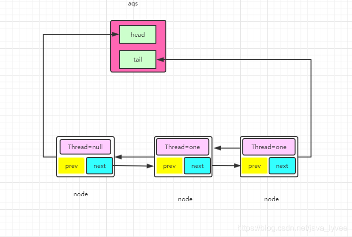

[TOC]

# AbstractQueuedSynchronizer

* 锁的实现框架

参考：<a href="https://tech.meituan.com/2019/12/05/aqs-theory-and-apply.html" target="_blank">美团技术文章：从ReentrantLock的实现看AQS的原理及应用</a>

参考：<a href="https://www.cnblogs.com/dennyzhangdd/p/7218510.html" target="_blank">《The java.util.concurrent Synchronizer Framework》 JUC同步器框架（AQS框架）原文翻译</a>

<a href="http://gee.cs.oswego.edu/dl/papers/aqs.pdf">论文地址</a>

<a href="https://docs.oracle.com/javase/8/docs/api/java/util/concurrent/locks/AbstractQueuedSynchronizer.html">docs api</a>

Provides a framework for implementing blocking locks and related synchronizers (semaphores, events, etc) that rely on first-in-first-out (FIFO) wait queues. This class is designed to be a useful basis for most kinds of synchronizers that rely on a single atomic int value to represent state. Subclasses must define the protected methods that change this state, and which define what that state means in terms of this object being acquired or released. Given these, the other methods in this class carry out all queuing and blocking mechanics. Subclasses can maintain other state fields, but only the atomically updated int value manipulated using methods getState(), setState(int) and compareAndSetState(int, int) is tracked with respect to synchronization.

## Aqs核心思想归纳

AQS核心思想是：<font color='red'>如果被请求的共享资源空闲，那么就将当前请求资源的线程设置为有效的工作线程，将共享资源设置为锁定状态；如果共享资源被占用，就需要一定的阻塞等待唤醒机制来保证锁分配。这个机制主要用的是CLH队列的变体实现的，将暂时获取不到锁的线程加入到队列中</font>

CLH：Craig、Landin and Hagersten队列，链表结构，AQS中的队列是CLH变体的虚拟双向队列（FIFO），AQS是通过将每条请求共享资源的线程封装成一个节点来实现锁的分配。




AQS使用一个`volatile`的int类型的成员变量state来表示同步状态，通过内置的FIFO队列来完成资源获取的排队工作，通过CAS完成对state值的修改。

## 同步器

两个操作

1. `acquire`操作：阻塞调用的线程，直到或除非同步状态允许其继续执行。
2. `release`操作：则是通过某种方式改变同步状态，使得一或多个被acquire阻塞的线程继续执行。

同步器需要支持如下：

* 阻塞和非阻塞（例如tryLock）的同步
* 可选的超时设置，让调用者可以放弃等待
* 通过中断实现的任务取消，通常是分为两个版本，一个acquire可取消，而另一个不可以

同步器的实现根据其状态是否**独占**而有所不同。独占状态的同步器，在同一时间只有一个线程可以通过阻塞点，而**共享**状态的同步器可以同时有多个线程在执行。一般锁的实现类往往只维护独占状态，但是，例如计数信号量在数量许可的情况下，允许多个线程同时执行。为了使框架能得到广泛应用，这两种模式都要支持。

j.u.c包里还定义了Condition接口，用于支持监控形式的await/signal操作，这些操作与独占模式的Lock类有关，且Condition的实现天生就和与其关联的Lock类紧密相关

## AbstractQueuedSynchronizer 相关概念

AbstractQueuedSynchronizer 抽象类的注释说明

1. AbstractQueuedSynchronizer 提供了一个框架，用来实现blocking locks 和 一些同步器，且是基于一个FIFO队列的
2. AbstractQueuedSynchronizer 被设计为使用一个`single atomic {@code int} value`来表示状态
3. AbstractQueuedSynchronizer的子类必须去定义状态，并提供protected方法去操作状态：getState、setState以及compareAndSet
4. 基于AQS的具体实现类必须根据暴露出的状态相关的方法定义tryAcquire和tryRelease方法，以控制acquire和release操作。当同步状态满足时，tryAcquire方法必须返回true，而当新的同步状态允许后续acquire时，tryRelease方法也必须返回true。这些方法都接受一个int类型的参数用于传递想要的状态

### 阻塞

j.u.c包有一个LockSuport类，这个类中包含了解决这个问题的方法。方法`LockSupport.park`阻塞当前线程除非/直到有个`LockSupport.unpark`方法被调用（unpark方法被提前调用也是可以的）。unpark的调用是没有被计数的，因此在一个park调用前多次调用unpark方法只会解除一个park操作。另外，它们作用于每个线程而不是每个同步器。一个线程在一个新的同步器上调用park操作可能会立即返回，因为在此之前可能有“剩余的”unpark操作。但是，在缺少一个unpark操作时，下一次调用park就会阻塞。虽然可以显式地消除这个状态但并不值得这样做。在需要的时候多次调用park会更高效。

**park**: n. 公园; 专用区; 园区; (英国) 庄园，庭院; v. 停(车); 泊(车); 坐下(或站着); 把…搁置，推迟(在以后的会议上讨论或处理);

### 同步操作

* 独占模式


* 共享模式


* AbstractQueuedSynchronizer 的变量：有CLH队列的头部，尾部，以及同步器状态的int变量

```java
//用于标识共享锁
static final Node SHARED = new Node();

//用于标识独占锁
static final Node EXCLUSIVE = null;

/**
* 因为超时或者中断，节点会被设置为取消状态，被取消的节点时不会参与到竞争中的，他会一直保持取消状态不会转变为其他状态；
*/
static final int CANCELLED =  1;

/**
* 当前节点释放锁的时候，需要唤醒下一个节点
*/
static final int SIGNAL    = -1;

/**
* 节点在等待队列中，节点线程等待Condition唤醒
*/
static final int CONDITION = -2;

/**
* 表示下一次共享式同步状态获取将会无条件地传播下去
*/
static final int PROPAGATE = -3;

/** 等待状态 */
volatile int waitStatus;

/** 前驱节点 */
volatile Node prev;

/** 后继节点 */
volatile Node next;

/** 节点线程 */
volatile Thread thread;

//
Node nextWaiter;
```

### FIFO队列(CLH 队列，双向链表)

整个框架的关键就是如何管理被阻塞的线程的队列，该队列是严格的FIFO队列，因此，框架不支持基于优先级的同步。

自旋判断前驱节点是否释放了锁：如果前驱没有释放锁，那么就一直自旋；否则就能获取到锁，结束自旋

#### `acquireQueued`方法中会使线程自旋阻塞，直到获取到锁

```java
/**
    * Acquires in exclusive uninterruptible mode for thread already in
    * queue. Used by condition wait methods as well as acquire.
    *
    * @param node the nodxe
    * @param arg the acquire argument
    * @return {@code true} if interrupted while waiting
    */
final boolean acquireQueued(final Node node, int arg) {
    boolean failed = true;
    try {
        boolean interrupted = false;
        for (;;) {
            final Node p = node.predecessor();
            if (p == head && tryAcquire(arg)) {
                setHead(node);
                p.next = null; // help GC
                failed = false;
                return interrupted;
            }
            if (shouldParkAfterFailedAcquire(p, node) &&
                parkAndCheckInterrupt())
                interrupted = true;
        }
    } finally {
        if (failed)
            cancelAcquire(node);
    }
}
```

#### `addWaiter`方法会将当前线程封装成Node节点，CAS操作追加在队尾，并返回该节点

```java
/**
    * Creates and enqueues node for current thread and given mode.
    *
    * @param mode Node.EXCLUSIVE for exclusive, Node.SHARED for shared
    * @return the new node
    */
private Node addWaiter(Node mode) {
    Node node = new Node(Thread.currentThread(), mode);
    // 将该线程节点加入到队列的尾部,头尾指针变化
    // Try the fast path of enq; backup to full enq on failure
    Node pred = tail;
    if (pred != null) {
        node.prev = pred;
        if (compareAndSetTail(pred, node)) {
            pred.next = node;
            return node;
        }
    }
    enq(node);
    return node;
}
```

在`addWaiter`方法处理失败的时候进一步会调用`enq`方法

#### `enq`方法会将将node加入队尾，不断的进行CAS操作

```java
/**
    * Inserts node into queue, initializing if necessary. See picture above.
    * @param node the node to insert
    * @return node's predecessor
    */
private Node enq(final Node node) {
    for (;;) {
        Node t = tail;
        if (t == null) { // Must initialize
            if (compareAndSetHead(new Node()))
                tail = head;
        } else {
            node.prev = t;
            if (compareAndSetTail(t, node)) {
                t.next = node;
                return t;
            }
        }
    }
}
```

通过`自旋`(CAS操作)来保证该节点能顺利的加入到队列尾部，只有加入成功才会退出循环，否则会一直自旋直到成功。

### 自己实现AbstractQueuedSynchronizer抽象类和Lock接口

```java
class Sync extends AbstractQueuedSynchronizer {
    // Reports whether in locked
    @Override
    protected boolean isHeldExclusively() {
        return getState() == 1;
    }

    // status 为0能获取锁；自旋设置为1，表示获取到锁了
    // Acquires the lock if state is zero
    @Override
    public boolean tryAcquire(int acquires) {
        assert acquires == 1; // Otherwise unused
        if (compareAndSetState(0, 1)) {
            setExclusiveOwnerThread(Thread.currentThread());
            return true;
        }
        return false;
    }

    // 释放锁，要把状态设置为0
    // Releases the lock by setting state to zero
    @Override
    protected boolean tryRelease(int releases) {
        assert releases == 1; // Otherwise unused
        if (getState() == 0) {
            throw new IllegalMonitorStateException();
        }
        setExclusiveOwnerThread(null);
        setState(0);
        return true;
    }

    // Provides a Condition
    Condition newCondition() {
        return new ConditionObject();
    }

    // Deserializes properly
    private void readObject(ObjectInputStream s)
            throws IOException, ClassNotFoundException {
        s.defaultReadObject();
        setState(0); // reset to unlocked state
    }
}

class SelfLock implements Lock{

    private final Sync sync = new Sync();

    @Override
    public void lock() {
        sync.acquire(1);
    }

    @Override
    public void lockInterruptibly() throws InterruptedException {
        sync.acquireInterruptibly(1);
    }

    @Override
    public boolean tryLock() {
        return sync.tryAcquire(1);
    }

    @Override
    public boolean tryLock(long time, TimeUnit unit) throws InterruptedException {
        return sync.tryAcquireNanos(1, unit.toNanos(time));
    }

    @Override
    public void unlock() {
        sync.release(1);
    }

    @Override
    public Condition newCondition() {
        return sync.newCondition();
    }
}
```
