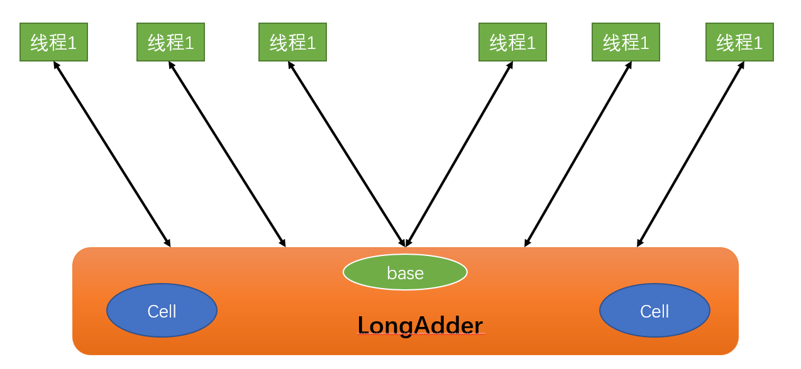

[TOC]

# LongAdder

LongAdder内部将一个long分成多个cell，每个线程可以对一个cell操作，如果需要取出long数据则求和即可，这样增强了在高并发情况下的效率



```java
/**
 * One or more variables that together maintain an initially zero
 * {@code long} sum.  When updates (method {@link #add}) are contended
 * across threads, the set of variables may grow dynamically to reduce
 * contention. Method {@link #sum} (or, equivalently, {@link
 * #longValue}) returns the current total combined across the
 * variables maintaining the sum.
 *
```

* 只能做累加，或者自增自减操作，不能做其它操作
* 用一个`Cell`数组来存放分段数据值大小，Cell数组元素只有一个`volatile long value`表示存放的值
* `sum方法`用于返回当前计数值，返回所有Cell中value的和
* 多个线程会进行hash，对不同的Cell元素进行操作
* 内部有扩容方法，增加更多的Cell元素

英语单词

* probe: v. 盘问; 追问; 探究; (用细长工具) 探查，查看;n.探究; 详尽调查; (不载人) 航天探测器，宇宙探测航天器; (医生用的) 探针;
* contention: n. 争吵; 争执; 争论; (尤指争论时的) 看法，观点;

## 源码分析

### unsafe int 操作的一些方法

* public native int getInt(Object o, long offset);//获得给定对象偏移量上的int值
* public native void putInt(Object o, long offset, int x);//设置给定对象偏移量上的int值
* public native long objectFieldOffset(Field f);//获得字段在对象中的偏移量
* public native void putIntVolatile(Object o, long offset, int x);//设置给定对象的int值，使用volatile语义
* public native int  getIntVolatile(Object o, long offset);//获得给定对象对象的int值，使用volatile语义
* public native void putOrderedInt(Object o, long offset, int x);//和putIntVolatile()一样，但是它要求被操作字段就是volatile类型的

### Cell 对象(`Striped64`类的静态内部类)

* 使用了`@sun.misc.Contended`注解(**缓存行**使用,解决**伪共享**问题)

```java
/**
    * Padded variant of AtomicLong supporting only raw accesses plus CAS.
    *
    * JVM intrinsics note: It would be possible to use a release-only
    * form of CAS here, if it were provided.
    */
@sun.misc.Contended static final class Cell {
    volatile long value;
    Cell(long x) { value = x; }
    final boolean cas(long cmp, long val) {
        return UNSAFE.compareAndSwapLong(this, valueOffset, cmp, val);
    }

    // Unsafe mechanics
    private static final sun.misc.Unsafe UNSAFE;
    private static final long valueOffset;
    static {
        try {
            UNSAFE = sun.misc.Unsafe.getUnsafe();
            Class<?> ak = Cell.class;
            valueOffset = UNSAFE.objectFieldOffset
                (ak.getDeclaredField("value"));
        } catch (Exception e) {
            throw new Error(e);
        }
    }
}
```

* `Striped64`静态初始化

```java
// Unsafe mechanics
private static final sun.misc.Unsafe UNSAFE;
private static final long BASE;
private static final long CELLSBUSY;
private static final long PROBE;
static {
    try {
        UNSAFE = sun.misc.Unsafe.getUnsafe();
        Class<?> sk = Striped64.class;
        BASE = UNSAFE.objectFieldOffset
            (sk.getDeclaredField("base"));
        CELLSBUSY = UNSAFE.objectFieldOffset
            (sk.getDeclaredField("cellsBusy"));
        Class<?> tk = Thread.class;
        PROBE = UNSAFE.objectFieldOffset
            (tk.getDeclaredField("threadLocalRandomProbe"));
    } catch (Exception e) {
        throw new Error(e);
    }
}
```

* base：为非竞争状态下的一个值
* PROBE：一个随机的hashCode一样，每个线程有一个自己的probe，可以标示cells数组下标

### add(long x)

```java
/**
    * Adds the given value.
    *
    * @param x the value to add
    */
public void add(long x) {
    Cell[] as; long b, v; int m; Cell a;
    if ((as = cells) != null || !casBase(b = base, b + x)) {
        boolean uncontended = true;
        if (as == null || (m = as.length - 1) < 0 ||
            (a = as[getProbe() & m]) == null ||
            !(uncontended = a.cas(v = a.value, v + x)))
            longAccumulate(x, null, uncontended);
    }
}
```

* `casBase`就是一个CAS操作(一般自旋锁这里是`whille(!cas){}`)，当有竞争的时候，CAS可能操作失败

```java
 /**
     * CASes the base field.
     */
    final boolean casBase(long cmp, long val) {
        return UNSAFE.compareAndSwapLong(this, BASE, cmp, val);
    }
```

1. as == null，
2. (m = as.length - 1) < 0
3. (a = as[getProbe() & m]) == null
4. !(uncontended = a.cas(v = a.value, v + x))

* if中判断1和判断2是判断cells是否为空
* 判断3是判断当前线程的cell是否是null
* 判断4是当前线程进行cas操作
* 最后是`longAccumulate(x, null, uncontended);`

#### longAccumulate(x, null, uncontended)

如果`Cell[]`数组未初始化，会调用父类的longAccumelate去初始化`Cell[]`，如果`Cell[]`已经初始化但是冲突发生在Cell单元内，则也调用父类的longAccumelate，此时可能就需要对`Cell[]`扩容了。

### sum()

base + `cells`数组中各内容值

```java
public long sum() {
    Cell[] as = cells; Cell a;
    long sum = base;
    if (as != null) {
        for (int i = 0; i < as.length; ++i) {
            if ((a = as[i]) != null)
                sum += a.value;
        }
    }
    return sum;
}
```

### `LongAdder`和`AtomicLong`

<a href="http://blog.palominolabs.com/2014/02/10/java-8-performance-improvements-longadder-vs-atomiclong/" target="_blank">性能对比</a>
