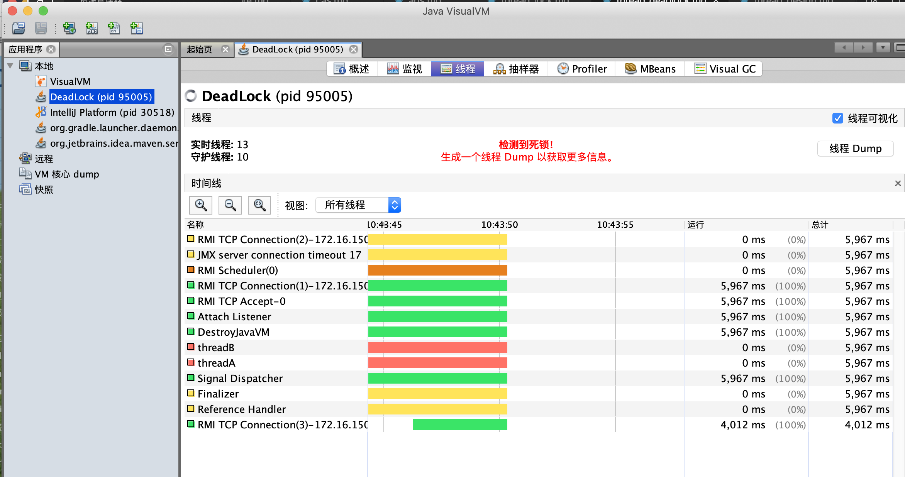

[TOC]

# 死锁

## 死锁的4个必要条件（操作系统）

1. 互斥：某种资源一次只允许一个进程访问，即该资源一旦分配给某个进程，其他进程就不能再访问，直到该进程访问结束。
2. 不可剥夺：进程所获得的资源在未使用完毕之前，不被其它进程强行剥夺，而只能由获得该资源的进程资源释放。
3. 请求和保持：进程每次申请它所需要的一部分资源，在申请新的资源的同时，继续占用已分配到的资源。
4. 循环等待：存在一个进程循环链，使得每个进程都占有下一个进程所需的至少一种资源。

## 程序死锁的可能原因

1. 交叉锁

2. 内存不足

例如线程T1获得了10M内存,线程T2获得了20M内存，每个线程都需要30M的运行内存，但是此时剩余可用的内存刚好为20M,那么两个线程有可能都在等待彼此能够释放的内存资源

3. 一问一答式的数据交换

服务端，客户端都在等待对方

4. 数据库锁

5. 文件锁

某个线程获得了文件锁意外退出，其它读取该文件的线程也将会进入死锁直到系统释放文件句柄资源

6. 死循环引起的死锁

系统假死

## 死锁代码例子(需要手写)

```java
class DeadLock {
    // 创建资源
    private static Object resourceA = new Object();
    private static Object resourceB = new Object();

    // 测试
    public static void test() {
        //启动线程A,B
        new Thread(new A(), "threadA").start();
        new Thread(new B(), "threadB").start();
    }

    static class A implements Runnable{
        @Override
        public void run() {
            synchronized (resourceA) { // 持有资源A
                System.out.println(Thread.currentThread() + " get ResourceA");

                try {
                    TimeUnit.SECONDS.sleep(1);
                } catch (InterruptedException e) {
                    System.err.print(e);
                }

                System.out.println(Thread.currentThread() + " waiting get ResourceB");
                // 想获取资源B
                synchronized (resourceB) {
                    System.out.println(Thread.currentThread() + " get ResourceB");
                }
            }
        }
    }

    static class B implements Runnable{
        @Override
        public void run() {
            synchronized (resourceB) { // 持有资源B
                System.out.println(Thread.currentThread() + " get ResourceB");

                try {
                    TimeUnit.SECONDS.sleep(2);
                } catch (InterruptedException e) {
                    System.err.print(e);
                }

                System.out.println(Thread.currentThread() + " waiting get ResourceA");
                // 想获取资源A
                synchronized (resourceA) {
                    System.out.println(Thread.currentThread() + " get ResourceA");
                }
            }
        }
    }

    public static void main(String[] args) {
        test();
    }
}
```

### 输出和死锁现象

输出如下，然后会一直卡住

```java
Thread[threadA,5,main] get ResourceA
Thread[threadB,5,main] get ResourceB
Thread[threadA,5,main] waiting get ResourceB
Thread[threadB,5,main] waiting get ResourceA
```

* jvisualvm 可查看到死锁现象



### 信号量解决死锁代码

```java
class DeadLock {
    // 创建资源
    private static Object resourceA = new Object();
    private static Object resourceB = new Object();

    private static Semaphore semaphoreA = new Semaphore(1);
    private static Semaphore semaphoreB = new Semaphore(1);

    //测试
    public static void test() {
        //启动线程A,B
        new Thread(new A(), "threadA").start();
        new Thread(new B(), "threadB").start();
    }

    static class A implements Runnable {
        @Override
        public void run() {
            try {
                if(semaphoreA.tryAcquire(1, TimeUnit.SECONDS)) {
                    System.out.println(Thread.currentThread() + " get ResourceA");


                    TimeUnit.SECONDS.sleep(2);

                    System.out.println(Thread.currentThread() + " waiting get ResourceB");
                    // 想获取资源B
                    if(semaphoreB.tryAcquire(1, TimeUnit.SECONDS)) {
                        System.out.println(Thread.currentThread() + " get ResourceB");

                        System.out.println("A do sth");

                        semaphoreB.release();
                    }else {
                        System.out.println("A get ResourceB failed");
                    }

                    semaphoreA.release();
                }else{
                    System.out.println("A get ResourceA failed");
                }
            }catch (Exception e){
                e.printStackTrace();
            }
        }
    }

    static class B implements Runnable{
        @Override
        public void run() {
            try {
                if(semaphoreB.tryAcquire(1, TimeUnit.SECONDS)) {
                    System.out.println(Thread.currentThread() + " get ResourceB");


                    TimeUnit.SECONDS.sleep(1);

                    System.out.println(Thread.currentThread() + " waiting get ResourceA");
                    // 想获取资源B
                    if(semaphoreA.tryAcquire(1, TimeUnit.SECONDS)) {
                        System.out.println(Thread.currentThread() + " get ResourceA");

                        System.out.println("B do sth");

                        semaphoreA.release();
                    }else{
                        System.out.println("B get ResourceA failed");
                    }
                    semaphoreB.release();
                }else{
                    System.out.println("B get ResourceB failed");
                }
            }catch (Exception e){
                e.printStackTrace();
            }
        }
    }
}
```

## 死锁的避免与预防

### 死锁避免

死锁避免的基本思想：系统对进程发出的每一个系统能够满足的资源申请进行动态检查，并根据检查结果决定是否分配资源，如果分配后系统可能发生死锁，则不予分配，否则予以分配，这是一种保证系统不进入死锁状态的动态策略。如果操作系统能保证所有进程在有限时间内得到需要的全部资源，则系统处于安全状态否则系统是不安全的。

安全状态是指：如果系统存在由所有的安全序列{P1，P2，…Pn},则系统处于安全状态。一个进程序列是安全的，如果对其中每一个进程Pi(i >=1 && i <= n)他以后尚需要的资源不超过系统当前剩余资源量与所有进程Pj(j < i)当前占有资源量之和，系统处于安全状态则不会发生死锁。

### 死锁预防

通过破坏死锁产生的4个必要条件来预防死锁，其中资源互斥是资源使用的固有特性是无法改变的

* 破坏“不可剥夺”条件：一个进程不能获得所需要的全部资源时便处于等待状态，等待期间他占有的资源将被隐式的释放重新加入到系统的资源列表中，可以被其他的进程使用，而等待的进程只有重新获得自己原有的资源以及新申请的资源才可以重新启动、执行。
* 破坏”请求与保持条件“：第一种方法静态分配即每个进程在开始执行时就申请他所需要的全部资源。第二种是动态分配即每个进程在申请所需要的资源时他本身不占用系统资源。
* 破坏“循环等待”条件：采用资源有序分配其基本思想是将系统中的所有资源顺序编号，将紧缺的、稀少的采用较大的编号，在申请资源时必须按照编号的顺序进行，一个进程只有获得较小编号的进程才能申请较大编号的进程。

eg1: 在尝试获取锁的时候加一个超时时间，这也就意味着在尝试获取锁的过程中若超过了这个时限该线程则放弃对该锁请求
eg2: 死锁检测是一个更好的死锁预防机制，它主要是针对那些不可能实现按序加锁并且锁超时也不可行的场景
